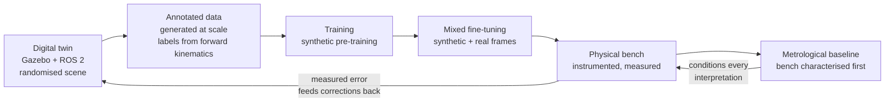
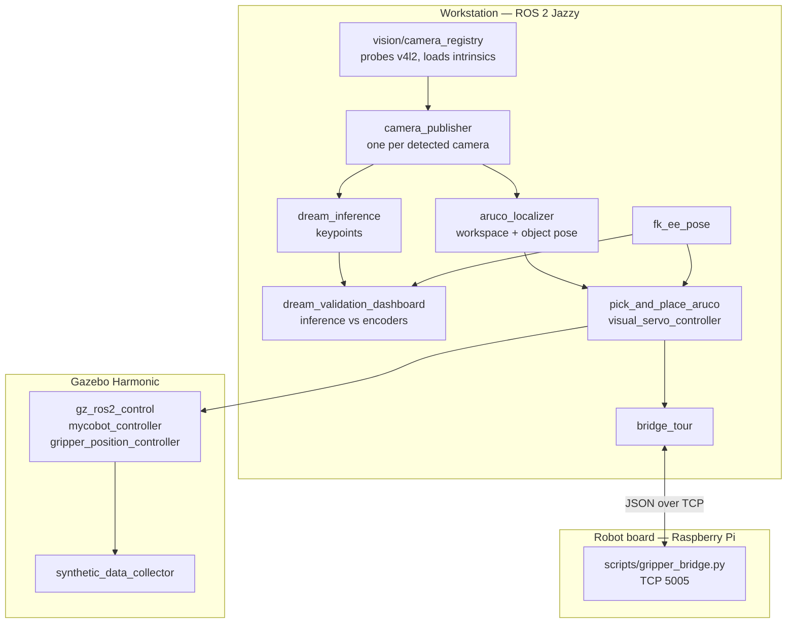

# R6A — Modular Vision-Guided Robotics


A 6-DoF arm driven from fixed cameras, with no fiducial marker on the robot
itself. Arm pose is recovered from plain RGB by a keypoint model trained in
simulation and adapted to the physical bench.

Research and Innovation Department, ABMI.

*R6A* stands for **Robot à 6 Axes**. The work started on a five-axis arm — R5A —
and moved to a six-axis one; the name followed the hardware. Earlier material
still carrying the R5A label refers to this same project before that change.

---

## Problem

Robotic cells that adapt to a change of environment are heavy and expensive.
Reconfiguring an arm designed for one workcell to serve another means a full
re-integration — which puts the technology out of reach of the SMEs facing the
repetitive, low-added-value tasks it would serve best.

A specific technical lock sits underneath. In an **eye-to-hand** layout — cameras
fixed, robot moving inside their field — guiding the arm requires knowing the
camera-to-robot transform at all times. Classical approaches bolt physical
markers onto the arm: awkward to fit, awkward to keep aligned. Estimating that
pose directly from an RGB image, marker-free, requires a learned model, and
therefore:

- a volume of annotated training data that cannot realistically be produced by
  hand on the physical robot;
- a **sim-to-real domain gap** between rendered and captured images.

## Objective

Build a modular, affordable robotic system on open-source emerging technology,
able to adapt to its environment while holding a level of robustness and
precision compatible with industrial use. Lower development cost must not be
paid for in reliability — which is why measurement, not demonstration, gates
every claim in this repository.

## Approach: digital twin and test benches

Simulation and hardware are one closed loop here, not two parallel activities.



1. **Digital twin** — robot and cell modelled under Gazebo Harmonic and ROS 2,
   with scene randomisation (lighting, backgrounds, objects, joint poses).
   See `mycobot_description/worlds/randomized.sdf`, `randomized_v2.sdf`.
2. **Data generation at scale** — the simulation emits images *and* their
   annotations automatically, derived from forward kinematics. This is the step
   that cannot be reproduced by hand on hardware.
3. **Training, then adaptation** — pre-training on synthetic data, then mixed
   fine-tuning that folds in real frames captured on the bench, to close the
   sim-to-real gap.
4. **Validation on the instrumented bench** — the physical bench is the
   arbiter. It confronts the model with measurement and feeds corrections back
   into the twin.
5. **Metrological characterisation of the bench itself** — before measuring an
   algorithm, measure the instrument: repeatability, approach-direction effect,
   open-loop error, vision stability, extrinsic calibration accuracy, then
   end-to-end performance.

**Point 5 is load-bearing.** Without a metrological baseline, an improvement
cannot be attributed to the model rather than to the robot. The protocol,
standard by standard, is in
[`training/calibration/PROTOCOLE_ESSAIS_PRECISION.md`](training/calibration/PROTOCOLE_ESSAIS_PRECISION.md);
the method behind it in
[`training/calibration/METHODOLOGIE_PRECISION.md`](training/calibration/METHODOLOGIE_PRECISION.md).

The project runs on **two complementary benches, in Nanterre and in Lyon**,
which imposes a shared protocol across sites so that campaigns stay comparable.
The precision campaign data currently in this repository
(`training/calibration/*_2026-09-09.csv`) was acquired on the **Lyon** bench.

## Architecture

The system is split between a development workstation and the robot's embedded
board. Heavy computation (inference, calibration, training) stays on the
workstation; the board runs the motion bridge.



`mycobot_gateway` declares **31 executables**. The main ones:

| Executable | Role |
|---|---|
| `bridge_tour` | TCP bridge to the arm's board |
| `camera_publisher` | One instance per detected camera, intrinsics from the registry |
| `marker_detector`, `aruco_localizer` | ArUco detection; workspace and object pose |
| `dream_inference` | Marker-free keypoint inference |
| `dream_validation_dashboard` | Live inference-vs-encoder comparison, per-joint error |
| `fk_ee_pose` | `/joint_states` → end-effector pose by forward kinematics |
| `calibrate_extrinsic`, `calibrate_hand_eye` | Extrinsic and hand-eye calibration |
| `synthetic_data_collector` | Image + annotation capture in the twin |
| `color_object_detector` | HSV segmentation and back-projection to the robot frame |
| `sim_sorting_grasp` | Physical-grasp sorting cycle (contact simulated, grasp verified) |
| `pick_and_place_aruco` | Pick-and-place, `mode:=sim` or `mode:=real` |
| `visual_servo_controller`, `object_pose_node` | Closed-loop visual servoing |
| `precision_benchmark` | 9-target grid, CSV report |
| `trajectory_to_robot_bridge`, `gripper_to_robot_bridge` | Hand-teleoperation bridges |

Full node and launch inventory: [`mycobot_gateway/README.md`](mycobot_gateway/README.md).
Topology: [`docs/ARCHITECTURE.md`](docs/ARCHITECTURE.md).

## Status

| State | Item |
|---|---|
| **Validated** | Modular ROS 2 architecture split across workstation and embedded board |
| **Validated** | MyCobot 320 Pi integrated; multi-camera cell with per-camera intrinsics; workspace referenced by four ArUco markers |
| **Validated** | End-to-end synthetic data generation under Gazebo, with scene randomisation |
| **Validated** | Marker-free pose estimation (DREAM architecture) trained, sim-to-real fine-tuned, evaluated on held-out real frames — see [`training/dream/README.md`](training/dream/README.md) |
| **Validated** | Real-time ROS 2 dashboard comparing inference against encoders |
| **Validated** | Vision-guided pick-and-place, validated in simulation then replayed closed-loop on the physical bench — see [`docs/PICK_AND_PLACE_BOUCLE_FERMEE.md`](docs/PICK_AND_PLACE_BOUCLE_FERMEE.md) |
| **Validated** | Structured metrology campaign, repeatability assessed against ISO 9283 |
| **In progress** | Extrinsic recalibration exists as a node and a script ([`scripts/calibration_extrinseque_auto.py`](scripts/calibration_extrinseque_auto.py)) with leave-one-out self-check, but is not yet wired as an automatic startup step in any launch file |
| **In progress** | Learned object detection: a YOLOv8 detector ([`scripts/yolo_object_detect.py`](scripts/yolo_object_detect.py)) is used by the live pick pipeline, but the ROS 2 node in the graph is still HSV-based |
| **In progress** | Physical-grasp sorting in simulation: outcome is **not deterministic** at identical commanded geometry — see [`docs/PICK_AND_PLACE_SIMULATION.md`](docs/PICK_AND_PLACE_SIMULATION.md) |
| **In progress** | VLA data plumbing: [`Gazebo_to_LeRobot_Pipeline/`](Gazebo_to_LeRobot_Pipeline/) and [`ROS2_to_RLDS_Conversion_OpenVLA/`](ROS2_to_RLDS_Conversion_OpenVLA/) are pipeline proofs on scripted episodes, not trained policies |
| **To come** | Replace HSV thresholding with a learned detector *inside the ROS 2 graph* |
| **To come** | Higher simulation realism for vision-guided pick-and-place |
| **To come** | Extended multi-view fusion and an additional keypoint, to lift the last-joint limitation |
| **To come** | Automation of the collect / replay / analysis chain |
| **To come** | Migration of the simulation path to NVIDIA Isaac Sim (parity to be proven on its own branch) |

### Open issues

These are stated rather than hidden; they shape what the results mean.

- **The last joint is structurally unobservable.** No keypoint in the 7-point
  schema depends on J6's own rotation; measured forward-kinematic displacement
  of all keypoints across its range is zero. Not a tuning problem — it needs a
  keypoint downstream of J6, or a second view.
- **Extrinsic calibration is validated only in the table plane.** All
  calibration markers are coplanar, so the fit carries no evidence off that
  plane.
- **Lighting and exposure sensitivity is not sufficiently characterised.**
- **No external metrological reference.** Every measurement to date depends on
  the robot's own encoders or on the vision chain, which cannot arbitrate
  between them. A calibrated external artefact is the missing instrument.

## Installation

**Workstation** — Ubuntu 24.04, ROS 2 Jazzy, Python 3.12, Gazebo Harmonic.
An NVIDIA GPU is required for training, not for running the cell.

```bash
sudo apt install ros-jazzy-ros-gz-sim ros-jazzy-ros-gz-bridge \
                 ros-jazzy-ros2-control ros-jazzy-ros2-controllers \
                 ros-jazzy-gz-ros2-control
```

Gazebo **Harmonic**, not Gazebo Classic — the package names differ and Classic
tutorials do not transpose.

```bash
# Conda's interpreter shadows the one ROS 2 needs. Leave it first, in every
# terminal, or imports fail with opaque C-extension errors.
conda deactivate

cd <your_ws>/src
git clone https://github.com/ABMI-software/mycobot_320pi_R6A.git
cd mycobot_320pi_R6A

# Git LFS carries the DREAM training images only (datasets/**/*.png).
# Not needed for simulation, pick-and-place or robot control.
git lfs pull

cd <your_ws>
colcon build --packages-select mycobot_gateway mycobot_description --symlink-install
source install/setup.bash
```

`colcon build` runs from the workspace root, never from `src/` — colcon writes
`build/`, `install/` and `log/` into its working directory.

Python dependencies for training are in
[`training/requirements.txt`](training/requirements.txt) and belong in a
dedicated environment, never in the ROS 2 interpreter.

### Verify the installation

```bash
ros2 launch mycobot_gateway real_table.launch.py
```

Gazebo must open on the wooden table with its four ArUco markers and the arm.
A **grey table with no markers** means `models/` was not installed: run
`colcon build` again.

## Quick start

All commands assume `conda deactivate` and a sourced workspace.

```bash
# Simulated cell, wooden table replicating the physical bench
ros2 launch mycobot_gateway real_table.launch.py

# Physical-grasp sorting bench — two terminals
ros2 launch mycobot_gateway sim_grasp.launch.py       # headless:=true to skip the window
ros2 run mycobot_gateway sim_sorting_grasp --ros-args -p use_sim_time:=true

# Marker-free pose estimation, live against the encoders
ros2 launch mycobot_gateway dream_multicam.launch.py  # auto-detects 1 or 2 cameras

# Synthetic dataset collection
ros2 launch mycobot_gateway synthetic_data_v3.launch.py

# Precision benchmark — 9-target grid, CSV report
ros2 launch mycobot_gateway precision_benchmark.launch.py

# Before any physical session
bash scripts/real_robot_preflight.sh
```

The robot's board address is **not fixed**. Confirm it with a TCP round-trip on
port 5005 before running anything that commands motion — a successful `ping`
proves nothing.

## Repository structure

```
mycobot_gateway/            ROS 2 package — 31 executables, 23 launch files
  mycobot_gateway/vision/   camera registry, publishers, ArUco, localisers
  mycobot_gateway/visual_servo/  closed-loop servoing
  launch/                   topology descriptions
mycobot_description/        URDF, meshes, Gazebo worlds, controller config
  worlds/                   randomized*.sdf (data generation),
                            real_table.sdf (bench replica),
                            pick_and_place_sorting.sdf, precision_benchmark.sdf
training/
  dream/                    keypoint training, evaluation, FK/IK, solvers
  calibration/              intrinsics, extrinsics, metrology protocol + CSV results
  requirements.txt          training dependencies (separate environment)
datasets/                   synthetic and real datasets (images via Git LFS)
scripts/                    calibration, diagnostics, dashboards, robot bridges
teleop/                     hand-teleoperation pipeline
tests/                      pick FSM, IK control, safety, live ArUco geometry
docs/                       architecture, procedures, per-domain documentation
Gazebo_to_LeRobot_Pipeline/            episode export to LeRobot format
ROS2_to_RLDS_Conversion_OpenVLA/       episode export to RLDS / OpenVLA
Headless_Task-Grounded_Pick-and-Place_in_Gazebo/  headless pick-and-place POC
```

## Experimental results

Numbers are not reproduced here — they belong with their protocol, and are
worthless detached from it.

| Subject | Where |
|---|---|
| Precision campaign: protocol, standard, procedure and result per test | [`training/calibration/PROTOCOLE_ESSAIS_PRECISION.md`](training/calibration/PROTOCOLE_ESSAIS_PRECISION.md) |
| Measurement methodology | [`training/calibration/METHODOLOGIE_PRECISION.md`](training/calibration/METHODOLOGIE_PRECISION.md) |
| Raw campaign data, Lyon bench (repeatability, approach directions, leave-one-out) | `training/calibration/*_2026-09-09.csv` |
| Keypoint model: training runs, evaluation, joint observability | [`training/dream/README.md`](training/dream/README.md) |
| Validation dashboard and its reading | [`docs/DREAM_VALIDATION_DASHBOARD.md`](docs/DREAM_VALIDATION_DASHBOARD.md) |
| Sorting simulation: measured state and rejected hypotheses | [`docs/PICK_AND_PLACE_SIMULATION.md`](docs/PICK_AND_PLACE_SIMULATION.md) |
| Closed-loop pick-and-place on hardware | [`docs/PICK_AND_PLACE_BOUCLE_FERMEE.md`](docs/PICK_AND_PLACE_BOUCLE_FERMEE.md) |
| Version history | [`CHANGELOG.md`](CHANGELOG.md) |

Two cautions when reading any of it. An extrinsic's fit residual is **not** an
accuracy — leave-one-out on a held-out marker is the honest figure. And a
repeatability figure is not an absolute accuracy: they answer different
questions and are routinely confused.

## Roadmap

1. Learned object detection inside the ROS 2 graph, replacing HSV thresholding.
2. Higher simulation realism for vision-guided pick-and-place, and a contact
   model that makes the sorting bench reproducible.
3. Extended multi-view fusion plus an additional keypoint downstream of the last
   joint, to lift the observability limit.
4. Automated collection, replay and analysis of test campaigns, so that
   cross-site campaigns stay comparable.
5. External metrological reference, independent of encoders and vision.
6. Migration of the simulation path to NVIDIA Isaac Sim, on its own branch until
   parity with the current twin is demonstrated.

## Contributing

- Branch per domain; see [`.claude/rules/git-branching.md`](.claude/rules/git-branching.md).
- Conventional commit prefixes: `feat` · `fix` · `docs` · `refactor` · `test` ·
  `chore` · `perf`, scoped by domain.
- Any user-visible change updates [`CHANGELOG.md`](CHANGELOG.md) in the same commit.
- A change affecting the physical robot requires a documented physical test pass.
- Three Python environments coexist and must not be mixed; see
  [`.claude/rules/python-environments.md`](.claude/rules/python-environments.md).

## Licence and contact

Apache License 2.0 — see [`LICENSE`](LICENSE). Both ROS 2 packages declare the
same SPDX identifier (`Apache-2.0`) in their `package.xml`.

Copyright 2026 ABMI.

**Dr. José Bernardo** — [jo.bernardo@abmi-groupe.com](mailto:jo.bernardo@abmi-groupe.com)
Direction Recherche & Innovation, ABMI.

Repository: [github.com/ABMI-software/mycobot_320pi_R6A](https://github.com/ABMI-software/mycobot_320pi_R6A).
