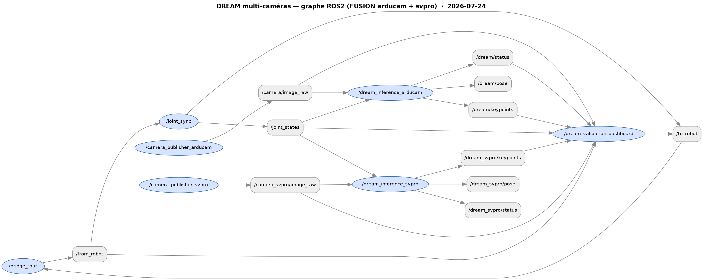

# MyCobot 320 Pi — ROS2 Control & Vision-Based Pose Estimation

**Plateforme de recherche pour le MyCobot 320 Pi 6-DoF — substrat d'un POC ABMI digital-twin / VLA / AI-physics**

Ce projet intègre :
- Un **bridge ROS2 TCP** pour contrôler un MyCobot 320 Pi depuis un PC distant
- Une **simulation Gazebo Harmonic** avec gripper adaptatif, 4 caméras et domain randomization
- Un **pipeline ML DREAM** : keypoint detection (VGG-19) → belief maps → PnP → pose 3D, avec un **dashboard de validation multi-caméras** (Arducam + SVPRO, auto-détection 1 ou 2 vues, fusion *solve-then-fuse* par joint) — `ros2 launch mycobot_gateway dream_multicam.launch.py`. Voir [`docs/DREAM_VALIDATION_DASHBOARD.md`](docs/DREAM_VALIDATION_DASHBOARD.md) et [`docs/DREAM_VALIDATION_LAUNCH.md`](docs/DREAM_VALIDATION_LAUNCH.md)
- Une **téléopération par la main** (Wilor + Orbbec Astra) avec dashboard de tuning et rapport Excel — adapté du pipeline R5A / LeRobot. **Pipeline validé sur robot physique le 22/04/2026**
- Des **datasets** synthétiques (Gazebo, 50K frames) et réels (caméras Pi, 4K images) via Git LFS
Ce dépôt intègre :
- Un **bridge ROS2 TCP** Tour ↔ Raspberry Pi pour contrôler le robot physique (`10.10.0.223`)
- Un **digital twin Gazebo Harmonic** : URDF + gripper adaptatif + 4 caméras + worlds randomisés
- Un **pipeline DREAM** (NVlabs) de pose-estimation par keypoints : VGG-19 → belief maps → PnP → pose 6-DoF
- Une **téléopération par la main** (Astra → Wilor → rosbridge → JTC) avec dashboard ABMI 3-onglets et performance analyzer Excel — *validée sur robot physique le 22/04/2026*
- Un **pipeline pick-and-place + sorting 4 couleurs** en simulation (`pick_and_place.launch.py`, `sorting_orchestrator`)
- Une **calibration intrinsèque ChArUco** des caméras (cam_0, cam_3, Astra) avec auto-save et rejet d'outliers — *cam_0 + cam_3 mesurées le 28/04/2026*
- Des **datasets** Git LFS : 50 K synth (Gazebo, randomized v1/v2) + 4 K réels (Arducam Pi cam_0/cam_3)

> Pour reprendre le développement → [`SESSION_RESUME.md`](SESSION_RESUME.md)
> Roadmap POC (Isaac Sim, VLA, AI physics) → [`CLAUDE.md § POC direction`](CLAUDE.md)
> Manuel téléop → [`docs/TELEOPERATION.md`](docs/TELEOPERATION.md) · Manuel calibration → [`docs/CAMERA_CALIBRATION.md`](docs/CAMERA_CALIBRATION.md)

---

## 📑 Table des matières

- [Architecture](#-architecture) — diagramme des 3 chemins de commande (GUI/CLI · téléop main · vision DREAM)
- [Packages & Composants](#-packages--composants) — `mycobot_gateway`, `mycobot_description`, `training/`, `teleop/`, `datasets/`, `scripts/`, `docs/`
- [Quick Start](#-quick-start) — prérequis, installation, démarrage robot + contrôles + sorting
- [Pipeline Vision / Pose Estimation](#-pipeline-vision--pose-estimation) — DREAM, résultats par checkpoint, tests réalisés, pistes pour la suite
- [Datasets](#-datasets) — synthétique 50 K + réel 4 K via Git LFS
- [Modes de Contrôle](#-modes-de-contrôle) — GUI · sliders · clavier · CLI · sync RViz
- [Téléopération par la main](#%EF%B8%8F-téléopération-par-la-main) — pipeline Astra→Wilor→robot avec validation physique
- [Pick-and-place (Gazebo)](#-pick-and-place-gazebo) — pipeline mono + sorting 4 couleurs
- [Structure du Projet](#-structure-du-projet) — arborescence complète
- [Configuration Réseau](#-configuration-réseau) — IP Tour ↔ Pi, ports TCP
- [Troubleshooting](#%EF%B8%8F-troubleshooting) — conda/ROS2, TCP, Git LFS
- [Documentation](#-documentation) — index des fichiers `docs/`
- [License](#-license) · [Contributeurs](#-contributeurs)

---

## 🏗️ Architecture

```
┌──────────────────────────────────────────────────────────────────────────────────────┐
│                              PC TOUR (10.10.0.115)                                   │
│           ROS2 Jazzy / Ubuntu 24.04 / Python 3.12 (system)                           │
│           Conda env hand-teleop : Python 3.10 (Wilor + Astra)                        │
│           Conda env venv_dream  : Python 3.12 / PyTorch 2.6 + CUDA 12.4              │
│           GPU : NVIDIA RTX 4000 Ada (20 GB VRAM)                                     │
├──────────────────────────────────────────────────────────────────────────────────────┤
│ ┌─────────────────── CONTRÔLES INTERACTIFS ────────────────────┐                     │
│ │ simple_gui · slider_control · teleop_keyboard · commander    │                     │
│ │ (Tkinter / RViz / clavier / CLI)                             │                     │
│ └──────────────────────────────┬───────────────────────────────┘                     │
│                                │                                                     │
│ ┌──────────── TÉLÉOPÉRATION PAR LA MAIN (conda hand-teleop) ───────────────┐        │
│ │  Astra S RGB ──► Wilor (hand 6-DoF) ──► mapping rel + filtres R5A        │        │
│ │  (oni_grabber, shm)    (PyTorch)        (Kalman + EMA + slew 1°/frame)   │        │
│ │                                  │                                       │        │
│ │                                  ▼  rosbridge :9090                      │        │
│ │  /mycobot_controller/joint_trajectory  +  /teleop/* (gains, recal, KPI)  │        │
│ └─────────────────┬────────────────────────────────────────┬───────────────┘        │
│                   │                                        │                         │
│           target=sim │                              target=real │                    │
│                   ▼                                        ▼                         │
│        ┌──────────────────┐                   ┌──────────────────────────┐          │
│        │ Gazebo Harmonic  │                   │ trajectory_to_robot_     │          │
│        │ + JTC + 4 caméras│                   │  bridge (rad → deg JSON, │          │
│        │ + gripper 4 DOF  │                   │  15 Hz, deadband 1°)     │          │
│        │ /joint_states    │                   └──────────────┬───────────┘          │
│        └──────────────────┘                                  │                       │
│                                                              ▼                       │
│ ┌──────── PIPELINE VISION DREAM ────────┐         ┌──────────────────┐              │
│ │ training/dream/  ·  venv_dream         │         │   bridge_tour    │              │
│ │ VGG-19 → belief maps → 7 keypoints     │         │  (JSON /to_robot)│              │
│ │ → PnP → pose 6-DoF                     │         └────────┬─────────┘              │
│ │ checkpoints_dream/vgg_*                │                  │                        │
│ └────────────────────────────────────────┘                  │                        │
│                                                             │                        │
│ ┌─────── PICK-AND-PLACE GAZEBO ─────────┐                   │                        │
│ │ pick_and_place_node  (mono)            │                  │                        │
│ │ sorting_orchestrator (4 couleurs)      │                  │                        │
│ │   ←  color_object_detector (HSV)       │                  │                        │
│ └────────────────────────────────────────┘                  │                        │
├─────────────────────────────────────────────────────────────┼────────────────────────┤
│                          RÉSEAU ETHERNET (10.10.0.x)        │                        │
├─────────────────────────────────────────────────────────────┼────────────────────────┤
│                                                             ▼                        │
│              ┌──────────────────┐              ┌─────────────────────┐              │
│              │ pi_camera_server │              │  bridge_pi_simple   │              │
│              │   TCP:5006       │              │   TCP:5005          │              │
│              └────────┬─────────┘              └──────────┬──────────┘              │
│                       │                                   ▼                          │
│              ┌────────▼────────┐                ┌─────────────────┐                  │
│              │ Arducam USB ×2  │                │    pymycobot    │                  │
│              │  cam0 + cam3    │                │  /dev/ttyAMA0   │                  │
│              └─────────────────┘                └────────┬────────┘                  │
│                                                          ▼                           │
│                                                ┌─────────────────┐                   │
│                                                │  MyCobot 320 Pi │                   │
│                                                └─────────────────┘                   │
│                          RASPBERRY PI (10.10.0.224)                                  │
└──────────────────────────────────────────────────────────────────────────────────────┘
```

> **Trois chemins de commande convergent vers le robot** :
> (1) GUI/CLI/clavier classique → `bridge_tour` → Pi ;
> (2) téléop main (Astra→Wilor) → rosbridge → JTC (sim) **ou** trajectory_to_robot_bridge → bridge_tour → Pi (réel) ;
> (3) pipeline vision DREAM (synthétique + mixte) pour l'estimation de pose qui alimentera le futur asservissement par caméra.

---

## 📦 Packages & Composants

| Composant | Description |
|-----------|-------------|
| `mycobot_gateway/` | Bridge TCP, GUI, contrôles, vision DREAM, pick-and-place mono + sorting (ROS2 package) |
| `mycobot_description/` | URDF avec gripper adaptatif et 4 caméras stylisées + worlds Gazebo (randomized, pick-and-place mono, pick-and-place sorting) |
| `training/` | Pipeline ML : DREAM keypoint detection (VGG-19, mixed real+synth), legacy ResNet regression |
| `teleop/` | Téléopération par la main : Wilor + Astra + dashboard ABMI + performance analyzer (env conda `hand-teleop`) |
| `datasets/` | Données synthétiques (Gazebo, 50K) et réelles (Pi, 4K) — via **Git LFS** |
| `scripts/` | Scripts utilitaires : preflight robot réel, train pipeline, monitoring, diagnostics |
| `docs/` | Documentation technique complète (architecture, téléop, real-robot, dashboard, tuning, sim testing) |

---

## 🚀 Quick Start

### Prérequis

**PC Tour :**
- Ubuntu 24.04, ROS2 Jazzy, Python 3.12
- Conda avec PyTorch 2.6 + CUDA (pour le training)
- GPU NVIDIA (recommandé pour entraînement)

**Raspberry Pi :**
- Ubuntu, pymycobot (`pip3 install pymycobot`)
- Caméras USB Arducam (pour capture réelle)

**Pour la simulation Gazebo** (scène `real_table`, pick-and-place) :
```bash
sudo apt install ros-jazzy-ros-gz-sim ros-jazzy-ros-gz-bridge
```
Gazebo **Harmonic** — pas Gazebo Classic, les noms de paquets diffèrent.

### Installation

```bash
# 1. Sortir de conda — son Python 3.13 masque celui de ROS2 et tout échoue
#    avec des erreurs d'extension C incompréhensibles. À faire en premier,
#    dans CHAQUE terminal.
conda deactivate

# 2. Cloner
cd ~/ros_jazzy/src
git clone https://github.com/ABMI-software/mycobot_320pi_R6A.git
cd mycobot_320pi_R6A

# 3. Git LFS — UNIQUEMENT pour les datasets d'entraînement DREAM (~9,5 Go).
#    Inutile pour la simulation, le pick-and-place ou le contrôle du robot :
#    seul `datasets/**/*.png` passe par LFS, tout le reste est dans git.
git lfs pull

# 4. Compiler
cd ~/ros_jazzy
colcon build --packages-select mycobot_gateway mycobot_description --symlink-install
source install/setup.bash
```

> **`colcon build` se lance depuis `~/ros_jazzy`, jamais depuis `src/`.** Colcon
> écrit `build/`, `install/` et `log/` dans son répertoire courant, et on les
> veut à la racine de l'espace de travail.

**Vérifier que tout est en place**, en une commande :

```bash
ros2 launch mycobot_gateway real_table.launch.py
```

Une fenêtre Gazebo doit s'ouvrir sur le plateau bois avec ses quatre marqueurs
ArUco et le bras. Si le plateau apparaît **gris et sans marqueurs**, c'est que
`models/` n'a pas été installé : refaire le `colcon build`.

### Démarrage du robot

```bash
# Sur le Pi — Terminal 1 : bridge robot
ssh er@10.10.0.224
python3 bridge_pi_simple.py

# Sur le Pi — Terminal 2 : serveur caméras
python3 pi_camera_server.py --cameras 0 3 --names cam0 cam3
```

### Contrôle du robot (PC Tour)

```bash
# ⚠️ Important : désactiver conda avant ROS2
conda deactivate
source /opt/ros/jazzy/setup.bash
source ~/ros_jazzy/src/mycobot_R6A/install/setup.bash

# Modes de contrôle
ros2 launch mycobot_gateway simple_gui.launch.py        # GUI graphique
ros2 launch mycobot_gateway slider_control.launch.py    # Sliders RViz
ros2 launch mycobot_gateway teleop_keyboard.launch.py   # Clavier
ros2 launch mycobot_gateway commander.launch.py         # CLI interactif
ros2 launch mycobot_gateway rviz_sync.launch.py         # Sync robot→RViz

# Pick-and-place en simulation (Gazebo)
ros2 launch mycobot_gateway pick_and_place.launch.py             # mono-objet (cube rouge → zone verte)
ros2 launch mycobot_gateway pick_and_place_sorting.launch.py     # multi-objet par couleur (4 objets → 4 bacs)
```

### Multi-object color sorting (`feature/pick-and-place-sorting`)

Branche dédiée au tri par couleur en Gazebo Harmonic. Le monde
[`mycobot_description/worlds/pick_and_place_sorting.sdf`](mycobot_description/worlds/pick_and_place_sorting.sdf)
contient 4 objets de couleurs et formes différentes (cube rouge, cube bleu,
cylindre vert, boîte jaune) côté +X, et 4 bacs colorés à parois côté −X.

| Composant | Rôle |
|-----------|------|
| `color_object_detector` | Segmentation HSV sur la caméra top-down + rétro-projection vers le repère robot (`/sorting/detections`) |
| `sorting_orchestrator` | Boucle sur les couleurs détectées, plan IK par objet, dépose dans le bac correspondant |
| `gz service set_pose` | Émulation du grasp : téléport du modèle sur l'EE pendant le portage |

```bash
# Lancement complet (détecteur HSV actif)
ros2 launch mycobot_gateway pick_and_place_sorting.launch.py

# Smoke-test sans perception (positions SDF connues)
ros2 launch mycobot_gateway pick_and_place_sorting.launch.py use_detector:=false

# Trier seulement un sous-ensemble
ros2 launch mycobot_gateway pick_and_place_sorting.launch.py process_order:=blue,green
```

---

## 🧠 Pipeline Vision / Pose Estimation

### Vue d'ensemble

Le projet utilise **deux approches** de pose estimation, la seconde (DREAM) étant l'approche active :

```
═══════════════════════════════════════════════════════════════
  Phase 1 : Régression directe (image → angles)  [ABANDONNÉ]
═══════════════════════════════════════════════════════════════
  ResNet50 multi-view → 12.97° MAE synthétique
  ❌ Bloqué à ~32° MAE sur données réelles (robot trop petit)

═══════════════════════════════════════════════════════════════
  Phase 2 : DREAM Keypoint Detection  [ACTIF — écart sim-to-real comblé]
═══════════════════════════════════════════════════════════════
  Image → VGG-19 → 7 belief maps → keypoints 2D → PnP → pose

  VGG synth-only 20K : 97% det synth, 3.1px médiane ✅
  VGG synth-only 50K (v4, 2026-07-06) : 99.4% det synth, 2.61px ✅
  Fine-tune custom (σ=4 / σ=2)  : ❌ deux échecs documentés (abandonné, voir plus bas)
  VGG mix fine-tune (v4_mix_ft_e30, 2026-07-08) :
        50K synth + 6K réel ×5 oversampling → ~80K frames
        99.4% det synth (pas de régression) / 91.6% det réel ✅
        → écart sim-to-real fermé (27% → 91.6%)
  VGG synth-only 50K : 98.3% det synth, 3.15px ✅ / 26% det réel ❌
  VGG mixte 18K (10K réel ×5 + 8K synth, 50 epochs) :
        synth val : 91.9% det, 2.72px médiane ✅ (régression -6.4 pts vs synth-only, contrôlée)
        réel all  : 47.3% det, 2.78px médiane proximaux ✅✅ (+21 pts vs synth-only)
        bottleneck restant : link4-6 sur réel (link6 à 3.0% / 61.6 px médiane)
  Fine-tune custom (σ=4 / σ=2)  : ❌ deux échecs documentés
  Relaxed thresholding (peak=0.001) : ❌ +0.7 pt det mais médianes explosées (peaks low-conf = bruit)
```

### Approche DREAM (active)

**DREAM** (NVlabs) détecte les 7 articulations du robot dans l'image via des **belief maps** (cartes de chaleur), puis résout la pose 3D par **PnP**.

```
Image 640×480 → VGG-19 → 6 stages cascadés → 7 belief maps 100×100
                                                      ↓
                                              Peak Detection → 7 keypoints 2D
                                                      ↓
                              3D keypoints (FK) → PnP → Pose caméra [R|t]
```

### Résultats

| Modèle | Dataset entraînement | Eval synth | Eval réel | Notes |
|--------|----------------------|------------|-----------|-------|
| VGG base (synth-only) | 20K synth (5K poses × 4 vues) | 97% det · 3.1 px | ~26% det | val=0.000438, baseline DREAM |
| VGG augmenté (synth-only) | 20K synth + augmentation aggressive | 97% det · 3.1 px | 22.9 → 25.7% det | val=0.000667, gain marginal |
| VGG weighted (50K synth) | 50K synth + loss pondérée par keypoint | 98.3% det · 3.15 px | 13.2% det · 172 px | meilleure perf synth (ancien), gap sim-to-real majeur |
| VGG fine-tune v1 (σ=4) | 2K réel, single-stage | — | 0% det | ❌ pics belief écrasés, modèle mort |
| VGG fine-tune v2 (σ=2) | 2K réel, MSE direct | — | 0% det | ❌ belief maps effondrées (max ≈ 0) |
| **vgg_ultimate_v4_e50** (2026-07-06) | 50K synth v3 (intrinsèques corrigées, filtre capsule) | **99.4% det · 2.61 px** (13920/14000) | ≈27% det | Record synthétique — voir [`training/dream/VGG_ULTIMATE_V4_50K.md`](training/dream/VGG_ULTIMATE_V4_50K.md) |
| **vgg_ultimate_v4_mix_ft_e30** (2026-07-08) | 50K synth + 6K réel (real_3cam) ×5 oversampling → ~80K | 99.4% det (pas de régression) | **91.6% det · 2.91 px médiane** (9618/10500, 1500 frames jamais vues, 3 caméras) | **Écart sim-to-real fermé** — voir [`training/dream/README.md`](training/dream/README.md#fine-tune-mixte-réel-real_3cam-×5-oversampling--2026-07-03--2026-07-08) |
| VGG augmenté (synth-only) | 20K synth + augmentation agressive | 97% det · 3.1 px | 22.9 → 25.7% det | val=0.000667, gain marginal |
| VGG weighted (50K synth) | 50K synth + loss pondérée par keypoint | **98.3% det · 3.15 px** | **26% det · 128 px** | meilleur perf synth, gap sim-to-real majeur |
| VGG fine-tune v1 (σ=4) | 2K réel, single-stage | — | **0% det** | ❌ pics belief écrasés, modèle mort |
| VGG fine-tune v2 (σ=2) | 2K réel, MSE direct | — | **0% det** | ❌ belief maps effondrées (max ≈ 0) |
| **VGG mixte v1 (DREAM natif, e50)** | **18K = 2K cam0 ×5 + 8K synth, 50 epochs** | **91.9% det · 2.72 px** | **47.3% det · 2.78 px (proximaux)** | ✅ **+21 pts réel** vs synth-only, régression contrôlée -6.4 pts sur synth |
| └─ relaxed (peak_thresh=0.001) | (même checkpoint, threshold abaissé) | — | 48.0% det · base 328 px ⚠️ | ❌ peaks low-conf = bruit, hypothèse réfutée |
| **VGG mixte v2 (cam0 + cam3, e25)** | **18K = 2K cam0 ×3 + 2K cam3 ×3 + 6K synth** | 93.1% det · 2.93 px | cam0: **40.2%** (-7.1 pts) · cam3: **35.1%** (+10 pts vs eval croisée v1) | 🟰 trade-off cam0↔cam3, extrinsèques cam3 approximatives load-bearing → calibration nécessaire |

**Détail eval mixte e50 sur réel par keypoint** (28/04/2026, 500 frames de `real_cam0`) :

| Keypoint | Det% | Médiane px | Note |
|----------|------|------------|------|
| base | 0 % | n/a | baseline pas détecté en mode strict |
| link1 / link2 | 100 % | 2.78 / 2.79 | ✅ proximaux parfaits |
| link3 | 88.8 % | 2.20 | ✅ |
| link4 | 35.6 % | 81.23 | ⚠️ bottleneck distal |
| link5 | 3.8 % | 7.28 | ⚠️ |
| link6 (EE) | 3.0 % | 61.6 | ⚠️ |

**Détail eval mixte e50 sur synth val** (1000 frames de `synthetic`) :

| Keypoint | Det% | Médiane px |
|----------|------|------------|
| base / link1 / link2 | 99.9–100 % | 2.54–2.62 |
| link3 | 94.4 % | 6.68 |
| link4 | 90.1 % | 10.40 |
| link5 | 85.7 % | 13.48 |
| link6 (EE) | 73.2 % | 18.59 |

> Adéquation pick-and-place (cible ±5 mm) : ✅ proximaux sur réel (2–3 px ≈ 3–5 mm) · ❌ distal sur réel encore loin du seuil. Sur synth, link3-6 utilisables uniquement pour de la téléopération souple, pas pour du pick précis.

**Résultat final — validation synthétique 50k** (`vgg_ultimate_v4_e50`, split val 40000–50000, 2000 frames, 2026-07-06 · meilleure époque **49/50**) :

| Keypoint | Mean (px) | Median (px) | Std (px) | Max (px) | Det % |
|----------|-----------|-------------|----------|----------|-------|
| base | 3.47 | 3.38 | 0.17 | 3.89 | 100.0% |
| link1 | 3.20 | 3.17 | 0.21 | 3.64 | 100.0% |
| link2 | 3.20 | 3.18 | 0.21 | 3.65 | 100.0% |
| link3 | 1.88 | 1.61 | 2.40 | 51.88 | 99.8% |
| link4 | 2.11 | 1.69 | 4.55 | 97.69 | 100.0% |
| link5 | 2.11 | 1.59 | 5.15 | 127.65 | 99.2% |
| link6 | 2.30 | 1.77 | 5.35 | 112.54 | 97.0% |
| **OVERALL** | **2.61** | **2.78** | **3.46** | 127.65 | **99.4%** |

Précision par seuil : 37.1% <2px · 98.8% <5px · 99.5% <10px · 99.7% <20px · 99.9% <50px. Erreur moyenne par frame : 2.62 ± 2.33 px.

**Résultats finaux — évaluation réelle complète** (`vgg_ultimate_v4_mix_ft_e30`, 1500 frames, 3 caméras, 500 poses jamais vues, 2026-07-08) :

| Keypoint | Mean (px) | Median (px) | Std | Max | Det% |
|----------|-----------|-------------|-----|-----|------|
| base | 1.59 | 1.59 | 0.58 | 10.93 | 100.0% |
| link1 | 1.41 | 1.56 | 1.01 | 17.74 | 100.0% |
| link2 | 1.41 | 1.56 | 1.01 | 17.74 | 100.0% |
| link3 | 10.00 | 7.22 | 9.53 | 87.05 | 97.3% |
| link4 | 21.14 | 15.90 | 19.07 | 161.09 | 89.8% |
| link5 | 29.20 | 21.85 | 26.40 | 234.99 | 75.7% |
| link6 | 34.44 | 27.44 | 27.24 | 231.21 | 78.4% |
| **OVERALL** | **12.82** | **2.91** | **19.95** | 234.99 | **91.6%** (9618/10500) |

Précision par seuil : 35.1% <2px · 54.4% <5px · 64.8% <10px · 78.6% <20px · 94.4% <50px. Erreur moyenne par frame : 12.67 ± 9.28 px (meilleure frame 0.83 px, pire frame 100.25 px).

> Adéquation pick-and-place (cible ±5 mm) : les keypoints proximaux sont largement à niveau ; les distaux (link4/5/6) restent le point faible relatif mais ont le plus progressé pendant le fine-tune (+27–33% de MSE). Prochaine direction : pose estimation eye-to-hand + courbe d'écart par joint (angles DREAM vs encodeurs), voir `CHANGELOG.md` [1.13.0].

### Tests réalisés (DREAM)

| Test | Date | Résultat |
|------|------|----------|
| Conversion 20K frames → NDDS (0 skip) | 03/04/2026 | ✅ |
| FK + projection caméra (4 vues) | 03/04/2026 | ✅ |
| Training ResNet-H (25 epochs) | 03/04/2026 | ❌ BN instable, tué E10 |
| Training VGG-base (25 epochs) | 03/04/2026 | ✅ val=0.000438 |
| Training VGG-aug (25 epochs) | 03/04/2026 | ✅ val=0.000667 |
| Eval synthétique (20K) | 03/04/2026 | ✅ 97% det, 3.1 px |
| Eval sim-to-real (20K) | 03/04/2026 | ⚠️ ~26% det |
| Training VGG weighted 50K (50 epochs) | 15/04/2026 | ✅ 98.3% det synth |
| Eval VGG 50K sur réel | 15/04/2026 | ⚠️ 13.2% det, 172 px |
| Fine-tune custom v1 (σ=4) | 15/04/2026 | ❌ 0% det |
| Fine-tune custom v2 (σ=2) | 16/04/2026 | ❌ belief effondrées |
| Génération dataset synthétique 50k v3 (12.5K poses × 4 caméras, filtre capsule) | 02/07/2026 | ✅ couverture 100% du réel |
| Training `vgg_ultimate_v4_e50` (50 epochs, from scratch) | 02–06/07/2026 | ✅ **99.4% det synth**, 2.61px — record |
| Recalage extrinsèques caméras réelles (arducam/svpro/astra) | 03/07/2026 | ✅ débloque le fine-tune mixte |
| Fine-tune mixte `vgg_ultimate_v4_mix_ft_e30` (50K synth + 6K réel ×5, 13.8h) | 03–08/07/2026 | ✅ **91.6% det réel** (1500 frames jamais vues) — écart sim-to-real fermé |

### Pistes pour la suite

L'écart sim-to-real est fermé (27% → 91.6%). Direction actuelle (voir `CHANGELOG.md` [1.13.0]) :
| Dataset mixte 18K créé (2K×5 + 8K) | 16/04/2026 | ✅ |
| Training mixte natif 50 epochs | 16/04/2026 | ✅ checkpoint sauvegardé |
| Resume training e25→e50 (option 1) | 23/04/2026 | ⚠️ détection inchangée 47.3 %, val loss plafond |
| **Eval finale (a) strict réel** | 28/04/2026 | ✅ 47.3 % confirmé |
| **Eval finale (b) strict synth val** | 28/04/2026 | ✅ 91.9 % — régression -6.4 pts contrôlée |
| **Eval finale (c) relaxed réel** | 28/04/2026 | ❌ 48.0 % mais médianes explosées |
| Eval croisée v1 sur cam3 (extr. approx.) | 28/04/2026 PM | ⚠️ 25.1 % / 237 px — zéro cross-view generalization |
| Convert cam3 → NDDS (extr. approx.) | 28/04/2026 PM | ✅ 2000 frames |
| Build `mixed_v2_cam03` (cam0 + cam3 + synth) | 28/04/2026 PM | ✅ 18K symlinks |
| Retrain v2 25 epochs sur mixed_v2_cam03 | 28/04/2026 PM | ✅ 2h35, val=0.000356 |
| Eval v2 cam0 / cam3 / synth | 28/04/2026 PM | 🟰 cam0 -7.1 pts, cam3 +10 pts, synth +1.2 pts |
| **Calibration intrinsèque cam_0 + cam_3** (ChArUco) | 28/04/2026 soir | ✅ cam_0 RMS 0.67 px / cam_3 RMS 0.68 px — voir [docs/CAMERA_CALIBRATION.md](docs/CAMERA_CALIBRATION.md) |
| **Finding K dataset DREAM** | 28/04/2026 soir | ❌ `fx=fy=610` du `_camera_settings.json` faux de ~14 % vs caméras physiques (cam_0: fx=525.67) — cause probable du gap distal |

### Pistes pour la suite

> Mise à jour 28/04/2026 (PM) : test cheap cam0+cam3 fait. Verdict = **calibrer cam3 avant tout retrain v3**. Sans calibration on échange perf cam0 contre perf cam3 sans gain global.
>
> Mise à jour 28/04/2026 (soir) : **points 1 + 2 faits** sur la branche `feature/calibration-cam`. cam_0 mesurée à fx=525.67 fy=529.70 cx=317.73 cy=226.00 (RMS 0.67 px) ; cam_3 mesurée à fx=496.31 fy=494.14 cx=313.37 cy=248.01 (RMS 0.68 px). Le `fx=fy=610` du `_camera_settings.json` du dataset DREAM est **faux de ~14 %** par rapport aux deux Arducams physiques — c'est probablement la cause majeure du gap distal observé en 1.11.0/1.12.0. Voir [`docs/CAMERA_CALIBRATION.md`](docs/CAMERA_CALIBRATION.md). Astra **différée** (logistique : board jamais dans le frame, FOV trop large, capteur RGB trop "soft" pour les patterns 4×4 — à refaire avec setup mural fixe).

1. ~~**🔴 Calibrer cam3**~~ ✅ fait — `training/calibration/cam_3.{npz, meta.json}` (RMS 0.68 px, 21 vues).
2. ~~**🔴 Calibrer cam0**~~ ✅ fait — `training/calibration/cam_0.{npz, meta.json}` (RMS 0.67 px, 18 vues). **Confirmé** : `fx=610` du dataset est faux.
3. **🔴 Refactor `training/dream/convert_to_ndds.py`** : `REAL_CAMERA_INTRINSICS` devient un dict par-cam, `REAL_CAMERA_TRANSFORMS["cam3"]` mis à jour avec les valeurs calibrées.
4. **🔴 Régénérer `real_cam0_v3` + `real_cam3_v3`** + build `mixed_v3` (18K même structure que v2).
5. **🔴 Retrain v3 50 epochs** (vs 25 en v2 — la val loss n'avait pas plateauté). **Cible** : ≥ 50 % cam0 + ≥ 50 % cam3 simultanément.
6. **🟡 Si v3 < 50 % per-cam** → revenir à l'option historique : capture poses bras-étendu sur `cam0` (`|j2| < 30°` + `j3 ∈ [60°, 110°]`), retrain v4.
7. **🟡 Vérifier collecte 30K synth v2** dans `/tmp/dream_data/synthetic_50k_v2/` (worlds `randomized_v2.sdf`).
8. **🟡 Re-training Isaac Sim** (cf. [`POC direction`](CLAUDE.md) §1) — Isaac Sim + Isaac Lab pour rendu photoréaliste, devrait fermer le gap sim-to-real à la racine plutôt que par oversampling.
9. **🟢 Tester l'inférence DREAM en sim Gazebo** (`pick_and_place.launch.py`) avec le checkpoint **v1** (toujours le meilleur sur cam0).
10. **🟢 Bench pose-driven pick-and-place sur robot réel** une fois la détection ≥ 70 %.

1. **🔴 Pose estimation eye-to-hand + courbe d'écart par joint** — caméra fixe devant le bras, DREAM → angles articulaires (reprojection-min sur `mycobot_fk.py`/`mycobot_ik.py`) → comparaison angles estimés vs encodeurs réels. Outillage en place (`training/dream/estimate_angles_from_keypoints.py`, `plot_angle_error_curve.py`), calibration extrinsèque `T_base_camera` de la caméra fixe (astra) en cours.
2. **🟡 Fermer l'écart angulaire J1-J6** — le detection gap est fermé mais l'angle gap ne l'est pas (cible José : 0.5-0.9°, mesuré 10-20× ça). J6 structurellement non-observable (aucun keypoint ne dépend de sa rotation), J5 faiblement observable — nécessite une 2e caméra ou un keypoint supplémentaire en aval de J6. Voir `CLAUDE.md` § DREAM pose-estimation — validation status.
3. **🟢 Visual servoing** — une fois la courbe d'écart par joint validée, boucler la pose DREAM dans le contrôle pour le pick-and-place.
4. **🟡 Re-training Isaac Sim** (cf. [`POC direction`](CLAUDE.md) §1) — substitution de Gazebo par Isaac Sim + Isaac Lab pour rendu photoréaliste, piste de fond pour la suite du POC.

### Validation live — dashboard DREAM (`dream_validation_dashboard.py`) — état 2026-07-24

Outil PyQt qui superpose **en temps réel** la pose estimée par DREAM (caméra seule)
aux **angles réels des encodeurs**, avec compteur MAE/RMSE par joint et 6 courbes
encodeur vs DREAM. C'est l'outil qui mesure l'écart angulaire de la piste #1
ci-dessus. Il est désormais **multi-caméras** (auto-détection Arducam + SVPRO) :

```bash
conda deactivate && source /opt/ros/jazzy/setup.bash && source ~/Osama_ws/install/setup.bash
# launch unique multi-caméras (auto-détecte 1 ou 2 caméras) :
ros2 launch mycobot_gateway dream_multicam.launch.py
# ou le nœud seul (+ 4 nœuds, voir doc lancement) :
ros2 run mycobot_gateway dream_validation_dashboard
```

Avec 2 caméras calibrées, le dashboard passe en **fusion *solve-then-fuse*** :
chaque caméra résout son propre `q`, puis fusion **par joint** pondérée par
l'observabilité (ce qu'une vue perd, l'autre le reprend). Topologie ROS2 :



Points clés à comprendre en lisant les courbes :

- **Filtrage temporel — 3 filtres au choix** (boutons radio ; **`aucun` par défaut,
  Kalman n'est plus activé d'office**) : `kalman` (vitesse constante), `passe_bas`
  (EMA) et `moyenne` (fenêtre glissante). Tous lissent les estimations DREAM (jamais
  l'encodeur) et sont **réinitialisés** quand on commande une pose. ⚠ Un filtre ne
  coupe que le tremblement rapide ; la dérive lente des joints faiblement observables
  (J3-J5) n'est pas filtrable.
- **Mode cohérence + poids solveur** (`_CONSISTENCY_REG_VEC`) — le solveur est
  amorcé sur la branche encodeur (l'image monoculaire ne peut pas lever
  l'ambiguïté de branche seule) ; les poids épinglent les joints distaux et J2.
  ⚠ Là où un keypoint distal n'est **pas détecté**, l'angle **recopie l'encodeur**
  (erreur ≈ 0) — ce n'est **pas** une mesure caméra. Les vraies mesures sont sur
  J1-J2 (bien observés) ; J5/J6 sont faiblement/non observables.
- **Acquisition CSV** — sauvegarde les 6 joints (enc/dream/err) ; sous-dossier au
  nom du filtre actif (`kalman/`, `passe_bas/`, `moyenne/`) — série filtrée vs brute
  séparées.

Doc complète : [`docs/DREAM_VALIDATION_DASHBOARD.md`](docs/DREAM_VALIDATION_DASHBOARD.md)
· lancement des 5 nœuds : [`docs/DREAM_VALIDATION_LAUNCH.md`](docs/DREAM_VALIDATION_LAUNCH.md).

### Entraînement DREAM (recette actuelle — v4 + fine-tune mixte)

```bash
conda deactivate
source ~/ros_jazzy/venv_dream/bin/activate
cd training/dream

# From scratch sur le 50k synthétique (record 99.4%)
python train_dream_ultimate_v4.py \
  --data dream_data/synthetic_50k_ndds \
  --output output/checkpoints_dream/vgg_ultimate_v4_e50 \
  --epochs 50 --batch-size 8 --workers 8 --patience 5

# Fine-tune mixte depuis ce checkpoint (écart sim-to-real fermé à 91.6%)
python train_dream_ultimate_v4_mix.py \
  --data dream_data/<fusion_50k_synth_plus_real3cam_x5> \
  --pretrained output/checkpoints_dream/vgg_ultimate_v4_e50/best_network.pth \
  --epochs 30
```

Détails et méthodologie complète : [`training/dream/VGG_ULTIMATE_V4_50K.md`](training/dream/VGG_ULTIMATE_V4_50K.md), [`training/dream/FINETUNE_MIX_REAL3CAM_PLAN.md`](training/dream/FINETUNE_MIX_REAL3CAM_PLAN.md).

### Capture de données réelles — 3 caméras (ArduCam + SVPRO + Astra)

Dataset `real_3cam` utilisé pour le fine-tune mixte (91.6%) : capture synchronisée
sur les 3 caméras réelles, script [`training/capture_real_3cam.py`](training/capture_real_3cam.py),
lanceur [`training/capture_session.sh`](training/capture_session.sh).

```bash
# Le plus simple (output horodaté, chemins by-id + exposition/focus déjà réglés)
bash training/capture_session.sh

# Commande directe (preview + 5 poses de test)
python3 training/capture_real_3cam.py --preview --num-samples 5 \
  --output /tmp/dream_data/real_3cam_test \
  --pi-host 10.10.0.224 \
  --arducam-index /dev/v4l/by-id/usb-Arducam_Technology_Co.__Ltd._Arducam_8mp_SN0001-video-index0 \
  --svpro-index   /dev/v4l/by-id/usb-5MP_USB_Camera_5MP_USB_Camera_01.00.00-video-index0 \
  --arducam-exposure 75 --svpro-focus 90 \
  --speed 25 --settle-time 3.0 --limit-fraction 0.5
```

**Toujours** les chemins `/dev/v4l/by-id/…-video-index0` pour ArduCam/SVPRO,
jamais les index `/dev/videoN` bruts — ils se réassignent au rebranchement.
`--no-astra` pour sauter l'Astra (pas de `/dev/video`, capture par mémoire
partagée / oni_grabber). Preview : **ENTER** démarre la capture (le robot
bouge), **q/ESC** quitte sans toucher le robot.

Détails complets (réglages exposition/focus gravés, dépannage, calibration
intrinsèques par caméra) : [`training/CAPTURE_3CAM.md`](training/CAPTURE_3CAM.md).

---

## 💾 Datasets

> ⚠️ Les images sont stockées via **Git LFS**. Après `git clone`, `git lfs pull`.
> Nécessaire **uniquement** pour l'entraînement DREAM — inutile pour la
> simulation, le pick-and-place ou le contrôle du robot.

### Jeux en service

Ils vivent sous `training/dream/dream_data/`, **pas** sous `datasets/`.

| Jeu | Poses | Caméras | Images | Taille |
|---|---|---|---|---|
| **Synthétique** — `synthetic_50k/` | 12 500 | 4 (front, left, right, top) | **50 000** | 7,2 Go |
| **Réel** — `real_3cam/` | 2 500 | 3 (**arducam, svpro, astra**) | **7 500** | 2,7 Go |

Le réel est accumulé sur 5 sessions de 500 poses (index 0 → 2499), les trois
caméras déclenchant sur la même pose.

### Découpes et mélanges

| Dossier | Contenu | Taille |
|---|---|---|
| `real_3cam_train/` | 6 000 lignes | 708 Ko |
| `real_3cam_val/` | 1 500 lignes | 184 Ko |
| `real_3cam_train_x5/` | 30 000 lignes — train suréchantillonné ×5 pour équilibrer le mélange | 3,5 Mo |
| `real_3cam_train_x5_ndds/` | le même, converti au format NDDS | **11 Go** |
| `mix_20k3_50k/` | 110 000 entrées — le mélange du point de contrôle courant | 867 Mo |

Les trois premières découpes ne pèsent que quelques centaines de kilo-octets :
ce sont des **`labels.csv` qui pointent vers les images de `real_3cam`**, pas
des copies. C'est la **conversion NDDS** qui duplique les images, et qui coûte
les 11 Go.

### Encombrement total

| Emplacement | Taille |
|---|---|
| `training/dream/dream_data/` — tous les jeux, mélanges et conversions | **212 Go** |
| `datasets/` — les jeux antérieurs | 9,5 Go |

Les 212 Go accumulent une trentaine de variantes (bruts, NDDS, CLAHE, CycleGAN,
mélanges). **Rien de tout cela n'est versionné** — seul `datasets/**/*.png`
passe par Git LFS.

### Format `labels.csv`

Les angles sont donnés **en radians et en degrés**, une ligne par image :

```
index,j1_rad,...,j6_rad,j1_deg,...,j6_deg,camera,image_path
0,-0.5245,...,-0.7255,-30.05,...,-41.57,arducam,images/arducam/000000.png
```

### Jeux antérieurs

`datasets/synthetic_dataset/` (5 000 poses, 4 caméras, 20 000 images, 8,3 Go) et
`datasets/real_dataset/` (2 000 poses, 2 caméras, 4 000 images, 1,2 Go) existent
toujours mais **ne sont plus ceux qu'on entraîne**. Leur `labels.csv` suit
l'ancien format `camera,image_path,j1..j6`, en degrés seulement.

⚠️ Le lien `dream_data/` à la racine du dépôt est **mort** — passer par
`training/dream/dream_data/`.

Plus de détails : [`datasets/README.md`](datasets/README.md)

---

## 🎮 Modes de Contrôle

| Mode | Launch file | Description |
|------|-------------|-------------|
| **Simple GUI** | `simple_gui.launch.py` | Interface Tkinter (angles, coords, gripper, LED) |
| **Slider Control** | `slider_control.launch.py` | Joint State Publisher GUI + RViz temps réel |
| **Teleop Keyboard** | `teleop_keyboard.launch.py` | Contrôle clavier (WASD + ZX) |
| **Commander CLI** | `commander.launch.py` | Commandes textuelles interactives |
| **RViz Sync** | `rviz_sync.launch.py` | Synchronisation robot réel → RViz |
| **Hand Teleop** | `mycobot_teleop.launch.py` | **Téléop par caméra/main** (Wilor + Astra), `target={sim,real,both}` |
| **Pick-and-place mono** | `pick_and_place.launch.py` | Cube rouge → zone verte (Gazebo, vision DREAM optionnelle) |
| **Pick-and-place sorting** | `pick_and_place_sorting.launch.py` | 4 objets colorés → 4 bacs assortis (Gazebo, HSV + IK) |

---

## 🖐️ Téléopération par la main

Pipeline complet de pilotage du robot par la main de l'opérateur, adapté du R5A / LeRobot. **Orbbec Astra S** (RGB via OpenNI2 shared-memory) → **Wilor** (hand pose 6-DoF) → mapping relatif → filtres R5A → **rosbridge** → JTC Gazebo + `bridge_tour` vers le Pi réel.

**Outils livrés** ([teleop/](teleop/)) :

| Outil | Rôle |
|-------|------|
| `mycobot_teleop.py` | Script principal — caméra → joints |
| `teleop_dashboard.py` | GUI ABMI navy+pink, 3 onglets (🏠 Home · 📊 Analytics · 🎛️ Tuning) · KPI cards SIM/REAL · caméra opérateur intégrée · ActionButton dynamiques (tooltip + feedback + toast) · presets de gains (🐢 Safe / ⚙️ Nominal / ⚡ Reactive) · badge de mode auto |
| `performance_analyzer.py` | Générateur de rapport Excel — protocole guidé 7 phases → verdict READY / CAUTIOUS / NOT READY + onglets par-joint, par-scénario, raw data |
| `orbbec_capture.py` | Wrapper shared-memory Astra avec auto-spawn `oni_grabber` + watchdog |

**Workflow 5 terminaux** :

```bash
# T1 — rosbridge
ros2 launch rosbridge_server rosbridge_websocket_launch.xml

# T2 — Gazebo + controllers
ros2 launch mycobot_gateway mycobot_teleop.launch.py target:=sim

# T3 — teleop (env conda hand-teleop)
conda activate hand-teleop && cd teleop
python3 mycobot_teleop.py --camera astra --ros --use-rosbridge

# T4 — dashboard ABMI (Home / Analytics / Tuning)
python3 teleop_dashboard.py

# T5 — rapport de performance avant robot réel
python3 performance_analyzer.py --guided
```

**Documentation détaillée** :
- [`docs/TELEOPERATION.md`](docs/TELEOPERATION.md) — pipeline complet, filtres, historique
- [`docs/TELEOP_ARCHITECTURE_VIZ.md`](docs/TELEOP_ARCHITECTURE_VIZ.md) — **visuel détaillé** : de la détection main au mouvement du bras (types, unités, latences)
- [`docs/TELEOP_DASHBOARD.md`](docs/TELEOP_DASHBOARD.md) — manuel utilisateur du dashboard
- [`docs/TELEOP_TUNING.md`](docs/TELEOP_TUNING.md) — référence des paramètres + dépannage
- [`docs/TELEOP_SIM_TESTING.md`](docs/TELEOP_SIM_TESTING.md) — **valider la téléop en simulation seule** avant le robot réel : KPIs, scénarios guidés, seuils, use cases sim-only
- [`docs/REAL_ROBOT_TEST_PROCEDURE.md`](docs/REAL_ROBOT_TEST_PROCEDURE.md) — procédure de test sur robot physique

---

## 🎯 Pick-and-place (Gazebo)

### Réplique du banc réel — `real_table`

Monde qui reproduit le poste physique plutôt qu'une table générique : plateau
**622 × 449 × 8,5 mm** aux dimensions mesurées le 09/09/2026, texture bois
reconstruite depuis les photos du plan de travail, et les **quatre ArUco 19 /
23 / 25 / 26 de 50 mm** aux positions relevées.

Depuis un clone neuf, faire d'abord [Installation](#installation). Ensuite :

```bash
conda deactivate
cd ~/ros_jazzy
colcon build --packages-select mycobot_description mycobot_gateway --symlink-install
source install/setup.bash
ros2 launch mycobot_gateway real_table.launch.py
```

> `conda deactivate` est obligatoire, et le `colcon build` aussi : sans lui
> `models/` n'est pas installé et la scène apparaît **sans bois ni marqueurs**,
> silencieusement.

| argument | défaut | effet |
|---|---|---|
| `demo:=true` | `false` | exécute un cycle de préhension physique du cube rouge vers le bac |
| `robot_appearance:=realistic` | `original` | base grise et coques blanc satiné — **visuel seulement**, la cinématique, les collisions et les inerties sont inchangées |
| `headless:=true` | `false` | sans interface graphique |
| `bridge_camera:=false` | `true` | ne publie pas les images de la caméra de dessus |

Guide complet : [docs/GAZEBO_REAL_TABLE.md](docs/GAZEBO_REAL_TABLE.md) ·
provenance de la texture : [models/wood_table/README.md](mycobot_description/models/wood_table/README.md)

### Tri des 4 objets — saisie physique *(la référence)*

La pince se ferme réellement, `gz_ros2_control` simule le contact, et **chaque
prise est vérifiée sur la pose Gazebo de l'objet** : il monte avec les doigts ou
la prise est déclarée ratée. Deux terminaux :

```bash
# Terminal 1 — le banc (monde pick_and_place_sorting par défaut)
conda deactivate && source /home/genji/Osama_ws/install/setup.bash
ros2 launch mycobot_gateway sim_grasp.launch.py

# Terminal 2 — le tri des 4 objets, saisie réelle
conda deactivate && source /home/genji/Osama_ws/install/setup.bash
ros2 run mycobot_gateway sim_sorting_grasp --ros-args -p use_sim_time:=true
```

Les quatre cibles et leurs paramètres de préhension sont dans
[`sim_sorting_grasp.py`](mycobot_gateway/mycobot_gateway/sim_sorting_grasp.py) :

| objet | largeur pincée | bac | particularité |
|---|---|---|---|
| `red_cube` | 40 mm | (−0,22 · −0,18) | — |
| `blue_cube` | 50 mm | (−0,22 · −0,06) | — |
| `green_cylinder` | 50 mm | (−0,22 · +0,06) | `squeeze_mm=6` — un cylindre ne touche les patins que sur une **ligne**, il faut serrer plus que sur une face plane sinon il file à la levée |
| `yellow_box` | 30 mm | (−0,22 · +0,18) | `phi_deg=90` — la boîte fait 50×30×40, on pince les 30 mm, doigts sur l'axe Y |

Options utiles : `-p only:=green_cylinder` pour n'en faire qu'un,
`-p move_duration:=0` pour dimensionner la durée au trajet.

**Le point outil est le centre des patins** — 166 mm de la bride sur +Z du
link6, décalé de 7,8 mm en +Y — **et non le bout du doigt**. Les trois chiffres
qui gouvernent le cycle sortent des meshes `pro_adaptive_gripper/*.dae` et ont
été vérifiés en simulation.

### Pipelines par téléportation *(antérieurs, conservés)*

Ces deux-là **n'attrapent rien** : ils appellent le service Gazebo
`/world/<world>/set_pose` pour coller l'objet à l'effecteur pendant le
transport. Ce n'était pas un raccourci gratuit — ils datent d'avant la pince
modélisée. C'est ce qui explique que l'objet **saute** au lieu d'être saisi.

| Pipeline | Monde | Objets | Perception | Nœud |
|----------|-------|--------|------------|------|
| Mono-objet | `worlds/pick_and_place.sdf` | 1 cube rouge → zone verte | DREAM keypoints + PnP (fallback IK boucle ouverte) | [pick_and_place_node.py](mycobot_gateway/mycobot_gateway/pick_and_place_node.py) |
| Multi-couleur | `worlds/pick_and_place_sorting.sdf` | 4 objets → 4 bacs | HSV top-down + rétroprojection sténopé | [sorting_orchestrator.py](mycobot_gateway/mycobot_gateway/sorting_orchestrator.py) |

Ils gardent leur intérêt pour la partie **perception** — la détection HSV et la
rétroprojection sont les mêmes — mais pour démontrer une préhension, utiliser
`sim_sorting_grasp`.

**Composant partagé** : IK numérique `training/dream/mycobot_ik.py`
(scipy L-BFGS-B + chaîne FK, multi-restart, warm-start, < 0,01 mm).

**Pipeline sorting (testé end-to-end le 23/04/2026)** :
```
   Top camera (1.2 m)              ┌──────────────────────────┐
        │                          │   sorting_orchestrator   │
        ▼                          │   ────────────────────   │
 ┌──────────────┐  /sorting/      │  for color in detections │
 │  HSV detector │ detections ──▶ │    1. plan IK            │
 │  + back-proj  │                 │    2. approach + descend │
 └──────────────┘                  │    3. GRASP (gz set_pose)│
                                    │    4. lift + carry       │
                                    │    5. place in bin       │
                                    │    6. RELEASE + retreat  │
                                    └──────────┬───────────────┘
                                               │
                                               ▼  /model/.../cmd_pos
                                       Gazebo joints (DART)
```

**Lancement** :
```bash
ros2 launch mycobot_gateway pick_and_place.launch.py             # mono-objet
ros2 launch mycobot_gateway pick_and_place_sorting.launch.py     # 4 couleurs
ros2 launch mycobot_gateway pick_and_place_sorting.launch.py use_detector:=false   # smoke-test
ros2 launch mycobot_gateway pick_and_place_sorting.launch.py process_order:=blue,green
```

**Résultats validation 23/04/2026** :
- ✅ 4/4 couleurs détectées par HSV (positions à ~1 mm près des positions SDF)
- ✅ IK résolue pour tous les waypoints (erreur < 0.01 mm sur l'EE)
- ✅ Cycle complet 4 objets en ~95 s (red → blue → green → yellow → home)
- ✅ Aucune chute, aucun objet manqué (téléport gz fiable)

---

## 📁 Structure du Projet

```
mycobot_R6A/
├── README.md                       # 👈 Ce fichier
├── SESSION_RESUME.md               # Point de départ sessions dev
├── DEVELOPMENT_SUMMARY.md          # Résumé technique complet
├── CHANGELOG.md                    # Historique versionné (Keep a Changelog)
│
├── mycobot_gateway/                # 📦 Package ROS2 — contrôle + vision + sorting
│   ├── mycobot_gateway/
│   │   ├── bridge_tour.py                    # Client TCP vers Pi
│   │   ├── trajectory_to_robot_bridge.py     # JointTrajectory rad → JSON deg (téléop réel)
│   │   ├── gripper_to_robot_bridge.py        # Gripper bridge (no-op tant que pas de pince)
│   │   ├── simple_gui.py                     # GUI Tkinter
│   │   ├── slider_control.py                 # Contrôle sliders
│   │   ├── dream_inference_node.py           # Inférence DREAM + PnP pose
│   │   ├── dream_validation_dashboard.py     # Dashboard PyQt live DREAM vs encodeurs (KPI, courbes)
│   │   ├── pick_and_place_node.py            # State machine pick & place mono
│   │   ├── color_object_detector.py          # HSV + back-projection (top camera)
│   │   ├── sorting_orchestrator.py           # Pick & place multi-objets par couleur
│   │   └── synthetic_data_collector_v3.py    # Génération dataset synthétique 50k (filtre capsule, domain randomization)
│   ├── scripts/
│   │   ├── bridge_pi_simple.py     # Script Pi (serveur robot)
│   │   └── pi_camera_server.py     # Script Pi (serveur caméras)
│   └── launch/                     # Fichiers launch ROS2 (dont synthetic_data_v3.launch.py)
│
├── mycobot_description/            # 📦 Package ROS2 — URDF/Gazebo
│   ├── urdf/320_pi/                # Modèle 3D + 4 caméras stylisées (corps + objectif + LED)
│   ├── urdf/pro_adaptive_gripper/  # Gripper adaptatif (meshes)
│   ├── config/controller.yaml      # JTC + gripper_position_controller (gz_ros2_control)
│   └── worlds/
│       ├── randomized.sdf                # Monde utilisé pour le 50k synthétique (v3, lumière calée réel)
│       ├── randomized_v2.sdf             # Variante 6 lights + 12 clutter objects
│       ├── pick_and_place.sdf            # Cube rouge + zone verte (mono-objet)
│       └── pick_and_place_sorting.sdf    # 4 objets colorés + 4 bacs colorés
│
├── training/                       # 📦 Pipeline ML/IA
│   ├── train.py                    # Legacy : régression directe ResNet (abandonné)
│   ├── predict.py                  # Legacy : inférence régression (abandonné)
│   ├── capture_real_3cam.py        # Capture réelle 3 caméras synchronisées (ArduCam+SVPRO+Astra) → real_3cam
│   ├── capture_session.sh          # Lanceur capture_real_3cam.py (chemins/expo/focus pré-réglés)
│   ├── CAPTURE_3CAM.md             # Fiche capture 3 caméras (réglages, dépannage, calibration)
│   ├── SYNTHETIC_50K_V3.md         # Pipeline génération dataset 50k (filtre anti-collision, distribution, couverture)
│   └── dream/                      # DREAM keypoint detection (actif)
│       ├── train_dream_ultimate_v4.py       # 🎯 Entraînement 50k synthétique from scratch (record 99.4%)
│       ├── train_dream_ultimate_v4_mix.py   # 🎯 Fine-tune mixte 50k synth + real_3cam ×5 (91.6% réel)
│       ├── VGG_ULTIMATE_V4_50K.md           # Rapport run 50k synthétique (résultats complets)
│       ├── FINETUNE_MIX_REAL3CAM_PLAN.md    # Méthodologie fine-tune mixte (résultats complets)
│       ├── evaluate_dream.py       # Évaluation (métriques par keypoint)
│       ├── convert_to_ndds.py      # Conversion dataset custom → NDDS
│       ├── merge_ndds.py           # Fusion deux datasets déjà NDDS (synth + réel ×5 oversamplé)
│       ├── mycobot_fk.py           # Forward kinematics + projection + KEYPOINT_NAMES
│       ├── dream_angle_solver.py   # Récupère les angles articulaires depuis les keypoints 2D
│       ├── infer_dream.py          # Inférence keypoints + PnP
│       └── README.md               # Résultats détaillés + tableaux complets (synth 50k, fine-tune mixte)
│
├── datasets/                       # 📦 Données (Git LFS) — legacy, voir training/dream/dream_data/ pour le pipeline actif
│   ├── real_dataset/
│   └── synthetic_dataset/
│
├── teleop/                         # 🖐️ Téléopération par la main (env conda hand-teleop)
│   ├── mycobot_teleop.py           # Script principal : caméra → joints
│   ├── teleop_dashboard.py         # GUI ttkbootstrap live tuning + plots
│   ├── performance_analyzer.py     # Rapport Excel avant robot réel
│   └── orbbec_capture.py           # Wrapper Astra via oni_grabber + shm
│
├── scripts/
│   ├── real_robot_preflight.sh     # Check pré-vol robot réel (5 étapes)
│   ├── train_pipeline.sh           # Pipeline merge→NDDS→training automatisé
│   └── monitor_collection.sh       # Suivi collecte en temps réel
└── docs/                           # Documentation détaillée (ARCHITECTURE, TELEOPERATION, ...)
```

---

## 📡 Configuration Réseau

| Machine | IP | Ports |
|---------|-----|-------|
| PC Tour | 10.10.0.115 | — |
| Raspberry Pi | 10.10.0.224 | 5005 (robot) + 5006 (caméras) |

```bash
ros2 launch mycobot_gateway simple_gui.launch.py pi_ip:=<VOTRE_IP_PI>
```

---

## ⚠️ Troubleshooting

### Erreur Python conda/ROS2
```bash
# Toujours désactiver conda avant ROS2
conda deactivate
```

### Connexion TCP échoue
```bash
ping 10.10.0.224
nc -zv 10.10.0.224 5005   # robot bridge
nc -zv 10.10.0.224 5006   # camera server
```

### Git LFS — images manquantes après clone
```bash
git lfs install
git lfs pull
```

---

## 📚 Documentation

| Fichier | Description |
|---------|-------------|
| [`SESSION_RESUME.md`](SESSION_RESUME.md) | Point de départ pour le développement (état courant) |
| [`DEVELOPMENT_SUMMARY.md`](DEVELOPMENT_SUMMARY.md) | Résumé technique complet |
| [`INDEX.md`](INDEX.md) | Index général de la documentation |
| [`CHANGELOG.md`](CHANGELOG.md) | Historique versionné (Keep a Changelog) |
| [`CLAUDE.md`](CLAUDE.md) | Onboarding + POC direction (Isaac Sim, VLA, etc.) |
| [`docs/ARCHITECTURE.md`](docs/ARCHITECTURE.md) | Architecture détaillée du système |
| [`docs/QUICKSTART.md`](docs/QUICKSTART.md) | Guide démarrage rapide |
| [`docs/SYNTHETIC_DATA.md`](docs/SYNTHETIC_DATA.md) | Pipeline données synthétiques |
| [`docs/ROBOT_QUICKSTART.md`](docs/ROBOT_QUICKSTART.md) | Procédure robot réel |
| **Téléopération** | |
| [`docs/TELEOPERATION.md`](docs/TELEOPERATION.md) | Pipeline téléop main (filtres, mapping, historique) |
| [`docs/TELEOP_ARCHITECTURE_VIZ.md`](docs/TELEOP_ARCHITECTURE_VIZ.md) | Visuel détaillé — détection main → mouvement bras |
| [`docs/TELEOP_DASHBOARD.md`](docs/TELEOP_DASHBOARD.md) | Manuel utilisateur du dashboard ABMI 3-onglets |
| [`docs/TELEOP_TUNING.md`](docs/TELEOP_TUNING.md) | Référence paramètres + dépannage téléop |
| [`docs/TELEOP_SIM_TESTING.md`](docs/TELEOP_SIM_TESTING.md) | **Procédure de validation en simulation seule** (avant le robot réel) |
| [`docs/REAL_ROBOT_TEST_PROCEDURE.md`](docs/REAL_ROBOT_TEST_PROCEDURE.md) | Protocole de calibration sécurisé sur robot physique |
| **Pick-and-place / sorting** | |
| [`mycobot_description/README_GAZEBO.md`](mycobot_description/README_GAZEBO.md) | Worlds Gazebo (mono, sorting) + visuels caméra |
| [`mycobot_gateway/README.md`](mycobot_gateway/README.md) | Nœuds, launches, topics — incluant `color_object_detector` et `sorting_orchestrator` |
| **Données / ML** | |
| [`datasets/README.md`](datasets/README.md) | Documentation des datasets |
| [`training/README.md`](training/README.md) | Documentation pipeline ML |
| [`training/dream/README.md`](training/dream/README.md) | Module DREAM (keypoints + PnP, training mixte) |
| [`docs/DREAM_VALIDATION_DASHBOARD.md`](docs/DREAM_VALIDATION_DASHBOARD.md) | Dashboard de validation live (caméra vs encodeurs) : filtrage Kalman, poids solveur, mode cohérence, acquisition CSV |
| [`docs/DREAM_VALIDATION_LAUNCH.md`](docs/DREAM_VALIDATION_LAUNCH.md) | Lancement des 5 nœuds du dashboard + piège `.venv` |

---

## 📄 License

Apache License 2.0

## 👥 Contributeurs

- ABMI Software Team
