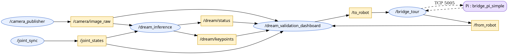

# DREAM Validation Dashboard

Outil de validation en direct qui superpose l'estimation de pose **caméra-seule**
de DREAM aux angles réels des encodeurs, avec un compteur MAE/RMSE par joint, des
courbes temps réel encodeur vs DREAM, un pilotage manuel du robot, un mode
automatique (poses 3cam) et une acquisition CSV.

Nœud : `mycobot_gateway/mycobot_gateway/dream_validation_dashboard.py`
Checkpoint courant : `vgg_ultimate_v4_mix_ft_e30`.

---

# Lancer le dashboard de validation DREAM

*Procédure vérifiée le 2026-07-16 sur le robot réel (`10.10.0.221`).*

Le dashboard est un **pur consommateur** : il ne capture pas d'image, ne fait pas
d'inférence, ne parle pas au robot. Lancé seul, il affiche une fenêtre vide
(`Caméra : 0.0 FPS`, `DREAM : 0.0 Hz`, encodeurs à `0.0`). Il lui faut **quatre
autres nœuds**, chacun dans son propre terminal, tous laissés ouverts.

## Le piège numéro un — le `.venv`

**Toute commande ROS2 échoue si `(.venv)` apparaît dans le prompt.** Le venv à la
racine du repo met son `bin/` en tête du `PATH`, donc `python3` devient celui du
venv, avec son NumPy 2.4.4 et son PyQt5/cv2 :

| Symptôme | Cause |
|----------|-------|
| `Could not load the Qt platform plugin "xcb" in ".../.venv/.../cv2/qt/plugins"` | Le Qt de `cv2` (venv) écrase celui de PyQt5 |
| `KeyError: 16` dans `cv_bridge.cv2_to_imgmsg` | NumPy 2.4.4 (venv) vs `cv_bridge` compilé NumPy 1.x |

**Correctif :** `deactivate` avant de sourcer. C'est tout — inutile de changer de
répertoire (`ros2 run` résout via `install/`, pas via le CWD) et inutile de
réinstaller DREAM. Le réglage `"python.terminal.activateEnvironment": false` dans
`.vscode/settings.json` empêche VS Code de le réactiver à chaque nouveau terminal.

**Vérification en une ligne** — doit afficher `/usr/lib/python3/dist-packages/…`,
jamais `.venv` :

```bash
python3 -c "import numpy; print(numpy.__file__)"
```

## Préambule (dans chacun des 5 terminaux)

```bash
deactivate                              # si (.venv) est dans le prompt
source /opt/ros/jazzy/setup.bash
source ~/Osama_ws/install/setup.bash    # PAS ~/ros_jazzy/install — autre clone
```

## Les 5 nœuds

```bash
# 1 — caméra Arducam → /camera/image_raw
ros2 run mycobot_gateway camera_publisher

# 2 — inférence DREAM → /dream/keypoints
#     ⚠ défauts trompeurs : camera_topic=/synth_camera/image (Gazebo)
#       et model_name=vgg_weighted_e50 (ancien). À surcharger :
ros2 run mycobot_gateway dream_inference --ros-args \
  -p camera_topic:=/camera/image_raw \
  -p model_name:=vgg_ultimate_v4_mix_ft_e30

# 3 — encodeurs → /joint_states   (sans lui : statut NO_JOINTS)
ros2 run mycobot_gateway joint_sync

# 4 — pont ROS2 ↔ Pi (TCP 5005)   (sans lui : le bras ne bouge pas)
ros2 run mycobot_gateway bridge_tour

# 5 — le dashboard
ros2 run mycobot_gateway dream_validation_dashboard
```

Côté Pi, `bridge_pi_simple.py` doit tourner. Vérification :
`ping -c1 10.10.0.221` puis `bash scripts/real_robot_preflight.sh`.

## Diagnostic

| Ce que montre le dashboard | Nœud manquant / cause | Action |
|---------------------------|----------------------|--------|
| `Caméra : 0.0 FPS`, image noire | `camera_publisher` | Le relancer |
| `DREAM : 0.0 Hz`, colonne px vide | `dream_inference`, ou il écoute `/synth_camera/image` | Relancer avec `-p camera_topic:=/camera/image_raw` |
| `Statut : NO_JOINTS`, encodeurs `0.0` | `joint_sync` | Le relancer |
| `SET Angles` sans effet, `/from_robot` muet | `bridge_tour` mort | Le relancer ; sinon redémarrer le bridge du Pi |
| `État servos : relâché (power_off envoyé)` | servos coupés | **Tenir le bras**, puis cliquer 🔒 Fixer (power_on) |

> Sécurité robot : bras dégagé et surveillé avant toute commande de mouvement.

---

## Graphe ROS

Vue en direct : `rqt_graph` (Nodes/Topics, désactiver « Dead sinks » / « Leaf
topics », filtre = `/`). Si rqt reste vide : le terminal a conda/`.venv` actif
(`conda deactivate` puis relancer).

Graphe réel capturé du système (nœuds = ovales, topics = rectangles) :



Rendu équivalent en mermaid :


| Topic | Type | Producteur → Consommateur |
|-------|------|---------------------------|
| `/camera/image_raw` | `sensor_msgs/Image` | camera_publisher → dream_inference, dashboard |
| `/dream/keypoints` | `std_msgs/Float64MultiArray` | dream_inference → dashboard |
| `/dream/status` | `std_msgs/String` | dream_inference → dashboard |
| `/joint_states` | `sensor_msgs/JointState` | joint_sync → dashboard |
| `/to_robot` | `std_msgs/String` (JSON) | dashboard → bridge_tour → Pi |
| `/from_robot` | `std_msgs/String` | Pi → bridge_tour → dashboard |

---

## Interface

Trois colonnes : **Vue caméra** | **Courbes** | **Contrôle**.

- **Vue caméra** — image 640×480 avec squelette encodeur (vert) vs DREAM (rose),
  cadences FPS/Hz et pastille santé de pose incrustées ; dessous : `MAE 30s`,
  `RMSE`, `RMS reprojection` et le tableau d'erreur pixel par keypoint.
- **Courbes** — 6 graphes, angle encodeur (FK, plein) vs DREAM (pointillé), titre
  `encodeur X° · DREAM Y° · erreur Z°`. Bouton « A » = auto-range.
- **Contrôle** — Mode manuel, Mode automatique, KPI.

### Mode manuel
`SET Angles` / `SET Coords` commandent le robot (protocole `simple_gui.py`).
Fixer/Relâcher = `power_on` / `release_all_servos`.

### Mode automatique
Un clic = **une** pose aléatoire sûre (générateur repris de
`training/capture_real_3cam.py` : chaque joint dans 50 % de sa course, rejet si la
FK entre en collision table/base). ⚠ commande le vrai robot.

### Acquisition CSV
Case à cocher (panneau manuel). Sortie sous `training/dream/acquisitions/` :

- `manuel/` — nommé d'après le(s) joint(s) changé(s).
- `auto/` — nommé avec les 6 joints.

Chaque fichier contient les 6 joints :
`t_s, enc_J1..6, dream_J1..6, err_J1..6`, capturés sur ~4 s (mouvement + pose
stabilisée), suivis de deux lignes de résumé `MAE` et `RMSE` par joint.

---

## Note observabilité

J5 est faiblement observable et J6 structurellement inobservable (aucun keypoint
ne dépend de leur rotation) : leur `dream` recopie l'encodeur (erreur ≈ 0), ce
n'est pas une vraie mesure caméra. Les mesures utiles sont J1–J4. Voir
`CLAUDE.md` § « DREAM pose-estimation — validation status » et
`training/dream/README.md`.

---

# Diagnostic latence — 2026-07-16

*Point de départ : `Latence totale image → angles : 1485 ms`, `DREAM : 1.7 Hz`,
`Caméra : 4.7 FPS` alors que le nœud est réglé à 30 fps. **Aucun code n'a été
gardé** — tout a été reverté à la demande. Ce qui suit est le diagnostic, pour
repartir de là sans refaire les mesures.*

## Cause racine : `net.core.rmem_max` (non corrigée)

```
net.core.rmem_max = 212992      →  208 Ko   (défaut Linux, jamais touché)
taille d'une image             →  921 Ko   (640×480×3, brute)
RMW                            →  rmw_fastrtps_cpp (Fast DDS, UDP)
```

**Le tampon de réception du noyau est 4.4× plus petit qu'une seule image.** Fast DDS
fragmente les 921 Ko en ~640 datagrammes ; le socket déborde, des fragments sont
perdus, et Fast DDS jette l'image entière. C'est le problème classique de ROS2 avec
`sensor_msgs/Image` brut.

Correctif à tester (nécessite sudo, non persistant, réversible) :
```bash
sudo sysctl -w net.core.rmem_max=8388608      # ~9 images ; doc Fast DDS
# puis redémarrer les nœuds (les sockets sont créés au démarrage)
# retour arrière : sudo sysctl -w net.core.rmem_max=212992
```

## Preuves qui isolent la cause

| Mesure | Résultat | Ce que ça élimine |
|--------|----------|-------------------|
| `dmesg` / `kern.log` | 0 erreur USB/UVC/xhci | matériel, driver |
| Banc hors ROS (`bench_capture.py`) | **0 gel / 800 captures**, 27.8 Hz | OpenCV, capture |
| `camera_publisher` instrumenté | **0 callback > 100 ms** | le nœud publie bien à 30 Hz |
| `ros2 topic hz` côté abonné | 5 Hz, trous jusqu'à **3.6 s** | → le transport DDS |
| Gels avec / sans `dream_inference` | 12 vs 10 par 30 s (**identique**) | le nombre d'abonnés |

Le publisher est sain, les abonnés ne reçoivent pas : la perte est **entre les deux**.

⚠️ Deux pièges de mesure rencontrés — le pourcentage de gels est trompeur (il varie
avec le nombre de messages reçus, pas avec le nombre de gels : toujours ~10 par 30 s),
et le **débit médian** est la bonne métrique (la moyenne est écrasée par les gels).

## Correctifs caméra testés puis revertés

Mesurés comme gagnants, **annulés à la demande** — à reprendre si la latence
redevient un sujet :

| Changement | Gain mesuré |
|-----------|-------------|
| `cv2.VideoCapture(i, cv2.CAP_V4L2)` | OpenCV choisissait GStreamer, qui **ignore silencieusement** `FOURCC`/`BUFFERSIZE`/`FPS` (« unhandled property » dans les logs). D'où YUYV, plafonné à **10 fps** contre 30 en MJPG. |
| `CAP_PROP_BUFFERSIZE = 2` | 1 empêche le double-buffering (13.9 Hz) ; 2/3/4 donnent 27.8 Hz. Une file profonde rend l'image la plus **ancienne**. |
| `grab()` + stamp + `retrieve()` | Le stamp posé après `read()` **masque la péremption** : il affichait 1.4 ms sur des images périmées. |
| Relire `CAP_PROP_FOURCC` après le `set` | `cap.set()` renvoie un succès même quand le driver refuse. |

Résultat mesuré de l'ensemble : latence image→keypoints **1485 → 91 ms**, débit
médian **3.1 → 27.7 Hz**, keypoints **7/7 dans 100% des frames**. Les gels DDS,
eux, restaient — ils sont indépendants de ces correctifs.

## Ce qui n'est PAS en cause

- `exposure_dynamic_framerate` : mis à 0, effet nul (1.91 → 2.16 Hz).
- Le dashboard : il sature un cœur (102% CPU) et double la cadence quand on le
  ferme, mais il ne cause **pas** les gels (identiques avec 0 abonné).
- `CompressedImage` : envisagé, **abandonné** — le transport n'est pas saturé en
  volume, c'est le tampon qui est sous-dimensionné. À reconsidérer seulement si
  `rmem_max` ne suffit pas.

## Rappels

- **DREAM est déjà installé** (`/tmp/DREAM`, editable dans `venv_dream`). Vérifier
  avec `import dream` avant d'envisager un clone — `/tmp` peut être vidé au reboot.
- La case **⚠ Mode cohérence** est **OFF par défaut** et doit le rester pour une
  mesure DREAM indépendante. Voir `CLAUDE.md` § 2026-07-15.
- Le robot **n'a pas de gripper**.
- Sur la fiabilité des angles mesurés, voir
  [`training/dream/J4_OBSERVABILITY_DIAG.md`](../training/dream/J4_OBSERVABILITY_DIAG.md).
