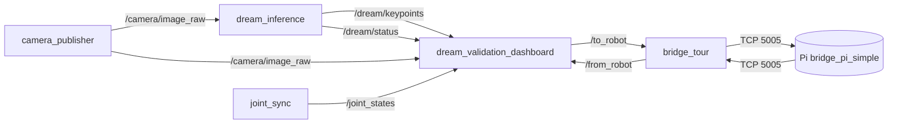

# DREAM Validation Dashboard

Outil de validation en direct qui superpose l'estimation de pose **caméra-seule**
de DREAM aux angles réels des encodeurs, avec un compteur MAE/RMSE par joint, des
courbes temps réel encodeur vs DREAM, un pilotage manuel du robot, un mode
automatique (poses 3cam) et une acquisition CSV.

Nœud : `mycobot_gateway/mycobot_gateway/dream_validation_dashboard.py`
Checkpoint courant : `vgg_ultimate_v4_mix_ft_e30`.

---

## Lancement — 5 terminaux

Avant **chaque** terminal ROS2 : `conda deactivate` puis sourcer l'overlay.

```bash
conda deactivate
source /opt/ros/jazzy/setup.bash
source ~/ros_jazzy/install/setup.bash
```

| # | Terminal | Commande | Rôle |
|---|----------|----------|------|
| 1 | **Caméra** | `ros2 run mycobot_gateway camera_publisher` | Publie le flux USB sur `/camera/image_raw` |
| 2 | **Inférence DREAM** | `ros2 run mycobot_gateway dream_inference` | VGG-19 → belief maps → keypoints 2D sur `/dream/keypoints` (+ `/dream/status`) |
| 3 | **Joint sync** | `ros2 run mycobot_gateway joint_sync` | Publie les angles encodeurs réels sur `/joint_states` |
| 4 | **Pont Tour ↔ Pi** | `ros2 run mycobot_gateway bridge_tour` | Relaie `/to_robot` → Pi (TCP 5005) et Pi → `/from_robot` |
| 5 | **Dashboard** | `ros2 run mycobot_gateway dream_validation_dashboard` | UI : caméra + courbes + pilotage + KPI |

Sur le **Pi** (`10.10.0.221`), le pont bas niveau doit tourner :

```bash
ssh er@10.10.0.221
python3 bridge_pi_simple.py
```

> Sécurité robot : `ping -c1 10.10.0.221`, puis `bash scripts/real_robot_preflight.sh`
> avant toute commande de mouvement. Bras dégagé et surveillé.

---

## Graphe ROS



| Topic | Type | Producteur → Consommateur |
|-------|------|---------------------------|
| `/camera/image_raw` | `sensor_msgs/Image` | camera_publisher → dream_inference, dashboard |
| `/dream/keypoints` | `std_msgs/Float64MultiArray` | dream_inference → dashboard |
| `/dream/status` | `std_msgs/String` | dream_inference → dashboard |
| `/joint_states` | `sensor_msgs/JointState` | joint_sync → dashboard |
| `/to_robot` | `std_msgs/String` (JSON) | dashboard → bridge_tour → Pi |
| `/from_robot` | `std_msgs/String` | Pi → bridge_tour → dashboard |

---

## Interface

Trois colonnes : **Vue caméra** | **Courbes** | **Contrôle**.

- **Vue caméra** — image 640×480 avec squelette encodeur (vert) vs DREAM (rose),
  cadences FPS/Hz et pastille santé de pose incrustées ; dessous : `MAE 30s`,
  `RMSE`, `RMS reprojection` et le tableau d'erreur pixel par keypoint.
- **Courbes** — 6 graphes, angle encodeur (FK, plein) vs DREAM (pointillé), titre
  `encodeur X° · DREAM Y° · erreur Z°`. Bouton « A » = auto-range.
- **Contrôle** — Mode manuel, Mode automatique, KPI.

### Mode manuel
`SET Angles` / `SET Coords` commandent le robot (protocole `simple_gui.py`).
Fixer/Relâcher = `power_on` / `release_all_servos`.

### Mode automatique
Un clic = **une** pose aléatoire sûre (générateur repris de
`training/capture_real_3cam.py` : chaque joint dans 50 % de sa course, rejet si la
FK entre en collision table/base). ⚠ commande le vrai robot.

### Acquisition CSV
Case à cocher (panneau manuel). Sortie sous `training/dream/acquisitions/` :

- `manuel/` — nommé d'après le(s) joint(s) changé(s).
- `auto/` — nommé avec les 6 joints.

Chaque fichier contient les 6 joints :
`t_s, enc_J1..6, dream_J1..6, err_J1..6`, capturés sur ~4 s (mouvement + pose
stabilisée), suivis de deux lignes de résumé `MAE` et `RMSE` par joint.

---

## Note observabilité

J5 est faiblement observable et J6 structurellement inobservable (aucun keypoint
ne dépend de leur rotation) : leur `dream` recopie l'encodeur (erreur ≈ 0), ce
n'est pas une vraie mesure caméra. Les mesures utiles sont J1–J4. Voir
`CLAUDE.md` § « DREAM pose-estimation — validation status » et
`training/dream/README.md`.
