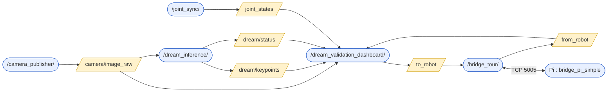

# DREAM Validation Dashboard

Outil de validation en direct qui superpose l'estimation de pose **caméra-seule**
de DREAM aux angles réels des encodeurs, avec un compteur MAE/RMSE par joint, des
courbes temps réel encodeur vs DREAM, un pilotage manuel du robot, un mode
automatique (poses 3cam) et une acquisition CSV.

Nœud : `mycobot_gateway/mycobot_gateway/dream_validation_dashboard.py`
Checkpoint courant : `vgg_ultimate_v4_mix_ft_e30`.

---

# Lancer le dashboard de validation DREAM

*Procédure vérifiée le 2026-07-16 sur le robot réel (`10.10.0.221`).*

Le dashboard est un **pur consommateur** : il ne capture pas d'image, ne fait pas
d'inférence, ne parle pas au robot. Lancé seul, il affiche une fenêtre vide
(`Caméra : 0.0 FPS`, `DREAM : 0.0 Hz`, encodeurs à `0.0`). Il lui faut **quatre
autres nœuds**, chacun dans son propre terminal, tous laissés ouverts.

## Le piège numéro un — le `.venv`

**Toute commande ROS2 échoue si `(.venv)` apparaît dans le prompt.** Le venv à la
racine du repo met son `bin/` en tête du `PATH`, donc `python3` devient celui du
venv, avec son NumPy 2.4.4 et son PyQt5/cv2 :

| Symptôme | Cause |
|----------|-------|
| `Could not load the Qt platform plugin "xcb" in ".../.venv/.../cv2/qt/plugins"` | Le Qt de `cv2` (venv) écrase celui de PyQt5 |
| `KeyError: 16` dans `cv_bridge.cv2_to_imgmsg` | NumPy 2.4.4 (venv) vs `cv_bridge` compilé NumPy 1.x |

**Correctif :** `deactivate` avant de sourcer. C'est tout — inutile de changer de
répertoire (`ros2 run` résout via `install/`, pas via le CWD) et inutile de
réinstaller DREAM. Le réglage `"python.terminal.activateEnvironment": false` dans
`.vscode/settings.json` empêche VS Code de le réactiver à chaque nouveau terminal.

**Vérification en une ligne** — doit afficher `/usr/lib/python3/dist-packages/…`,
jamais `.venv` :

```bash
python3 -c "import numpy; print(numpy.__file__)"
```

## Préambule (dans chacun des 5 terminaux)

```bash
deactivate                              # si (.venv) est dans le prompt
source /opt/ros/jazzy/setup.bash
source ~/Osama_ws/install/setup.bash    # PAS ~/ros_jazzy/install — autre clone
```

## Les 5 nœuds

```bash
# 1 — caméra Arducam → /camera/image_raw
ros2 run mycobot_gateway camera_publisher

# 2 — inférence DREAM → /dream/keypoints
#     ⚠ défauts trompeurs : camera_topic=/synth_camera/image (Gazebo)
#       et model_name=vgg_weighted_e50 (ancien). À surcharger :
ros2 run mycobot_gateway dream_inference --ros-args \
  -p camera_topic:=/camera/image_raw \
  -p model_name:=vgg_ultimate_v4_mix_ft_e30

# 3 — encodeurs → /joint_states   (sans lui : statut NO_JOINTS)
ros2 run mycobot_gateway joint_sync

# 4 — pont ROS2 ↔ Pi (TCP 5005)   (sans lui : le bras ne bouge pas)
ros2 run mycobot_gateway bridge_tour

# 5 — le dashboard
ros2 run mycobot_gateway dream_validation_dashboard
```

Côté Pi, `bridge_pi_simple.py` doit tourner. Vérification :
`ping -c1 10.10.0.221` puis `bash scripts/real_robot_preflight.sh`.

## Alternative — un seul launch (auto-détection 1 ou 2 caméras)

Depuis 2026-07-23, un launch unique remplace les 5 terminaux et **détecte tout
seul** les caméras branchées (voir § Multi-caméras plus bas) :

```bash
ros2 launch mycobot_gateway dream_multicam.launch.py
# forcer une caméra :  ... cameras:=arducam
# autre checkpoint :   ... model_name:=vgg_ultimate_v4_mix_ft_e30
```

Il sonde `v4l2-ctl`, spawne une branche `camera_publisher + dream_inference` par
caméra reconnue (chacune avec **son** intrinsèque et **son** exposition), puis
`joint_sync`, `bridge_tour` et le dashboard. Toujours `deactivate` le `.venv`
d'abord (le launch tourne via `/usr/bin/python3`, mais un `.venv` en tête de
`PATH` casse quand même `python3`). Les 5 nœuds manuels restent valables pour
déboguer une branche isolément.

## Diagnostic

| Ce que montre le dashboard | Nœud manquant / cause | Action |
|---------------------------|----------------------|--------|
| `Caméra : 0.0 FPS`, image noire | `camera_publisher` | Le relancer |
| `DREAM : 0.0 Hz`, colonne px vide | `dream_inference`, ou il écoute `/synth_camera/image` | Relancer avec `-p camera_topic:=/camera/image_raw` |
| `Statut : NO_JOINTS`, encodeurs `0.0` | `joint_sync` | Le relancer |
| `SET Angles` sans effet, `/from_robot` muet | `bridge_tour` mort | Le relancer ; sinon redémarrer le bridge du Pi |
| `État servos : relâché (power_off envoyé)` | servos coupés | **Tenir le bras**, puis cliquer 🔒 Fixer (power_on) |

> Sécurité robot : bras dégagé et surveillé avant toute commande de mouvement.

---

## Graphe ROS

Vue en direct : `rqt_graph` (Nodes/Topics, désactiver « Dead sinks » / « Leaf
topics », filtre = `/`). Si rqt reste vide : le terminal a conda/`.venv` actif
(`conda deactivate` puis relancer).

Graphe réel capturé du système (nœuds = ovales, topics = rectangles) :


Rendu équivalent en mermaid :



| Topic | Type | Producteur → Consommateur |
|-------|------|---------------------------|
| `/camera/image_raw` | `sensor_msgs/Image` | camera_publisher → dream_inference, dashboard |
| `/dream/keypoints` | `std_msgs/Float64MultiArray` | dream_inference → dashboard |
| `/dream/status` | `std_msgs/String` | dream_inference → dashboard |
| `/joint_states` | `sensor_msgs/JointState` | joint_sync → dashboard |
| `/to_robot` | `std_msgs/String` (JSON) | dashboard → bridge_tour → Pi |
| `/from_robot` | `std_msgs/String` | Pi → bridge_tour → dashboard |

---

## Interface

Trois colonnes : **Vue caméra** | **Courbes** | **Contrôle**.

- **Vue caméra** — image 640×480 avec squelette encodeur (vert) vs DREAM (rose),
  cadences FPS/Hz et pastille santé de pose incrustées ; dessous : `MAE 30s`,
  `RMSE`, `RMS reprojection` et le tableau d'erreur pixel par keypoint.
- **Courbes** — 6 graphes, angle encodeur (FK, plein) vs DREAM (pointillé), titre
  `encodeur X° · DREAM Y° · erreur Z°`. Bouton « A » = auto-range.
- **Contrôle** — Mode manuel, Mode automatique, KPI.

### Mode manuel
`SET Angles` / `SET Coords` commandent le robot (protocole `simple_gui.py`).
Fixer/Relâcher = `power_on` / `release_all_servos`.

### Mode automatique
Un clic = **une** pose aléatoire sûre (générateur repris de
`training/capture_real_3cam.py` : chaque joint dans 50 % de sa course, rejet si la
FK entre en collision table/base). ⚠ commande le vrai robot.

### Acquisition CSV
Case à cocher (panneau manuel). Sortie sous `training/dream/acquisitions/` :

- `manuel/` — nommé d'après le(s) joint(s) changé(s).
- `auto/` — nommé avec les 6 joints.
- `…/<filtre>/` — sous-dossier créé automatiquement (`kalman/`, `passe_bas/` ou
  `moyenne/`) selon le **filtre temporel** actif au moment de l'écriture. La
  colonne `dream` y contient la valeur **filtrée** ; sans filtre (`aucun`, défaut),
  elle contient la valeur **brute**, dans le dossier parent. Les deux séries
  restent ainsi comparables sans mélange (rejouer la même pose filtrée/brute → un
  CSV dans chaque emplacement).

Chaque fichier contient les 6 joints :
`t_s, enc_J1..6, dream_J1..6, err_J1..6`, capturés sur ~4 s (mouvement + pose
stabilisée), suivis de deux lignes de résumé `MAE` et `RMSE` par joint.

> ⚠ **Mesurer à l'arrêt, pas pendant le mouvement.** En mode auto, l'acquisition
> démarre dès l'envoi de la pose : le CSV capture le transitoire où l'encodeur
> balaie et DREAM peine à suivre (erreur gonflée). Pour une vraie mesure de
> validation, lire l'erreur une fois la pose **stabilisée**.

### Filtrage temporel des courbes (3 filtres — aucun par défaut)
Groupe de **boutons radio** (panneau KPI, cadre « Filtrage temporel des
courbes ») : `aucun` · `kalman` · `passe_bas` · `moyenne`. **`aucun` est le défaut
volontaire** — le Kalman n'est **plus** activé d'office. Tous lissent **les
estimations DREAM elles-mêmes** — jamais l'encodeur. Changer de filtre appelle
`reset_kalman()` (purge des trois états, pas de transitoire au basculement).

| Filtre | Modèle | Réglage | Comportement |
|--------|--------|---------|--------------|
| **kalman** | 1D vitesse constante (`KalmanAngle1D`, état `[angle, vitesse]`) | `q_pos = radians(0.5)²`, portail `_KF_OUTLIER_GATE_SIGMA = 3.0` σ | Très lisse au repos ; **dépasse** sur un saut d'angle (inertie de vitesse) |
| **passe_bas** | EMA `y = α·x + (1-α)·y_prev` | `_EMA_ALPHA = 0.3` | Sans dépassement, retard constant ; simple et prévisible |
| **moyenne** | Moyenne glissante des N dernières valeurs | `_MA_WINDOW = 6` | Le plus lisse ; retard = fenêtre/2 ; suit un plateau par palier |

**Effet de bord du Kalman (vitesse constante) :** sur un changement d'angle
brusque, le filtre accumule de la vitesse et **dépasse** puis redescend. Sur un
vrai mouvement commandé, le portail peut aussi **geler** l'ancienne valeur en la
prenant pour une aberration → d'où le `reset_kalman()` ci-dessous.

**Correctif — `reset_kalman()`** : quand l'utilisateur commande une pose
(`SET Angles`, `SET Coords`, `Pose automatique`), les filtres sont **réinitialisés**.
On *sait* que le grand mouvement qui suit est réel : la prochaine mesure DREAM
devient la nouvelle base, sans rejet par le portail. Le lissage/rejet reste actif
le reste du temps (bras au repos).

### Poids solveur — mode cohérence
`_CONSISTENCY_REG_VEC = [10, 40, 40, 40, 40, 1.5]` (J1→J6). Poids de
régularisation vers la branche encodeur, utilisés **uniquement** en mode
cohérence (`use_encoder_seed`) :

- **J1 = 10, J2 = 40** — J2 bascule sur la mauvaise branche monoculaire sous la
  caméra quasi-zénithale (ambiguïté avant/arrière, ~45° d'erreur à ~10 px) ;
  l'épingler à l'encodeur ramène ça à ~2-3°.
- **J3-J5 = 40** — joints distaux faiblement observables : l'angle dérive de
  dizaines de degrés à reprojection quasi-constante ; le poids fort les tient
  près de la branche encodeur.
- **J6 = 1.5** — 0 keypoint observant : reste au seed encodeur quel que soit le
  poids (rien ne l'en tire).

> Baisser ces poids laisse les keypoints DREAM détectés « tirer » l'angle
> (raffinement réel), mais ajoute du bruit sur J1/J2 et **ne change rien** aux
> joints dont les keypoints distaux ne sont pas détectés (rien à raffiner). Le
> vrai levier pour J3-J6 est la **détection distale** (modèle) ou une **2ᵉ
> caméra**, pas le poids. Voir `CLAUDE.md` § observabilité.

---

## Multi-caméras — fusion (auto-détection), 2026-07-23/24

Le dashboard prend **1 ou 2 caméras** de façon flexible : brancher une 2ᵉ caméra
calibrée suffit, aucune édition de code. But : lever les ambiguïtés monoculaires
(branche J2, joints distaux J3-J5) et l'**occlusion** — ce qu'une vue observe mal
ou pas du tout, l'autre le contraint.

### Caméras reconnues (`vision/camera_registry.py`)

| Caméra | Identité V4L2 | Intrinsèque | Exposition |
|--------|---------------|-------------|------------|
| **arducam** | carte contient « arducam » | `training/calibration/cam_3.meta.json` (fx≈496, 640×480) | manuelle **75** |
| **svpro** | carte contient « svpro » | `cam_2.meta.json` (calibrée 800×600, **rescalée** auto → 640×480) | normale (auto) |

> **Pas de recalibration** : les deux intrinsèques existent déjà. Le registry
> charge celle de chaque caméra et rescale à la résolution de capture. L'**Astra**
> est hors périmètre (pas de nœud V4L2, pas d'intrinsèque PnP — voir `CLAUDE.md`
> 2026-07-13). Topics : arducam garde les noms legacy (`/camera/image_raw`,
> `/dream/keypoints`) ; SVPRO publie sur `/camera_svpro/image_raw`,
> `/dream_svpro/keypoints`.

Graphe ROS2 live (2 caméras, mode FUSION), une branche
`camera_publisher → image → dream_inference → keypoints` par caméra convergeant
vers le dashboard :


### Ce que fait la fusion — architecture *solve-then-fuse*

- **1 caméra calibrée** → mode MONO, comportement historique inchangé.
- **≥2 caméras exploitables** (chacune ≥4 keypoints) → mode **FUSION**, en **deux
  temps** :
  1. **Résolution séparée par caméra** — chaque vue résout son propre `q` avec le
     mode cohérence (`_solve_view_consistency`, seed encodeur + `_CONSISTENCY_REG_VEC`,
     `reproj_px` retournée). Une caméra ne pollue jamais le fit de l'autre.
  2. **Fusion par joint, pondérée par l'observabilité** — pour chaque joint on ne
     retient que les caméras dont **le keypoint qui observe ce joint** est détecté
     ET reprojette sous `JOINT_CONFIDENCE_PX_THRESHOLD = 15 px`, puis on moyenne.
     Résultat : le `q` fusionné n'est **jamais pire** que la meilleure caméra sur
     chaque joint, et une occlusion sur une vue est reprise par l'autre.
- **Repli mono** : si la primaire (arducam) devient aveugle mais qu'une autre vue
  reste exploitable, l'estimation bascule sur elle (`_solve_single_view`, badge
  **MONO via svpro**) au lieu de tout afficher « — ».

> *Pourquoi solve-then-fuse et pas un bundle partagé ?* Le bundle (un `q` unique
> résolu contre toutes les vues, `solve_joint_angles_multiview` — import conservé)
> **basculait de branche** (J1 = −43°) : une vue à mauvaise branche monoculaire
> tirait le fit partagé. Résoudre chaque vue d'abord, puis fusionner par joint,
> supprime ce couplage. MAE retombée à ~1.1-1.9° en fusion.

Le mode cohérence (`use_encoder_seed`) et `_CONSISTENCY_REG_VEC` s'appliquent
par vue. Les mécanismes mono (WarmStartMonitor, borne de pose, cold-restart) ne
s'appliquent pas en fusion.

### Affichage multi-vues

- **Vues empilées verticalement** (arducam en haut, SVPRO dessous — en colonne
  pour ne pas casser la mise en page). Chaque vue secondaire porte le **même HUD**
  que la primaire (`Caméra : FPS`, `DREAM : Hz`, pastille santé de pose), pas un
  compteur « DREAM svpro : X/7 ».
- **Tableau keypoint = fusion** : par keypoint, erreur **moyenne des caméras qui
  le détectent**, étiquetée `(fusion)` si ≥2, sinon `(nom caméra)`, sinon
  `non détecté`. Ligne de synthèse **Détection globale (fusion) : N/7 kp · RMS X px
  [arducam A/7 + svpro B/7]** = union des deux caméras.
- **Badge KPI** : **🔗 FUSION N vues** ou **MONO via {source}**.

### Anti-clignotement (stabilité visuelle), 2026-07-24

- **Keypoints tenus** : chaque keypoint secondaire reste affiché **0.8 s** après sa
  dernière détection (`display_keypoints(grace=0.8)`) — si une inférence rate un
  point, il ne disparaît/réapparaît plus. **Affichage seul** : le solveur/la fusion
  utilisent toujours les détections **réelles** courantes, la mesure d'angle reste
  honnête.
- **Pastille de pose** : verte tant que la vue a détecté ≥4 keypoints dans la
  dernière **1 s** (`recently_detecting(grace=1.0)` + `prev_rvec` posé), au lieu de
  virer au jaune dès qu'une frame rate. Corrige la pastille qui jaunissait « alors
  que rien n'a bougé ».

Voir `docs/DREAM_VALIDATION_LAUNCH.md` pour le graphe des topics multi-branches.

---

## Note observabilité

J5 est faiblement observable et J6 structurellement inobservable (aucun keypoint
ne dépend de leur rotation) : leur `dream` recopie l'encodeur (erreur ≈ 0), ce
n'est pas une vraie mesure caméra. Les mesures utiles sont J1–J4. Voir
`CLAUDE.md` § « DREAM pose-estimation — validation status » et
`training/dream/README.md`.

---

# Diagnostic latence — 2026-07-16

*Point de départ : `Latence totale image → angles : 1485 ms`, `DREAM : 1.7 Hz`,
`Caméra : 4.7 FPS` alors que le nœud est réglé à 30 fps. **Aucun code n'a été
gardé** — tout a été reverté à la demande. Ce qui suit est le diagnostic, pour
repartir de là sans refaire les mesures.*

## Cause racine : `net.core.rmem_max` (non corrigée)

```
net.core.rmem_max = 212992      →  208 Ko   (défaut Linux, jamais touché)
taille d'une image             →  921 Ko   (640×480×3, brute)
RMW                            →  rmw_fastrtps_cpp (Fast DDS, UDP)
```

**Le tampon de réception du noyau est 4.4× plus petit qu'une seule image.** Fast DDS
fragmente les 921 Ko en ~640 datagrammes ; le socket déborde, des fragments sont
perdus, et Fast DDS jette l'image entière. C'est le problème classique de ROS2 avec
`sensor_msgs/Image` brut.

Correctif à tester (nécessite sudo, non persistant, réversible) :
```bash
sudo sysctl -w net.core.rmem_max=8388608      # ~9 images ; doc Fast DDS
# puis redémarrer les nœuds (les sockets sont créés au démarrage)
# retour arrière : sudo sysctl -w net.core.rmem_max=212992
```

## Preuves qui isolent la cause

| Mesure | Résultat | Ce que ça élimine |
|--------|----------|-------------------|
| `dmesg` / `kern.log` | 0 erreur USB/UVC/xhci | matériel, driver |
| Banc hors ROS (`bench_capture.py`) | **0 gel / 800 captures**, 27.8 Hz | OpenCV, capture |
| `camera_publisher` instrumenté | **0 callback > 100 ms** | le nœud publie bien à 30 Hz |
| `ros2 topic hz` côté abonné | 5 Hz, trous jusqu'à **3.6 s** | → le transport DDS |
| Gels avec / sans `dream_inference` | 12 vs 10 par 30 s (**identique**) | le nombre d'abonnés |

Le publisher est sain, les abonnés ne reçoivent pas : la perte est **entre les deux**.

⚠️ Deux pièges de mesure rencontrés — le pourcentage de gels est trompeur (il varie
avec le nombre de messages reçus, pas avec le nombre de gels : toujours ~10 par 30 s),
et le **débit médian** est la bonne métrique (la moyenne est écrasée par les gels).

## Ce qui n'est PAS en cause

- `exposure_dynamic_framerate` : mis à 0, effet nul (1.91 → 2.16 Hz).
- Le dashboard : il sature un cœur (102% CPU) et double la cadence quand on le
  ferme, mais il ne cause **pas** les gels (identiques avec 0 abonné).

## Rappels

- **DREAM vit dans `/tmp/DREAM`** (editable dans `venv_dream`), et `/tmp` est vidé
  au reboot : il faut donc **le re-cloner / réinstaller à chaque redémarrage**.
  Vérifier avec `import dream` ; s'il manque, refaire le clone dans `/tmp/DREAM`.
- La case **⚠ Mode cohérence** est **OFF par défaut** et doit le rester pour une
  mesure DREAM indépendante. Voir `CLAUDE.md` § 2026-07-15.
- Le robot **n'a pas de gripper**.
- Sur la fiabilité des angles mesurés, voir
  [`training/dream/J4_OBSERVABILITY_DIAG.md`](../training/dream/J4_OBSERVABILITY_DIAG.md).
