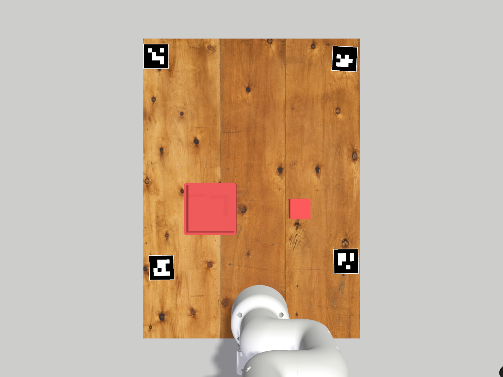

# Plateau réel dans Gazebo

La scène `real_table` reprend les dimensions du plateau mesurées le
09/09/2026 : **622 mm de longueur × 449 mm de largeur × 8,5 mm d'épaisseur**.
Elle utilise le MyCobot et la pince physique du banc `sim_grasp`.

Le plateau utilise une texture de bois couleur miel, avec veinage longitudinal,
nœuds, joints entre planches et traces d'usure, reconstruite à partir des photos
du plateau réel. Le matériau simule une finition satinée. Le veinage couvre
une seule fois les 449 × 622 mm, avec une texture aussi sur les chants.
Les positions exactes des nœuds et des rayures sont illustratives.
La [texture et son prompt de génération](../mycobot_description/models/wood_table/README.md)
sont conservés dans le paquet ROS.



Depuis la racine de ce dépôt :

```bash
conda deactivate
source /opt/ros/jazzy/setup.bash
colcon build --packages-select mycobot_description mycobot_gateway --symlink-install
source install/setup.bash
ros2 launch mycobot_gateway real_table.launch.py
```

Utiliser l'installation `install/` de ce dépôt après la construction : une
ancienne installation du workspace parent peut ne pas contenir les modèles
du plateau et sa texture. Relancer Gazebo pour recharger le matériau.

Pour lancer aussi le cycle de prise et dépose du cube rouge :

```bash
ros2 launch mycobot_gateway real_table.launch.py demo:=true
```

`headless:=true` lance le serveur avec rendu caméra sans fenêtre.
Le cycle attend les contrôleurs du bras et de la pince. Il utilise les poses
Gazebo pour vérifier la saisie physique. La caméra de cette scène publie
`/camera/image_raw` et `/camera/camera_info` ; le cycle ne s'asservit pas encore
sur les tags.

## Géométrie et provenance

Le repère est celui de la base : X vers l'avant, Y vers la gauche, Z vers le
haut. Le robot reste à l'origine et le dessus du plateau à Z = 0. Le centre
du solide est `(0,261 ; 0,017 ; −0,00425)` m ; ses limites sont X de −50 à
572 mm, Y de −207,5 à 241,5 mm, Z de −8,5 à 0 mm.

La position du plateau est **déduite des anciennes mesures des bords**, qui
restent approximatives. Les dimensions sont celles demandées ; les positions
de calibration n'ont pas été remesurées. Le plan gris sous le plateau représente
son support, à Z = −8,5 mm ; aucune hauteur de pieds n'a été supposée.

Les quatre tags viennent de
[`workspace_markers.yaml`](../training/calibration/workspace_markers.yaml),
et leurs orientations de
[`arducam_extrinsic_servo.yaml`](../training/calibration/arducam_extrinsic_servo.yaml).

| ID | X (mm) | Y (mm) | Rotation autour de Z |
|---|---:|---:|---:|
| 19 | 96,8 | 203,4 | −88,783° |
| 23 | 110 | −179 | −88,836° |
| 25 | 535 | 215 | −89,830° |
| 26 | 530 | −176 | −3,073° |

Chaque carré noir mesure **50 mm**, avec un support blanc de 52 mm. Le tag 25
est très proche du bord gauche selon les mesures disponibles. Les motifs sont
de vrais `DICT_4X4_50`, identiques aux mêmes IDs dans `DICT_4X4_1000`, construits
en géométrie SDF pour éviter toute dépendance aux textures de Gazebo Classic.
Le relief de rendu maximal est de 0,13 mm et n'ajoute aucune collision.

Le dossier `/home/genji/ros_jazzy/src/moveo_R5A` contient des textures ArUco
et des tags sur les maillons du Moveo ; les quatre repères du plateau sont
documentés dans le projet MyCobot actuel.

La caméra synthétique est centrée sur le plateau, à 0,90 m, en 1280 × 960,
avec un champ horizontal de 1,05 rad. Sa pose et ses paramètres sont propres
à la simulation : les extrinsèques de l'Arducam réelle ne s'appliquent pas à
cette caméra.

La démo utilise un cube rouge de 40 mm à `(0,22 ; −0,08)` m et un bac à
`(0,22 ; 0,10)` m. Ces emplacements sont choisis pour la simulation, à moins
de 320 mm de la base. La scène ne reproduit pas les erreurs mécaniques ou
optiques mesurées dans les diapositives (affaissement, biais d'échelle,
répétabilité).

## Fichiers

- [`real_table.sdf`](../mycobot_description/worlds/real_table.sdf) : plateau,
  caméra, objets et poses des tags.
- [`tabletop.dae`](../mycobot_description/models/wood_table/meshes/tabletop.dae) :
  maillage du plateau avec coordonnées de texture sur le dessus et les chants.
- [`real_table.launch.py`](../mycobot_gateway/launch/real_table.launch.py) :
  scène et option de démonstration.
- [`generate_gazebo_aruco.py`](../scripts/generate_gazebo_aruco.py) :
  régénération déterministe des quatre modèles ArUco avec OpenCV contrib.

```bash
.venv/bin/python scripts/generate_gazebo_aruco.py
```

Le banc historique reste disponible par
`ros2 launch mycobot_gateway sim_grasp.launch.py`.

## Validation du 09/09/2026

Construction des deux paquets réussie et SDF validé par `gz sdf -k`.
Dans Gazebo Harmonic, les trois contrôleurs sont actifs et l'image ROS de
1280 × 960 permet de détecter les quatre IDs 19, 23, 25 et 26 avec OpenCV.
Un cycle physique a levé le cube à Z = 108 mm, puis l'a déposé dans le bac
avec un écart de +5 mm en X et +3 mm en Y. C'est un essai, pas une mesure
de répétabilité. La détection des IDs ne valide pas la précision des coins
ou une calibration extrinsèque ; la bordure blanche étroite peut influencer
la localisation des coins.

## Validation de la texture bois du 10/09/2026

Construction des deux paquets réussie, SDF valide et géométrie du maillage
vérifiée (dimensions, normales extérieures et orientation du veinage).
Un lancement isolé de `real_table.launch.py headless:=true demo:=false`
a produit l'aperçu ci-dessus en 1280 × 960, sans erreur de chargement du
maillage ou de la texture. OpenCV détecte les quatre IDs 19, 23, 25 et 26
sur cette image texturée. Le cycle de saisie n'a pas été rejoué pour cette
modification visuelle.
