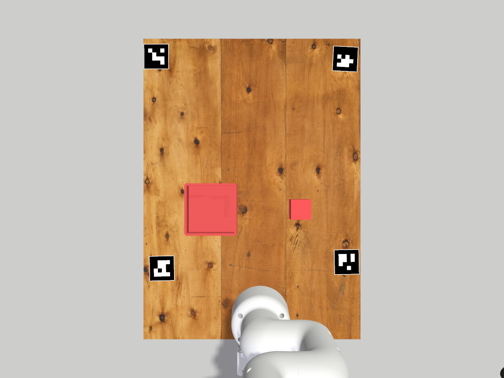
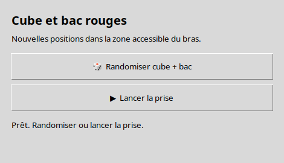
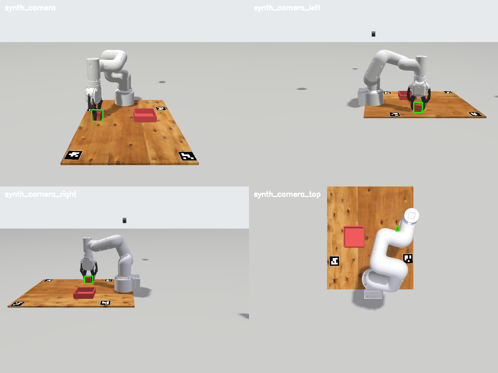

# Plateau réel dans Gazebo

> **Variante réaliste.** `banc_realiste_yolo26.sdf` reprend ce plateau et y met
> les **4 pièces peintes et leurs 4 bacs**, les marqueurs aux positions relevées
> **au robot** (`planche_actuelle.yaml` — ce monde-ci porte encore la forme au
> ruban, fausse de 10 à 16 mm), et les caméras **arducam et SVPRO à leur pose
> extrinsèque calibrée**. Lancement :
> `ros2 launch mycobot_gateway banc_realiste.launch.py`, détection par
> `scripts/yolo26_gazebo.py`. Voir
> [`../mycobot_description/README_GAZEBO.md`](../mycobot_description/README_GAZEBO.md).
>
> **La `table_camera` de ce monde-ci ne publie rien** : le monde ne déclare pas
> `gz-sim-sensors-system`, donc le capteur existe mais aucun greffon ne l'anime,
> et `bridge_camera:=true` ne peut rien donner — sans le moindre message d'erreur.


La scène `real_table` reprend les dimensions du plateau mesurées le
09/09/2026 : **622 mm de longueur × 449 mm de largeur × 8,5 mm d'épaisseur**.
Elle utilise le MyCobot et la pince physique du banc `sim_grasp`.

Le plateau utilise une texture de bois couleur miel, avec veinage longitudinal,
nœuds, joints entre planches et traces d'usure, reconstruite à partir des photos
du plateau réel. Le matériau simule une finition satinée. Le veinage couvre
une seule fois les 449 × 622 mm, avec une texture aussi sur les chants.
Les positions exactes des nœuds et des rayures sont illustratives.
La [texture et son prompt de génération](../mycobot_description/models/wood_table/README.md)
sont conservés dans le paquet ROS.



Depuis la racine de ce dépôt :

```bash
conda deactivate
source /opt/ros/jazzy/setup.bash
colcon build --packages-select mycobot_description mycobot_gateway --symlink-install
source install/setup.bash
ros2 launch mycobot_gateway real_table.launch.py
```

Utiliser l'installation `install/` de ce dépôt après la construction : une
ancienne installation du workspace parent peut ne pas contenir les modèles
du plateau et sa texture. Relancer Gazebo pour recharger le matériau.

Le lancement effectue maintenant **un cycle automatique guidé par les quatre
caméras**. Le cube et le bac rouges sont placés aléatoirement, à chaque lancement,
dans la partie accessible du plateau, à distance de la base et des tags,
avec un espace entre les deux objets.
Ils restent droits, sans rotation initiale. Le fichier SDF source reste inchangé :
le lancement crée une copie temporaire et la supprime à l'arrêt.

Avec l'interface graphique, un panneau **« Gazebo — Cube et bac rouges »**
s'ouvre à côté de Gazebo :

1. **Randomiser cube + bac** dégage la pince, vérifie les solutions de
   cinématique inverse et repositionne les deux objets dans la scène courante.
2. **Lancer la prise** localise le cube par les caméras puis le dépose dans le
   bac à sa nouvelle position.



Les boutons sont désactivés pendant les mouvements. Le serveur refuse aussi
les commandes concurrentes et les doubles clics. Après la dépose, randomiser
de nouveau avant de relancer. `panel:=false` masque ce panneau ; il ne démarre
pas avec `headless:=true`. `demo:=false` permet d'attendre le clic de l'utilisateur
au lieu de lancer immédiatement une prise.

Le repositionnement utilise `set_pose_vector` uniquement pour préparer la
scène entre deux essais. Le transport du cube pendant la prise reste physique.
La position du bac est transmise au détecteur pour déplacer son masque
d'exclusion, et au contrôleur pour mettre à jour la cible de dépose.

Pour afficher seulement la scène, sans mouvement automatique :

```bash
ros2 launch mycobot_gateway real_table.launch.py demo:=false
```

Le panneau reste disponible dans ce mode : cliquer sur **Randomiser cube + bac**,
attendre le message de fin, puis cliquer sur **Lancer la prise**. Répéter ces
deux actions pour un nouvel essai, sans relancer Gazebo.

Si une ancienne instance Gazebo provoque une fenêtre vide ou un conflit de
contrôleurs, lancer une instance isolée :

```bash
GZ_PARTITION=mycobot_table ROS_DOMAIN_ID=89 \
  ros2 launch mycobot_gateway real_table.launch.py demo:=false
```

Les outils ROS ouverts séparément doivent alors utiliser le même
`ROS_DOMAIN_ID=89`, et les commandes `gz` le même `GZ_PARTITION=mycobot_table`.

Pour reproduire une position aléatoire, ou reprendre la position historique :

```bash
ros2 launch mycobot_gateway real_table.launch.py seed:=7
ros2 launch mycobot_gateway real_table.launch.py randomize:=false
```

`headless:=true` lance le serveur avec rendu caméra sans fenêtre.
Le cycle attend les contrôleurs du bras et de la pince, puis trois estimations
visuelles fraîches et stables. La saisie est physique, par contact des doigts.
La pose Gazebo du cube sert uniquement à vérifier qu'il a été soulevé et déposé ;
elle ne fournit pas les coordonnées utilisées pour viser la prise. Un échec de
saisie déclenche une nouvelle localisation, avec au maximum trois essais.

### Vision et calibration des quatre caméras

Les quatre caméras du robot publient chacune `/<nom>/image` et
`/<nom>/camera_info`, avec les noms `synth_camera`, `synth_camera_right`,
`synth_camera_left` et `synth_camera_top`. Leurs intrinsèques sont lus dans les
messages `CameraInfo`. Les extrinsèques **connues de la simulation** sont
calculées à partir des montages fixes de l'URDF, avec conversion des axes du
capteur Gazebo vers les axes optiques OpenCV. Ce mode ne réalise pas une
calibration ArUco à partir des images et n'utilise aucun fichier de calibration
des caméras physiques. La cinématique place la base à l'origine du monde.

Le détecteur segmente le rouge, exclut le volume projeté du bac et ajuste les
silhouettes d'un cube de 40 mm posé sur le plateau à Z=0. Il estime X et Y ; la
hauteur du centre Z=20 mm découle de cette géométrie connue. L'ajustement utilise
les vues cohérentes disponibles parmi les quatre, avec au moins deux vues et
une erreur de reprojection inférieure à 3 pixels. Il rejette les vues masquées
ou incohérentes. Il ne s'agit donc pas d'une reconstruction 3D d'objets de forme
ou de hauteur inconnue.

La position visuelle alimente la cinématique inverse pour le survol, la
descente, le serrage, la levée et la dépose. Le bac reste fixe pendant un cycle ;
sa position est celle choisie lors de la préparation aléatoire (ou
`(0,22 ; 0,10)` m avec `randomize:=false`). Le cycle n'est pas un asservissement
visuel continu pendant
la descente : il localise un cube immobile avant de planifier la prise.
Les temporisations suivent l'horloge simulée pour supporter un rendu lent.

Diagnostics ROS :

- `/vision/red_cube/pose` : estimation horodatée, en mètres, repère `world` ;
- `/vision/multicam/calibration` : matrices `K` et `T_base_optical` des quatre caméras ;
- `/vision/multicam/status` : caméras retenues, erreur en pixels, absence de consensus ;
- `/vision/multicam/debug_image` : mosaïque des vues avec les détections ;
- `/pickplace/status` : progression et résultat de la manipulation ;
- `/real_table/control_state` : disponibilité des boutons et résultat du cycle ;
- `/real_table/bin_position` : position courante du bac pour le détecteur ;
- `/real_table/randomize` et `/real_table/pick` : services `std_srvs/Trigger` des boutons.

La caméra supplémentaire de dessus conserve `/camera/image_raw` et
`/camera/camera_info` pour l'observation ; elle ne participe pas à cet ajustement.
Le cube aléatoire reste entre 190 et 285 mm de la base, le centre du bac entre
200 et 280 mm, avec au moins 160 mm entre les deux centres. Le bras ne peut pas
saisir sur toute la longueur de 622 mm de la planche.

## Géométrie et provenance

Le repère est celui de la base : X vers l'avant, Y vers la gauche, Z vers le
haut. Le robot reste à l'origine et le dessus du plateau à Z = 0. Le centre
du solide est `(0,261 ; 0,017 ; −0,00425)` m ; ses limites sont X de −50 à
572 mm, Y de −207,5 à 241,5 mm, Z de −8,5 à 0 mm.

La position du plateau est **déduite des anciennes mesures des bords**, qui
restent approximatives. Les dimensions sont celles demandées ; les positions
de calibration n'ont pas été remesurées. Le plan gris sous le plateau représente
son support, à Z = −8,5 mm ; aucune hauteur de pieds n'a été supposée.

Les quatre tags viennent de
[`workspace_markers.yaml`](../training/calibration/workspace_markers.yaml),
et leurs orientations de
[`arducam_extrinsic_servo.yaml`](../training/calibration/arducam_extrinsic_servo.yaml).

| ID | X (mm) | Y (mm) | Rotation autour de Z |
|---|---:|---:|---:|
| 19 | 96,8 | 203,4 | −88,783° |
| 23 | 110 | −179 | −88,836° |
| 25 | 535 | 215 | −89,830° |
| 26 | 530 | −176 | −3,073° |

Chaque carré noir mesure **50 mm**, avec un support blanc de 52 mm. Le tag 25
est très proche du bord gauche selon les mesures disponibles. Les motifs sont
de vrais `DICT_4X4_50`, identiques aux mêmes IDs dans `DICT_4X4_1000`, construits
en géométrie SDF pour éviter toute dépendance aux textures de Gazebo Classic.
Le relief de rendu maximal est de 0,13 mm et n'ajoute aucune collision.

Le dossier `/home/genji/ros_jazzy/src/moveo_R5A` contient des textures ArUco
et des tags sur les maillons du Moveo ; les quatre repères du plateau sont
documentés dans le projet MyCobot actuel.

La caméra synthétique est centrée sur le plateau, à 0,90 m, en 1280 × 960,
avec un champ horizontal de 1,05 rad. Sa pose et ses paramètres sont propres
à la simulation : les extrinsèques de l'Arducam réelle ne s'appliquent pas à
cette caméra.

Avec `randomize:=false`, la démo utilise un cube rouge de 40 mm à `(0,22 ; −0,08)` m et un bac à
`(0,22 ; 0,10)` m. Ces emplacements sont choisis pour la simulation, à moins
de 320 mm de la base. La scène ne reproduit pas les erreurs mécaniques ou
optiques mesurées dans les diapositives (affaissement, biais d'échelle,
répétabilité).

## Fichiers

- [`real_table.sdf`](../mycobot_description/worlds/real_table.sdf) : plateau,
  caméra, objets et poses des tags.
- [`tabletop.dae`](../mycobot_description/models/wood_table/meshes/tabletop.dae) :
  maillage du plateau avec coordonnées de texture sur le dessus et les chants.
- [`real_table.launch.py`](../mycobot_gateway/launch/real_table.launch.py) :
  scène aléatoire et démonstration visuelle.
- [`sim_multicam_detector.py`](../mycobot_gateway/mycobot_gateway/sim_multicam_detector.py) :
  synchronisation des images, estimation et diagnostics ROS.
- [`sim_multicam_geometry.py`](../mycobot_gateway/mycobot_gateway/vision/sim_multicam_geometry.py) :
  extrinsèques, projections et ajustement des silhouettes.
- [`generate_gazebo_aruco.py`](../scripts/generate_gazebo_aruco.py) :
  régénération déterministe des quatre modèles ArUco avec OpenCV contrib.

```bash
.venv/bin/python scripts/generate_gazebo_aruco.py
```

Le banc historique reste disponible par
`ros2 launch mycobot_gateway sim_grasp.launch.py`.

## Validation du 09/09/2026

Construction des deux paquets réussie et SDF validé par `gz sdf -k`.
Dans Gazebo Harmonic, les trois contrôleurs sont actifs et l'image ROS de
1280 × 960 permet de détecter les quatre IDs 19, 23, 25 et 26 avec OpenCV.
Un cycle physique a levé le cube à Z = 108 mm, puis l'a déposé dans le bac
avec un écart de +5 mm en X et +3 mm en Y. C'est un essai, pas une mesure
de répétabilité. La détection des IDs ne valide pas la précision des coins
ou une calibration extrinsèque ; la bordure blanche étroite peut influencer
la localisation des coins.

## Validation du mode quatre caméras — 18/09/2026

Avant l'ajout du bac aléatoire : construction des deux paquets réussie. Trois lancements Gazebo sans interface
graphique ont réalisé une saisie et une dépose physiques au premier essai :

| Graine | Position initiale estimée X/Y (m) | Écart final au centre du bac X/Y (mm) |
|---|---|---|
| 7 | 0,2526 / −0,0753 | +5 / +10 |
| 12 | 0,1910 / −0,0737 | +5 / +4 |
| 31 | 0,2384 / −0,1329 | +2 / +1 |

Le premier essai a mis en évidence une attente trop courte lorsque le rendu
ralentit la simulation. Après passage des temporisations sur l'horloge Gazebo,
les essais 12 et 31 atteignent la hauteur demandée avant le serrage.



Sur cette capture de l'essai 31, la caméra de dessus est masquée : le consensus
retient les trois autres vues, avec une erreur de reprojection de 1,29 pixel.
Les rectangles affichent les candidats ; le diagnostic indique les vues
réellement retenues. Ces trois essais ne constituent pas une mesure exhaustive
du taux de réussite sur toute la zone aléatoire.

Les neuf tests vérifient les conventions optiques, l'ajustement avec bruit de
quantification et une vue aberrante, la distinction cube/bac, le rejet d'une
vue unique, 1 000 positions aléatoires, et l'absence de repli sur les poses
Gazebo lorsque les observations sont absentes, périmées, instables ou exprimées
dans le mauvais repère :

```bash
source /opt/ros/jazzy/setup.bash
/usr/bin/python3 -m unittest discover -s tests -p 'test_sim_*.py' -v
```

### Validation des boutons et du bac mobile

Les **14 tests** passent après ajout des contrôles : ils couvrent aussi 1 000
paires cube/bac séparées sur la planche, la détection d'un cube à l'ancienne
position du bac et le refus des commandes concurrentes.

Un essai Gazebo isolé a repositionné les deux objets par le service du bouton,
puis réalisé une prise et une dépose au premier essai dans le nouveau bac
`(0,22798 ; 0,02016)` m, avec un écart final de +6/+2 mm. Les demandes de prise
pendant la randomisation et de randomisation pendant la prise ont été refusées.
Le panneau a ensuite été ouvert et contrôlé sur le bureau avec la scène graphique.

## Validation de la texture bois du 10/09/2026

Construction des deux paquets réussie, SDF valide et géométrie du maillage
vérifiée (dimensions, normales extérieures et orientation du veinage).
Un lancement isolé de `real_table.launch.py headless:=true demo:=false`
a produit l'aperçu ci-dessus en 1280 × 960, sans erreur de chargement du
maillage ou de la texture. OpenCV détecte les quatre IDs 19, 23, 25 et 26
sur cette image texturée. Le cycle de saisie n'a pas été rejoué pour cette
modification visuelle.
