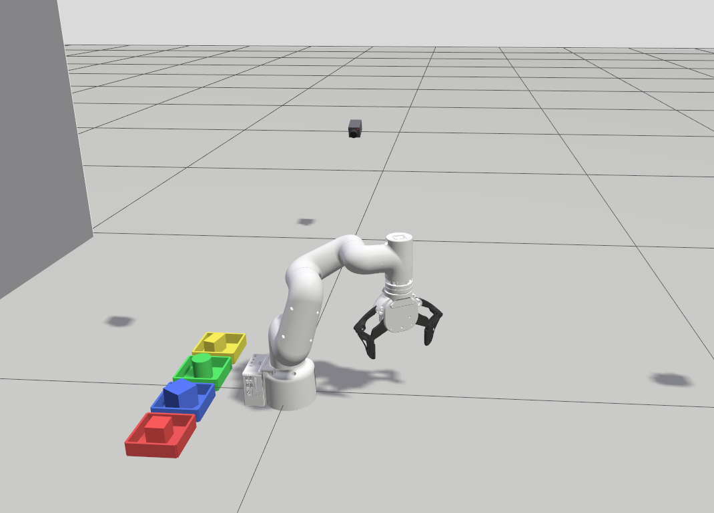

# Pick-and-place en simulation — tri des quatre objets

Tri de quatre objets par **saisie physique** dans Gazebo Harmonic : le bras
descend, la pince se referme sur l'objet, le porte et le **pose au fond** du bac
de sa couleur. Aucune téléportation — c'est ce qui distingue ce banc de
`sorting_orchestrator`, qui déplaçait les objets par `gz set_pose` et donnait
l'illusion d'une préhension.

Pour le vrai bras, voir [`PICK_AND_PLACE_REAL.md`](PICK_AND_PLACE_REAL.md).



---

## Résultat mesuré (31/08/2026)

4 objets sur 4, en **115 s**.

| objet | dimensions | serrage | bac | écart au centre | inclinaison |
|---|---|---|---|---|---|
| `red_cube` | 40 mm | 36 mm / 0,823 rad | `red_bin` | −6 / +3 mm | 0,0° |
| `blue_cube` | 50 mm | 46 mm / 0,740 rad | `blue_bin` | −5 / +0 mm | 0,0° |
| `green_cylinder` | ⌀44 × 50 mm | 38 mm / 0,807 rad | `green_bin` | −2 / +4 mm | 0,0° |
| `yellow_box` | 50×30×40 mm | 26 mm / 0,905 rad | `yellow_bin` | −13 / +4 mm | 0,0° |

Ouverture utile d'un bac : 95 mm. Les quatre objets reposent **à plat au fond**,
au millimètre près de la hauteur théorique.

> Un seul passage complet à ce jour. La répétabilité n'est pas mesurée.

---

## Lancer

Deux terminaux, `conda deactivate` d'abord dans chacun.

```bash
# 1 — le banc (Gazebo + les trois contrôleurs)
source /opt/ros/jazzy/setup.bash && source ~/Osama_ws/install/setup.bash
ros2 launch mycobot_gateway sim_grasp.launch.py          # headless:=true pour sans fenêtre

# 2 — le cycle de tri
ros2 run mycobot_gateway sim_sorting_grasp
```

Paramètres utiles :

| paramètre | défaut | rôle |
|---|---|---|
| `only` | `''` | ne traiter que ces objets : `-p only:="red_cube,blue_cube"` |
| `move_duration` | `0.0` | `0` = durée calculée sur le trajet ; une valeur force la durée |
| `settle_time` | `1.5` | plafond d'attente après un mouvement |

Remise à zéro de la scène entre deux essais :

```bash
for m in "red_cube 0.22 -0.12 0.021" "blue_cube 0.22 0.12 0.026" \
         "green_cylinder 0.27 -0.05 0.026" "yellow_box 0.27 0.05 0.021"; do
  set -- $m
  gz service -s /world/pick_and_place_sorting/set_pose \
    --reqtype gz.msgs.Pose --reptype gz.msgs.Boolean --timeout 800 \
    --req "name: \"$1\", position: {x: $2, y: $3, z: $4}, orientation: {x:0,y:0,z:0,w:1}"
done
```

---

## Le graphe

```
sim_grasp.launch.py
├── gz sim  ──  monde pick_and_place_sorting.sdf
│     └── plugin gz_ros2_control  ──  controller.yaml
│           ├── mycobot_controller           (JTC, 6 joints du bras)
│           ├── gripper_position_controller  (6 joints de la pince)
│           └── joint_state_broadcaster      → /joint_states
├── robot_state_publisher                    ← xacro de l'URDF
├── ros_gz_bridge   /clock  +  dynamic_pose/info → /gz/dynamic_poses
└── (à lancer à part)  sim_sorting_grasp
        pub  /mycobot_controller/joint_trajectory
        pub  /gripper_position_controller/commands
        sub  /joint_states
        lit  la pose Gazebo des objets  (vérification de prise)
```

Le nœud **n'utilise pas** `/model/mycobot_320/joint/<j>/cmd_pos` : le plugin
`gz-sim-joint-position-controller-system` a été retiré de l'URDF, il court-circuitait
`ros2_control` et n'exposait de toute façon qu'un seul topic mal nommé pour toute
la liste de joints.

---

## La pince, en chiffres

Tout vient des meshes `mycobot_description/urdf/pro_adaptive_gripper/*.dae`,
mesuré puis vérifié en simulation.

### Le point outil est le centre des PATINS

```python
TOOL_OFFSET = np.array([-0.001, 0.0078, 0.166])   # repère link6, mètres
```

166 mm sous la bride sur +Z, **décalé de 7,8 mm sur +Y**. Viser l'extrémité des
doigts au lieu du centre des patins place la consigne 15 mm à côté — exactement
la largeur d'un patin. Un cube de 40 mm rattrape l'erreur par sa largeur, un
cylindre de 44 mm non.

### Ouverture selon l'angle servo

| angle (rad) | 0,00 | 0,20 | 0,40 | 0,60 | 0,70 | 0,80 | 0,90 | 1,00 | 1,10 |
|---|---|---|---|---|---|---|---|---|---|
| **ouverture interne** (mm) | 120,0 | 104,1 | 84,7 | 62,7 | 50,9 | 38,8 | 26,6 | 14,2 | 1,9 |
| **demi-encombrement extérieur** (mm) | 80,8 | 72,8 | 63,3 | 52,3 | 46,4 | 40,4 | 34,2 | 28,0 | — |

Le serrage se commande à `largeur_objet − squeeze` (4 mm par défaut, 6 mm pour le
cylindre qui n'a qu'un contact linéaire). Butée logicielle à **1,02 rad** : les
faces se touchent vers 1,11, serrer au-delà n'ajoute aucune force et ne fait que
planter les doigts l'un dans l'autre.

### Les six joints

Le `gripper_position_controller` attend un `Float64MultiArray` de **6** valeurs :

```
[servo_gauche, servo_droit, bout_gauche, bout_droit, barre_gauche, barre_droite]
fermer à a :  [-a, +a, +a, -a, -a, +a]
ouvrir     :  six zéros
```

Les deux dernières sont les barres extérieures du quadrilatère articulé
(`gripper_left2` / `gripper_right2`). Elles étaient déclarées `fixed` dans
l'URDF, donc soudées à la bride : elles restaient immobiles pendant que le doigt
tournait et partaient à l'horizontale — la pince paraissait cassée sur les côtés.
Mesuré sur les meshes, la barre est parallèle **à 0,0° près** à la bielle
motrice : c'est un parallélogramme, elle tourne du même angle que son servo.

---

## Le cycle, objet par objet

1. **Ouvrir** la pince.
2. **Survol** à 110 mm au-dessus de l'objet.
3. **Descendre** à mi-hauteur de l'objet (`max(18 mm, hauteur × 0,45)`) : les
   patins mordent la moitié haute et les doigts restent à 18 mm de la planche.
4. **Serrer** à la largeur mesurée moins l'écrasement.
5. **Lever** à 110 mm — et **vérifier** sur la pose Gazebo que l'objet est monté
   avec les doigts. Sinon, échec déclaré et objet suivant.
6. **Transférer** au-dessus du bac.
7. **Descendre poser** l'objet sur le fond (1 mm de garde sous lui).
8. **Rendre la largeur exacte** de l'objet : il repose déjà, la force de serrage
   tombe à zéro et il est libéré sans que les doigts s'écartent.
9. **Remonter**, puis seulement **ouvrir en grand**.
10. **Vérifier** que l'objet est dans l'emprise du bac.

Les étapes 2, 3 et 5 partagent une **orientation de poignet unique** : résoudre
l'IK indépendamment à chaque hauteur laissait φ changer d'un point au suivant, et
l'objet se dévissait des doigts.

---

## Trois contraintes qui ne sont pas évidentes

### Le bac vert n'est atteignable que par-dessus l'épaule

L'outil sort à **~22° d'azimut de J1**. Le bac vert est à l'azimut 164,7°, ce qui
demanderait J1 ≈ 187° — au-delà de la butée (168°). La seule solution passe par
la branche J1 ≈ −35°, J3 > 0, J5 < 0, où le bras se replie par-dessus son épaule.
Le solveur ne la trouve qu'avec un germe dédié. **Vaut aussi pour le vrai bras.**

### La pointe ne monte pas au-dessus de ~140 mm

Les 166 mm d'outil mangent la course : outil à la verticale, la pointe plafonne
vers 140 mm à r = 0,25 m, et **110 mm à r = 0,28 m**. D'où `APPROACH_Z` et
`TRANSIT_Z` à 110 mm.

### Les doigts peuvent descendre dans le bac, mais pas s'y ouvrir

La collision avec la paroi demande **deux** conditions simultanées : être sous le
rebord (30 mm) **et** plus écarté que la paroi interne (±47,5 mm). Refermés sur
l'objet, les doigts ne font que ±34 à ±44 mm — ils entrent. Grand ouverts ils
font ±81 mm — ils raclent. D'où le lâcher en deux temps de l'étape 8-9. Marge
latérale la plus faible : **1,5 mm**, sur le cube bleu.

---

## La scène

`mycobot_description/worlds/pick_and_place_sorting.sdf`, coordonnées en mètres
dans le repère de la base du robot.

| objet | position | | bac | position |
|---|---|---|---|---|
| `red_cube` | (0,22 ; −0,12) | → | `red_bin` | (−0,22 ; −0,18) |
| `blue_cube` | (0,22 ; +0,12) | → | `blue_bin` | (−0,22 ; −0,06) |
| `green_cylinder` | (0,27 ; −0,05) | → | `green_bin` | (−0,22 ; +0,06) |
| `yellow_box` | (0,27 ; +0,05) | → | `yellow_bin` | (−0,22 ; +0,18) |

Bacs : 100 × 100 mm hors-tout, parois de 5 mm hautes de 30 mm, fond à z = 2 mm →
**95 mm d'ouverture utile**.

---

## Limites

- **Un seul passage 4/4.** Répétabilité non mesurée.
- **Pas de vision.** Les positions viennent de la pose Gazebo des objets, pas du
  détecteur. Brancher `color_object_detector` en entrée est l'étape suivante.
- **Objets isolés et posés à plat.** Ni empilement, ni objet couché, ni occlusion.
- **`yellow_box` impose son orientation de poignet** (φ = 90°, pour pincer les
  30 mm et non les 50). Les autres sont symétriques, l'IK choisit.
- **Simulation seulement.** Le `TOOL_OFFSET` centre-des-patins et la branche
  par-dessus l'épaule valent aussi pour le vrai bras, mais n'y ont pas été
  vérifiés.

---

## Fichiers

| chemin | rôle |
|---|---|
| [`mycobot_gateway/mycobot_gateway/sim_sorting_grasp.py`](../mycobot_gateway/mycobot_gateway/sim_sorting_grasp.py) | le cycle de tri |
| [`mycobot_gateway/launch/sim_grasp.launch.py`](../mycobot_gateway/launch/sim_grasp.launch.py) | le banc |
| [`mycobot_description/worlds/pick_and_place_sorting.sdf`](../mycobot_description/worlds/pick_and_place_sorting.sdf) | la scène |
| [`mycobot_description/config/controller.yaml`](../mycobot_description/config/controller.yaml) | JTC + pince 6 joints |
| [`mycobot_description/urdf/320_pi/mycobot_pro_320_pi_gazebo.urdf`](../mycobot_description/urdf/320_pi/mycobot_pro_320_pi_gazebo.urdf) | modèle, pince comprise |
| [`scripts/diff_ik.py`](../scripts/diff_ik.py) | IK différentielle, orientation tenue en matrice |
