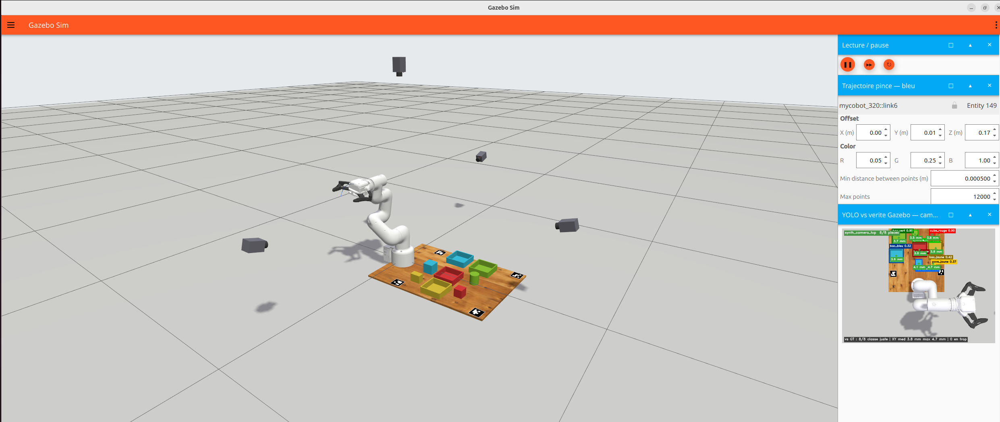
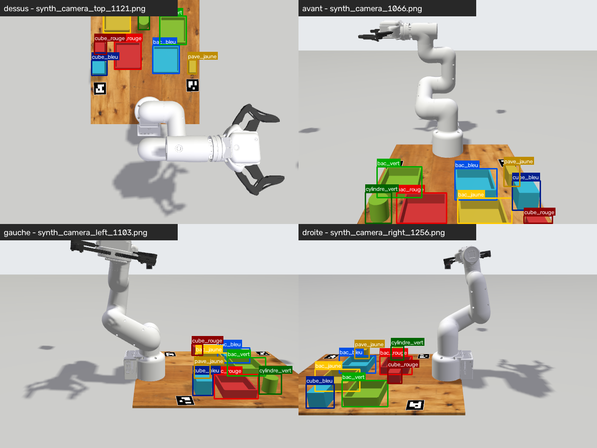
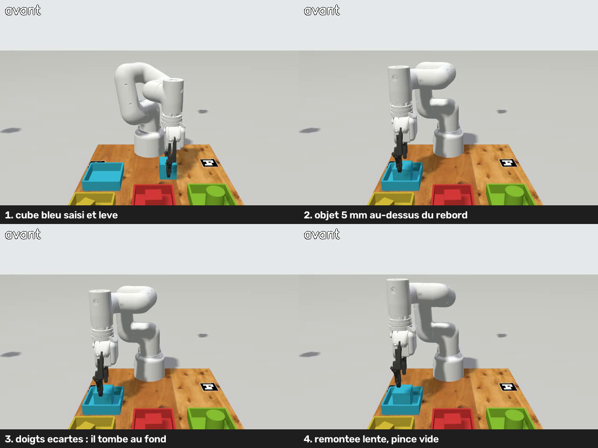

# Protocole — YOLO dans Gazebo, validé contre la vérité terrain

*Protocole de travail de Claude pour l'intégration YOLO → localisation 3D →
tri dans Gazebo Harmonic, avec DREAM en parallèle plus tard. On avance **une
étape à la fois**. Chaque étape a un critère de sortie, et on ne passe à la
suivante qu'une fois ce critère atteint et **validé par Osama**. L'état de chaque étape
est tenu dans le [journal](#journal) en fin de fichier.*

Créé le 29/09/2026 · branche `feature/pick-and-place-osama`

---

## 0. Invariants — à vérifier avant chaque étape

| # | Invariant | Valeur exacte | Comment le vérifier |
|---|-----------|---------------|---------------------|
| I1 | **Caméras = celles du dataset DREAM 50K**, sans exception | voir tableau § 1.3 | test `tests/test_cameras_dream50k.py` (étape 1) ; `ros2 topic echo --once /synth_camera_top/camera_info` → `k[0] = 493.7925` |
| I2 | **Masses du robot inchangées** : bras 1,58 kg (répartition d'origine), pince 0,22 kg, total 1,840 kg | défauts xacro `arm_mass_kg=1.58`, `gripper_mass_kg=0.22` | xacro de l'URDF comparé à HEAD : 18 liens, 0 écart (vérifié le 29/09) |
| I3 | **Base du robot à l'origine du monde**, spawn `-z 0.0`, dessus de table à z = 0 | `world` = `base` | `ros2 run tf2_ros tf2_echo world base` → identité |
| I4 | **La vérité terrain Gazebo n'entre jamais dans la perception ni dans la planification** | topics GT sous `/validation/gt/*` uniquement | seul le comparateur s'y abonne ; `grep -rn "pose/info\|dynamic_pose\|/validation/gt" ` sur les nœuds de perception et de planification → vide |
| I5 | Horodatage de l'image conservé de bout en bout, `use_sim_time: true` | `header.stamp` de l'image recopié dans chaque détection | le comparateur apparie sur ce stamp |
| I6 | Environnements Python : les nœuds ROS tournent sous le Python système, YOLO sous `.venv` **par un tube** (`scripts/yolo26_service.py`) | jamais `import rclpy` dans `.venv`, jamais `ultralytics` dans le Python système | `conda deactivate`, `deactivate` avant `ros2` |
| I7 | Fichiers non modifiables | `mycobot_pro_320_pi_gazebo_nogripper.urdf` (référence DREAM), `training/dream/mycobot_fk.py` (étiquettes DREAM), `scripts/pick_dashboard.py`, tout dossier de checkpoints | `git diff` sur ces fichiers → vide |
| I8 | Apparence `robot_appearance:=original` pour tout ce qui touche DREAM | c'est le rendu de l'entraînement | argument de lancement |

**Masses (I2), état au 29/09.** Le passage bras 3 kg / pince 0,340 kg a été
**annulé** : les valeurs par défaut sont revenues à 1,58 / 0,22 dans l'URDF,
`sim_grasp.launch.py`, `banc_realiste.launch.py` et `trajectory_preview.launch.py`.
Les arguments `arm_mass_kg` et `gripper_mass_kg` restent disponibles en option
explicite, sans quoi la campagne de précision, qui les passe, casserait. **Ne
jamais remettre 3.0 / 0.34 par défaut.**

---

## 1. État des lieux (inspection du 29/09/2026)

### 1.1 Composants

| Composant | Existe ? | Fichier | Topic / interface | Réutilisable ? |
|---|---|---|---|---|
| Monde DREAM (génération 50K) | oui | `worlds/randomized.sdf` (table 0,9 × 0,9 m à z = 0, murs, 3 objets parasites) | `/world/randomized/...` | Référence seulement : on n'y ajoute pas d'objets |
| Monde « banc réel » | oui | `worlds/real_table.sdf` (plateau 622 × 449 mm, ArUco 19/23/25/26, cube et bac rouges, `table_camera`) | `/world/real_table/...` | **Oui, comme base de la scène de tri** (plateau et ArUco) |
| Monde de tri, ancien | oui | `worlds/pick_and_place_sorting.sdf` (4 primitives et 4 bacs plats) | — | Non : objets que yolo26 ne connaît pas |
| Monde « banc réaliste » | oui | `worlds/banc_realiste_yolo26.sdf` (8 pièces peintes, caméras arducam et SVPRO) | `/arducam/image_raw`, `/svpro/image_raw` | **Pièces : oui. Caméras : non** (ce ne sont pas celles de DREAM) |
| Robot avec pince | oui | `urdf/320_pi/mycobot_pro_320_pi_gazebo.urdf` (xacro) | `robot_description` | Oui, pour le pick-and-place |
| Robot sans pince (rendu DREAM) | oui, non suivi par git | `urdf/320_pi/mycobot_pro_320_pi_gazebo_nogripper.urdf` | — | Oui, comme **référence DREAM** (I7) |
| Pince | oui | liens `gripper_*` + `gripper_position_controller` (gz_ros2_control) | `/gripper_position_controller/...` | Oui : pince physique, prise par contact, **sans attache** |
| 4 caméras RGB | oui, dans les deux URDF, **à des poses différentes** | voir § 1.3 | `/synth_camera{,_right,_left,_top}/image` + `/camera_info` | Oui, avec les **poses du 50K** (étape 1) |
| Objets (4) | oui | `models/cube_rouge`, `cube_bleu`, `cylindre_vert`, `pave_jaune` | — | Oui |
| Bacs (4) | oui | `models/bac_rouge`, `bac_bleu`, `bac_vert`, `bac_jaune` (105 × 105 × 30 mm, statiques) | — | Oui |
| Générateur de modèles | oui | `scripts/generer_pieces_gazebo.py` (cotes lues dans `tri_couleur.py`) | — | Oui, ne pas retaper les cotes |
| Randomisation | partielle | `vision/sim_multicam_geometry.sample_scene_xy()` (1 cube + 1 bac), `real_table.launch.py randomize:=true seed:=`, `sim_scene_control` `/real_table/randomize` | service `Trigger` | À **étendre à 4 + 4** |
| YOLO | oui | `scripts/yolo26_service.py` (tube, `.venv`), poids `runs/detect/training/yolo/runs/pieces_v5_yolo26s/weights/best.pt`, 8 classes figées | JSON sur stdin/stdout | **Oui, tel quel** |
| YOLO sur Gazebo | oui, pour arducam et SVPRO | `scripts/yolo26_gazebo.py` (rclpy + service) | lit `/arducam/image_raw`, `/svpro/image_raw` | Modèle à suivre ; à transformer en nœud (étape 4) |
| Localisation multicaméra simulée | oui | `sim_multicam_detector.py` + `vision/sim_multicam_geometry.py` (silhouette HSV, cube de 40 mm) | — | Le modèle caméra (`Camera`, `load_cameras`) est à réutiliser. **Actuellement cassé**, voir § 1.4 |
| Vérité terrain | oui | `sim_sorting_grasp.object_poses()` (`gz topic -e /world/<w>/dynamic_pose/info`) ; bridge `/gz/dynamic_poses` (PoseArray **sans noms**) | — | Le principe : oui. À exposer proprement (étape 3) |
| Pick-and-place + FSM | oui | `sim_sorting_grasp.py` (IK `_solve_tip`, `sort_one`, prise vérifiée), `sim_scene_control.py` (`pose_source:=vision`, **bridé à `red_cube`**) | JTC `mycobot_controller` | **Oui, à réutiliser** (étape 9) |
| `/joint_states` | oui | `joint_state_broadcaster` (lancé par `sim_grasp.launch.py`) | `/joint_states` | Oui |
| DREAM | oui | `dream_inference_node.py` (`camera_topic`, défaut `/synth_camera/image` ; `output_prefix`) | `/dream/*` | Oui, sans modification |
| Dashboard | oui (réel) | `dream_validation_dashboard.py`, `scripts/yolo26_dashboard.py` | — | Plus tard ; le CSV de l'étape 10 le préparera |

### 1.2 Architecture actuelle (lancement `real_table.launch.py`)

```
 gz sim (real_table.sdf) ───────────────────────────────────────────────┐
   │ robot: mycobot_pro_320_pi_gazebo.urdf (pince, caméras à 1,1 m / 1,0 m)
   ├─ /clock ───────────────► parameter_bridge ─► /clock
   ├─ dynamic_pose/info ────► parameter_bridge ─► /gz/dynamic_poses (PoseArray, sans noms)
   ├─ synth_camera*/image ──► parameter_bridge ─► /synth_camera*/image + /camera_info  (bridge_multicam)
   ├─ /camera/image_raw ────► parameter_bridge ─► /camera/image_raw  (table_camera, 0,90 m)
   └─ gz_ros2_control ◄──── controller_manager
        ├─ joint_state_broadcaster ─► /joint_states ─► robot_state_publisher ─► /tf
        ├─ mycobot_controller (JTC) ◄─ /mycobot_controller/joint_trajectory
        └─ gripper_position_controller

 sim_multicam_detector  (/synth_camera*/image → silhouette HSV → cube XY)
 sim_scene_control      (FSM de sim_sorting_grasp, pose_source=vision, only=red_cube)
        services /real_table/randomize, /real_table/pick ; /real_table/bin_position
 sim_scene_panel        (boutons Randomiser / Lancer)
```

### 1.3 Les quatre caméras — **paramètres exacts du 50K DREAM**

Source vérifiée : `dream_data/synthetic_50k_ndds/_camera_settings.json`
(fx = 493,7925) et `mycobot_fk.GAZEBO_CAMERAS`. Les keypoints 3D des images
NDDS 0 à 3 (avant, droite, gauche, top) sont reproduits **à 0,000 mm** avec ces
poses. Documentation du run : `training/dream/VGG_ULTIMATE_V4_50K.md` (robot
**sans pince**).

| Caméra | Topic image | camera_info | Pose dans `world` = `base` : xyz (m), rpy (rad) |
|---|---|---|---|
| `synth_camera` (avant) | `/synth_camera/image` | `/synth_camera/camera_info` | `0.8 0.0 0.4`, `0 0.3 3.1416` |
| `synth_camera_right` | `/synth_camera_right/image` | `/synth_camera_right/camera_info` | `0.0 0.8 0.4`, `0 0.3 -1.5708` |
| `synth_camera_left` | `/synth_camera_left/image` | `/synth_camera_left/camera_info` | `0.0 -0.8 0.4`, `0 0.3 1.5708` |
| `synth_camera_top` | `/synth_camera_top/image` | `/synth_camera_top/camera_info` | `0.0 0.0 0.95`, `0 1.5708 0` |

Toutes les caméras : `horizontal_fov = 1.15`, 640 × 480, R8G8B8, 10 Hz, clip
0,05 à 10 m, sans bruit ni distorsion → **fx = fy = 493,7925, cx = 320, cy = 240**.

⚠ **Trois dispositions différentes coexistent**. Une seule est la bonne :

| Fichier | avant/droite/gauche | top | fov | Utilisé par |
|---|---|---|---|---|
| `…_nogripper.urdf` | 0,8 m | 0,95 m | 1,15 | **50K DREAM** ✅ |
| `…_gazebo.urdf` (HEAD et arbre de travail) | 1,1 m | 1,0 m | 1,15 | `real_table`, `sim_grasp` ❌ pas DREAM |
| `…_gazebo.urdf` au commit `bff55d0` (23/04) | 0,8 m | 1,2 m | 1,047 | anciens datasets v2 ❌ |

**Champ utile sur le plateau** (calcul du 29/09 avec les poses du 50K, points à
z = 20 mm) :

| Caméra | plateau visible | x max vu | cube de 40 mm vers (0,25 ; 0) |
|---|---|---|---|
| avant | 71 % | 0,39 m | ~30 px |
| droite | 93 % | 0,57 m | ~22 px |
| gauche | 95 % | 0,57 m | ~22 px |
| top | 81 % | 0,45 m | ~21 px |

→ Pour être vus par les quatre caméras, objets et bacs doivent avoir **x ≤ 0,37 m**
(avec marge). Les bacs de `banc_realiste_yolo26.sdf`, à x = 0,395 m, ne remplissent pas cette condition.
→ Les objets font environ 20 px dans la top : c'est le régime « petits objets » pour
YOLO, à mesurer, pas à supposer.

**Mesuré à l'exécution le 29/09** (`sim_grasp.launch.py world_name:=real_table
camera_layout:=dream50k bridge_multicam:=true headless:=true`) :

| Caméra | `frame_id` publié | TF `base → camera_link*` | K publié |
|---|---|---|---|
| avant | `mycobot_320/camera_link/synth_camera` | (0,800 ; 0 ; 0,400) | fx = fy = 493,7925, cx = 320, cy = 240 |
| droite | `mycobot_320/camera_link_right/synth_camera_right` | (0 ; 0,800 ; 0,400) | idem |
| gauche | `mycobot_320/camera_link_left/synth_camera_left` | (0 ; −0,800 ; 0,400) | idem |
| top | `mycobot_320/camera_link_top/synth_camera_top` | (0 ; 0 ; 0,950) | idem |

- Le `frame_id` est un nom Gazebo (`modèle/lien/capteur`), **pas une frame TF**.
  Pour la TF, on utilise le lien `camera_link*` + la rotation optique
  (`sensor_from_optical` de `sim_multicam_geometry`), jamais le `frame_id` tel quel.
- Fréquence mesurée en temps réel : **1,4 à 2 Hz** par caméra en headless
  (`update_rate` = 10 Hz en temps simulé ; Gazebo tourne plus lentement que le
  temps réel avec 4 caméras). Les appariements se font donc sur le stamp simulé,
  jamais sur l'horloge murale.
- Vue des 4 caméras : [`protocole_yolo_gazebo/etape1_cameras_dream50k.png`](protocole_yolo_gazebo/etape1_cameras_dream50k.png).

### 1.4 Défauts trouvés dans l'arbre de travail (non commité)

1. ✅ *corrigé le 29/09 (étape 0)* — **`load_cameras()` ne trouvait plus aucune caméra.** L'URDF enveloppe désormais
   les caméras dans `<xacro:if value="$(arg enable_cameras)">`, et
   `sim_multicam_geometry.load_cameras()` lit le fichier **brut** (`root.findall('gazebo')`).
   Résultat : `ValueError: four fixed cameras required in the URDF`, donc
   `sim_multicam_detector` et la démo `real_table` plantent au démarrage.
   Reproduit le 29/09.
2. **Butées articulaires modifiées** dans l'URDF avec pince (J3 ±2,53 → ±2,618,
   etc., les « butées mesurées » du banc réaliste). Elles sont sans effet sur DREAM,
   mais elles font partie du même chantier « réaliste ». **Décision D3.**

### 1.5 Pince

1. Le modèle actuel avec pince **a une pince** : 7 liens `gripper_*` et 4
   articulations pilotées par `gripper_position_controller`.
2. Un modèle **sans pince** existe : `…_nogripper.urdf`, c'est celui du 50K.
3. Le contrôleur l'ouvre et la ferme : `sim_sorting_grasp` s'en sert, avec `_SPAN_TABLE`.
4. `sim_sorting_grasp` **saisit physiquement** (contact, prise vérifiée sur la pose
   Gazebo de l'objet), sans attache. En revanche, `sorting_orchestrator` et
   `pick_and_place_node` **téléportent** l'objet (`set_pose`) : on ne les utilise pas.

---

## 2. Décisions

### 2.1 Pince → deux configurations, aucune modification des modèles existants

| Configuration | Fichier | Rôle |
|---|---|---|
| `robot_dream_baseline` | `…_nogripper.urdf` **tel quel** | Rendu identique au 50K : test de non-régression DREAM |
| `robot_yolo_pickplace` | `…_gazebo.urdf` (pince) **+ caméras du 50K** | Scène de tri, YOLO, pick-and-place, DREAM en parallèle |

Pourquoi : le keypoint distal `link6` est **sur la bride**, là où la pince est
montée. La pince le masque ou le rend méconnaissable depuis la plupart des vues, et
elle change la silhouette de `link5`. Le modèle de base a été entraîné sans pince.
Les liens et articulations `link1` à `link6` sont **identiques** entre les deux
fichiers. La pince n'ajoute que des liens enfants de `link6` : les repères des
keypoints ne bougent pas.

**On ne suppose pas l'effet sur DREAM, on le mesure** (étape 10) : même q, même
caméra, les deux configurations. On compare la détection par keypoint et l'erreur
en pixels par rapport à la projection FK.

### 2.2 Position du robot → on ne la bouge pas

Aujourd'hui, `world` = `base` : le robot est à l'origine, le dessus de table à
z = 0, dans le monde DREAM comme dans `real_table`. DREAM ne dépend que de
**T_cam←base**. Déplacer la base sans déplacer les caméras changerait :

- **T_cam←base** des 4 caméras, donc des vues que le réseau n'a jamais vues. Le
  point de vue du 50K serait perdu ;
- les **extrinsèques** : les poses caméra sont écrites dans le repère `world`,
  dans l'URDF et dans `mycobot_fk.GAZEBO_CAMERAS`. Il faudrait les réécrire en
  deux endroits, avec un risque de divergence silencieuse ;
- le **workspace** : `sample_scene_xy` et `_solve_tip` travaillent en
  coordonnées base ; les bornes seraient à recalculer ;
- la **génération DREAM** : un nouveau 50K ne serait plus comparable à l'ancien ;
- la **comparaison GT/DREAM** : il faudrait une transformation world→base de plus
  dans chaque comparaison, alors qu'elle est aujourd'hui l'identité.

Si un jour on veut le robot au bord de la table, on déplace **la table et les
objets**, pas le robot, et T_cam←base reste intact.

### 2.3 Décisions ouvertes (à trancher par Osama avant l'étape indiquée)

| # | Question | Recommandation | Avant l'étape |
|---|---|---|---|
| D1 | Quelle table pour la scène de tri ? | ✅ **retenu 29/09** : plateau et ArUco de `real_table.sdf` | 2 |
| D2 | Comment appliquer les caméras du 50K à l'URDF avec pince ? | ✅ **retenu 29/09** : argument xacro `camera_layout:={legacy,dream50k}`, défaut `legacy` | 1 |
| D2b | Habillage des boîtiers caméra | ✅ **retenu 29/09** : on garde les boîtiers **sombres** de l'URDF avec pince. Ceux du 50K sont des boîtes bleue, verte, rouge et jaune, qui donneraient à YOLO de faux cubes de couleur. Ce ne sont ni des paramètres de caméra ni des pièces du robot | 1 |
| D3 | Butées « mesurées » de l'arbre de travail : les garder ? | les garder (sans effet sur DREAM, plus sûres) ; à confirmer | 9 |
| D4 | Jeu d'objets | les 8 pièces peintes (yolo26 connaît leurs 8 classes) | 2 |
| D5 | Type de message des détections | `vision_msgs/Detection2DArray` (installé) + CSV complet | 4 |

---

## 3. Architecture visée

### 3.1 V1 : une caméra, YOLO seul

```
 gz sim  (tri_yolo.sdf : plateau réel + 4 pièces + 4 bacs ; robot avec pince ; caméras du 50K)
   │
   ├─ /synth_camera_top/image ─────────┬──────────────────────────► (plus tard) dream_inference
   │  /synth_camera_top/camera_info    │
   │                                   ▼
   │                       yolo_gazebo_node  ◄─tube─►  .venv : yolo26_service.py
   │                         ├─► /yolo/synth_camera_top/image_annotated   (visualisation)
   │                         └─► /yolo/synth_camera_top/detections        (Detection2DArray, stamp de l'image)
   │                                   │
   │                                   ▼
   │                       yolo_localizer (étape 6) ─► /yolo/objects_3d   (P_YOLO, repère base)
   │                                   │
   │                                   ▼
   │                          yolo_gt_comparator ─► /validation/report + CSV
   │                                   ▲
   └─ /world/<w>/pose/info ─► bridge ─► gazebo_ground_truth ─► /validation/gt/objects   (GT UNIQUEMENT)
```

### 3.2 Final

```
 4 caméras ─┬─► yolo_gazebo_node ×1 (4 abonnements) ─► detections/cam ─► yolo_localizer ─► /yolo/objects_3d
            │                                                                  │
            └─► dream_inference ×4 ─► /dream_<cam>/*                            ▼
                                                        sim_sorting_grasp (pose_source=perception, FSM existante)
                                                                               │
 /joint_states ─► FK ─► T_GT(t) ──┐                                            ▼
 gazebo_ground_truth ─────────────┴──► comparateurs (YOLO/GT, DREAM/GT) ─► CSV ─► dashboard
```

Nouveaux espaces de noms : `/yolo/*` et `/validation/*`. Ils sont à ajouter dans
`docs/ARCHITECTURE.md` (règle `ros2-conventions`).

---

## 4. Les étapes

Pour chaque étape : **objectif · fichiers · actions · critère de sortie · ce qu'on ne
touche pas**. Une étape ne commence qu'après validation de la précédente.

### Étape 0 — Remise d'aplomb *(avant tout code YOLO)*

- **Objectif** : une base qui démarre, des masses d'origine.
- **Fait le 29/09** : masses revenues à 1,58 / 0,22 (I2 vérifié).
- **À faire** : corriger `load_cameras()` pour qu'elle lise l'URDF **après
  xacro**. Soit elle prend le XML déjà développé, par exemple le paramètre
  `robot_description`, soit elle appelle `xacro` sur le fichier avec les mêmes
  arguments que le lancement. Ajouter un test qui charge les 4 caméras depuis l'URDF.
- **Critère de sortie** : `ros2 launch mycobot_gateway real_table.launch.py`
  redémarre, `sim_multicam_detector` trouve ses 4 caméras, le test passe.
- **Ne pas toucher** : aux poses caméra (c'est l'étape 1).

### Étape 1 — Caméras du 50K dans la scène avec pince, et contrôle des flux

- **Objectif** : l'URDF avec pince publie **exactement** les caméras du 50K.
- **Fichiers** (réalisé) : `…_gazebo.urdf` : argument `camera_layout` et deux
  propriétés (`camera_side_distance` 1,1 ou 0,8 ; `camera_top_height` 1,0 ou 0,95). Les
  poses sont les **seules** différences entre les deux dispositions, donc on ne duplique pas
  le bloc. Une valeur inconnue fait échouer xacro. `sim_grasp.launch.py` : argument
  `camera_layout`. `sim_multicam_detector` : paramètre `camera_layout`.
  `tests/test_cameras_dream50k.py` : 7 tests.
- **Le test doit échouer** si la sortie xacro avec `camera_layout:=dream50k` diffère de
  `mycobot_fk.GAZEBO_CAMERAS` (xyz, rpy à 1e-9), si fov ≠ 1,15, si la résolution
  ≠ 640 × 480, si fx calculé ≠ `_camera_settings.json` du 50K à 1e-6 près, ou
  si la fréquence ≠ 10. Il s'agit d'une garde qui bloque, pas d'un message affiché.
- **Contrôle à l'exécution**, noté dans le journal pour chacune des 4 caméras : `frame_id`,
  K publié, `ros2 topic hz` (on attend ~10 Hz, mais le facteur temps réel le
  réduit), TF `world → <lien caméra>`.
- **Critère de sortie** : test vert, tableau § 1.3 complété avec les valeurs
  mesurées, une image par caméra enregistrée dans le journal.
- **Ne pas toucher** : aux intrinsèques ni aux poses (I1), au fichier `_nogripper` (I7).

### Étape 2 — Scène de tri 4 objets + 4 bacs, randomisation contrôlée

- **Fichiers** : créer `worlds/tri_yolo.sdf`, **généré** à partir de `real_table.sdf`
  (plateau + ArUco, sans `red_cube`, `red_bin` ni `table_camera`), en y incluant les
  8 modèles `models/*` existants. Créer `launch/tri_yolo.launch.py`, qui inclut
  `sim_grasp.launch.py` avec `world_file`, `camera_layout:=dream50k`,
  `bridge_multicam:=true`, et les masses par défaut. Ajouter
  `sample_tri_scene(rng)` à côté de `sample_scene_xy` dans
  `vision/sim_multicam_geometry.py`.
- **Contraintes de la randomisation**, chacune vérifiée par un test sur 1 000 tirages :
  - chaque empreinte (bac 105 × 105 mm, objet selon ses cotes + marge) est entièrement sur le plateau ;
  - aucune empreinte ne chevauche une autre ; distance minimale objet-objet, objet-bac et bac-bac réglable ;
  - toutes les pièces sont hors du socle du robot (rayon à mesurer sur le mesh `base`) ;
  - **x ≤ 0,37 m**, et le centre projeté de chaque pièce est dans l'image de `synth_camera_top`
    (et on consigne dans combien des 3 autres caméras il se trouve) ;
  - chaque objet et chaque bac est atteignable : `_solve_tip` de `sim_sorting_grasp`
    trouve une solution pour l'approche et pour le largage ;
  - la graine est journalisée ; `seed:=N` reproduit la scène.
- **Pose du bras pendant la perception** : une « pose d'observation » qui libère la
  vue top du plateau (à définir et à vérifier sur l'image).
- **Critère de sortie** : 10 graines lancées, 8/8 pièces visibles à l'œil dans la
  top pour chacune, aucune collision initiale (les pièces ne bougent pas pendant
  les 2 premières secondes, GT à l'appui).

### Étape 3 — Vérité terrain Gazebo (validation uniquement)

- **Fichiers** : créer le nœud `gazebo_ground_truth.py` (+ entrée dans `setup.py`),
  et ajouter à `tri_yolo.launch.py` le bridge
  `/world/<w>/pose/info@tf2_msgs/msg/TFMessage[gz.msgs.Pose_V`. Ce bridge couvre les
  modèles statiques, donc les bacs, et **conserve les noms**, contrairement à
  `/gz/dynamic_poses`.
- **Sortie** : `/validation/gt/objects`, un enregistrement par pièce : `object_id`
  (nom du modèle), `class` (nom = classe yolo26), position et orientation en
  `world`, puis en `base` via TF (l'identité ici, mais calculée et non supposée),
  `stamp` en temps simulé.
- **Critère de sortie** : pour une scène à graine fixe, la GT publiée est égale à
  la pose écrite dans le SDF généré, à moins de 1 mm près.
- **Garde I4** : aucun nœud de perception ou de planification ne référence `/validation/gt`
  ni `pose/info`. Un test fait ce `grep` et échoue sinon.

### Étape 4 — Nœud YOLO sur `synth_camera_top`

- **Fichiers** : créer `mycobot_gateway/yolo_gazebo_node.py`, qui reprend la
  mécanique de `scripts/yolo26_gazebo.py` : service `yolo26_service.py` lancé
  sous `.venv/bin/python`, dialogue par tube, **aucune modification du service**.
- **Paramètres** : `cameras` (V1 : `[synth_camera_top]`), `weights` (défaut
  `pieces_v5_yolo26s`), `conf_threshold` (défaut, celui du service, 0,10).
- **Sorties** : `/yolo/<cam>/detections` en `Detection2DArray` (D5). Le
  `header` est celui **de l'image** (stamp + `frame_id`). Pour chaque détection :
  `class_id` (nom), score, bbox. `/yolo/<cam>/image_annotated` affiche les boîtes,
  la classe et la confiance. Le CSV du nœud contient `camera_id, stamp, class_id
  (indice), class_name, confidence, x_min, y_min, x_max, y_max, center_u, center_v`.
- **Critère de sortie** : les boîtes s'affichent dans `rqt_image_view` ; sur 10
  scènes on consigne combien de pièces sont détectées et avec quelle confiance,
  **sans conclure** avant l'étape 5.
- **Ne pas faire** : connecter YOLO à la planification.

### Étape 5 — Comparaison YOLO 2D / GT

- **Fichiers** : créer `yolo_gt_comparator.py`, et ajouter à
  `sim_multicam_geometry` une projection de la boîte 3D d'un modèle.
- **Référence 2D** : Gazebo ne publie **pas** de boîte 2D. On n'en invente pas.
  La méthode : sommets de la boîte 3D du modèle (cotes lues dans `models/*/model.sdf` ;
  pour le cylindre, 2 cercles de 32 points), transformés par la pose GT, puis
  projetés avec K et T_cam←world de l'étape 1, et encadrés par min/max. C'est une
  boîte **amodale** : elle ignore les occultations. Les pièces masquées par le bras sont
  exclues grâce à la pose d'observation. Si c'est insuffisant, on passera au capteur
  Gazebo `boundingbox_camera` (+ système `gz-sim-label-system`), qui donne des boîtes
  visibles, à condition que sa pose et ses intrinsèques soient **identiques** à la caméra RGB.
- **Appariement** : par caméra et par image, algorithme hongrois sur le coût
  `1 − IoU` avec un seuil d'IoU de 0,5. Une détection non appariée est un faux
  positif ; une pièce GT visible non appariée est un faux négatif.
- **Métriques** : classe prédite contre classe réelle (matrice de confusion 8 × 8),
  `du, dv, e_pixel` (centre de la boîte YOLO contre centre de la boîte GT **et** contre le
  centre 3D projeté, les deux sont consignés), IoU, taux de détection, faux positifs et
  faux négatifs, confiance.
- **Critère de sortie** : rapport sur 50 scènes randomisées ; blocs de résultats
  **bruts** d'abord, analyse ensuite.

### Étape 6 — Localisation 3D par intersection rayon-plan

- **Fichiers** : créer `vision/ray_plane.py` (fonctions pures + test) et le nœud
  `yolo_localizer.py`.
- **Méthode** : (u, v) → rayon optique K⁻¹[u, v, 1] → repère `world` avec la TF
  de l'étape 1 → intersection avec le plan z = h. On calcule et on consigne
  **deux variantes** : h = 0 (plan de table) et h = hauteur utile de la classe
  (sommet de la pièce pour la top, mi-hauteur pour les vues obliques ; `y.HAUTEUR_BAC`
  et `pd.HAUTEUR_OBJET` existent déjà). On garde le meilleur des deux au vu des
  mesures, pas par principe.
- **Aucune calibration** : K et les poses sont celles de l'étape 1.
- **Métriques** : `dx, dy, dz, erreur_3d` entre P_YOLO et P_GT (centre de la pièce).
- **Critère de sortie** : distribution de `erreur_3d` par classe sur 50 scènes.

### Étape 7 — Les quatre caméras, sans fusion

- `cameras := [les 4]` dans `yolo_gazebo_node`. Même comparateur, **par caméra**.
- **Livrable** : tableau caméra × classe → taux de détection, confiance moyenne,
  `e_pixel` médian, `erreur_3d` médiane.
- La stratégie de sélection ou de fusion sera décidée **après** lecture de ce tableau.

### Étape 8 — Scénario 4 objets → 4 bacs, perception seule

- Association `cube_rouge→bac_rouge`, `cube_bleu→bac_bleu`,
  `cylindre_vert→bac_vert`, `pave_jaune→bac_jaune`, obtenue par la **classe**
  YOLO, jamais par un nom de modèle Gazebo.
- `/yolo/objects_3d` publie objets **et** bacs. Le système de tri ne reçoit rien d'autre.

### Étape 9 — Motion planning sur la perception

- **Réutiliser** la FSM et l'IK de `sim_sorting_grasp.py` (`sort_one`,
  `_solve_tip`, `_seed_over_shoulder`, prise vérifiée). **Pas de nouvelle FSM.**
- **Modification minimale** : une source de cibles `pose_source:=perception` qui lit
  `/yolo/objects_3d`, et la levée de la bride `only == ['red_cube']`.
  La vérification de prise sur la pose Gazebo reste possible, **mais comme contrôle
  a posteriori** journalisé, jamais comme cible.
- **Critère de sortie** : taux de tri réussi sur N scènes randomisées, avec la cause de
  chaque échec (détection, localisation, IK, prise, largage).

### Étape 10 — DREAM en parallèle (sans modifier DREAM)

- `dream_inference` × caméra, `camera_topic:=/synth_camera_top/image`,
  `output_prefix:=/dream_top`. Les mêmes images vont à YOLO et à DREAM.
- **Non-régression pince** : pour une série de q, rendu `robot_dream_baseline` et
  rendu `robot_yolo_pickplace`, mêmes caméras. On compare la détection par keypoint
  et l'erreur en pixels par rapport à la projection FK (`mycobot_fk`).
- Référence dynamique : `/joint_states` → FK → T_GT(t), comparée à T_DREAM(t), en appariant sur le stamp.

### Étape 11 — Journalisation CSV

Un fichier par campagne, `results/yolo_gazebo/<date>_<seed>/yolo_vs_gt.csv`
(`results/` n'est pas suivi par git). Colonnes :

```
stamp_sim, seed, camera_id, frame_id, object_id, gt_class, yolo_class_id, yolo_class,
confidence, x_min, y_min, x_max, y_max, u_yolo, v_yolo, u_gt, v_gt, du, dv, pixel_error,
iou, match (TP/FP/FN), plane_h, x_yolo, y_yolo, z_yolo, x_gt, y_gt, z_gt, dx, dy, dz, error_3d
```

Un en-tête `.yaml` à côté du CSV consigne la graine, les poids YOLO, le seuil, la
disposition des caméras (vérifiée par le test de l'étape 1), les masses et le commit.

---

## 5. Fichiers : récapitulatif

| Action | Fichier | Étape |
|---|---|---|
| modifié ✅ | `urdf/320_pi/mycobot_pro_320_pi_gazebo.urdf` (masses par défaut) | 0 |
| modifié ✅ | `launch/sim_grasp.launch.py`, `banc_realiste.launch.py`, `trajectory_preview.launch.py` (masses par défaut) | 0 |
| à modifier | `vision/sim_multicam_geometry.py` (`sample_tri_scene` ; projection de boîte 3D) | 2, 5 |
| modifié ✅ | `…_gazebo.urdf` (argument `camera_layout`), `sim_grasp.launch.py`, `sim_multicam_detector.py` | 1 |
| modifié ✅ | `vision/sim_multicam_geometry.py` (`load_cameras` passe par xacro) | 0 |
| créé ✅ | `tests/test_cameras_dream50k.py` | 1 |
| à créer | `worlds/tri_yolo.sdf` (généré), `launch/tri_yolo.launch.py` | 2 |
| à créer | `gazebo_ground_truth.py` | 3 |
| à créer | `yolo_gazebo_node.py` | 4 |
| à créer | `yolo_gt_comparator.py` | 5 |
| à créer | `vision/ray_plane.py`, `yolo_localizer.py` | 6 |
| à modifier | `sim_sorting_grasp.py` (`pose_source:=perception`) | 9 |
| à modifier | `setup.py` (entrées), `docs/ARCHITECTURE.md` (`/yolo`, `/validation`) | au fil de l'eau |
| **intouchables** | `…_nogripper.urdf`, `training/dream/mycobot_fk.py`, `scripts/yolo26_service.py`, `scripts/pick_dashboard.py`, checkpoints | — |

---

## Résultats yolo26 — campagne du 29/09 (10 graines, pose d'observation)

Pièces ni cachées ni tronquées ; bonne = bonne classe et IoU ≥ 0,5.

| Caméra | attendues | bonnes | mauvaise classe | manquées | fausses | e_pixel médian (p95) | IoU médian |
|---|---|---|---|---|---|---|---|
| **top** | 80 | **71 (89 %)** | 8 | 1 | 0 | 1,8 (2,5) px | 0,88 |
| avant | 47 | 31 (66 %) | 0 | 16 | 10 | 1,9 (13,0) px | 0,88 |
| gauche | 78 | 41 (53 %) | 5 | 32 | 10 | 2,1 (5,8) px | 0,85 |
| droite | 78 | 40 (51 %) | 5 | 33 | 5 | 1,8 (4,8) px | 0,88 |

Vue top, par classe, sur 10 scènes : cube_rouge, pave_jaune, cylindre_vert, cube_bleu,
bac_vert et bac_bleu 10/10 ; bac_rouge 9/10 ; **bac_jaune 2/10**, lu `bac_vert` 8 fois.

Lecture :
1. **La caméra top suffit pour la V1** : 7 classes sur 8 fiables, centre à ~2 px.
2. **bac_jaune → bac_vert** : c'est un écart de rendu. Dans Gazebo, le bac jaune sort
   moutarde ou olive (intérieur ombré), loin du jaune POSCA réel. Exemple :
   `protocole_yolo_gazebo/yolo26_top_seed4.png`. C'est le matériau du modèle qu'il faudrait
   corriger (`generer_pieces_gazebo.py`), pas yolo26. **Rien n'a été modifié.**
3. **Vues latérales** (tangage 17°) : les objets bas, derrière des bacs de 30 mm, sont
   masqués sans que la boîte amodale le sache. Les « manquées » y sont en partie des pièces invisibles.
4. **Fausses détections** : le socle gris clair du robot est lu `bac_bleu` à 0,10–0,13 dans la vue gauche,
   à chaque graine, juste au-dessus du seuil de 0,10.

## Correction des modèles Gazebo (29/09, validée par Osama)

Faite dans le **générateur** `scripts/generer_pieces_gazebo.py`, puis régénération des 8 modèles.
Les `model.sdf` ne sont jamais édités à la main.

### Bacs aux cotes du dossier de fabrication (`plans_cotes.pdf`, feuilles 6-7)

| | avant | maintenant (= plan) |
|---|---|---|
| extérieur | 105 × 105 × 30 mm | 105 × 105 × 30 mm |
| parois | 2 mm | **5 mm** |
| fond | 2 mm | 2 mm |
| ouverture | 101 × 101 mm | **95 × 95 mm** |
| coins | pleins | **retrait extérieur 2,5 × 2,5 mm** sur toute la hauteur |

`BIN_INNER_HALF_MM = 47,5` dans `sim_sorting_grasp` supposait déjà l'ouverture de 95 mm.
Le modèle et le code de dépose sont maintenant cohérents.

### Couleurs : la teinte RENDUE est calée sur la teinte des vraies images

Mesure : teinte médiane (H, échelle OpenCV 0-180) des pixels saturés (S ≥ 120) dans chaque
boîte. Images réelles : jeu `training/yolo/pieces_v5`, 74 images. Gazebo : caméra top dream50k,
graine 1.

| Bac | réel | Gazebo avant | matériau avant → après |
|---|---|---|---|
| jaune | 25 | 24 | 21 → **22** |
| vert | 44 | **36** | 39 → **47** |
| rouge | 173 | 0 | inchangé |
| bleu | 100 | 95 | inchangé |

- **Cause de la confusion** : ce n'était pas le jaune (24 contre 25 en réel), c'était le **vert**,
  rendu trop jaune. À 36, il tombait à mi-chemin du jaune réel (25) et du vert réel (44).
- **Origine du décalage** : l'éclairage de la scène décale la teinte rendue (vert 39 → 36, jaune 21 → 24).
  On corrige donc la teinte du matériau pour que le rendu tombe sur la teinte réelle.
- **Pièces non corrigées** : rouge et bleu, reconnus 10 fois sur 10, gardent la teinte de `tri_couleur`.
- **Objets de la même couleur** : le cylindre vert et le pavé jaune changent avec leur bac (même peinture).
- **Écarts non traités** : la saturation (185 en Gazebo contre 226-249 en réel) et la luminosité
  (212 contre 107-132) restent différentes. Elles dépendent de l'éclairage global, pas du modèle.

### Premier effet mesuré (graine 1, avant → après)

| Caméra | bonnes avant | bonnes après |
|---|---|---|
| top | 7/8 (bac_jaune lu `bac_vert`, 0,32) | **8/8** (bac_jaune 0,56 ; bac_vert 0,87 → 0,96) |
| droite | 5 | 7 |
| gauche | 5 (+ 1 mauvaise classe) | 5 (+ 1 mauvaise classe) |
| avant | 5 | 5 |

Image : `protocole_yolo_gazebo/avant_apres_seed1_top.png`.
### Campagne complète, mêmes 10 graines, avant → après

CSV : `protocole_yolo_gazebo/campagne_10_graines/` (avant), `campagne_10_graines_v2/` (après).

| Caméra | bonnes avant | bonnes après | mauvaise classe | manquées | fausses | e_pixel médian |
|---|---|---|---|---|---|---|
| **top** | 71/80 (89 %) | **73/80 (91 %)** | 8 → 6 | 1 → 1 | 0 → 0 | 1,8 px |
| avant | 31/47 (66 %) | 32/47 (68 %) | 0 → 0 | 16 → 15 | 10 → 10 | 1,9 px |
| gauche | 41/78 (53 %) | **48/78 (62 %)** | 5 → 6 | 32 → 24 | 10 → 9 | 2,2 px |
| droite | 40/78 (51 %) | 42/78 (54 %) | 5 → 5 | 33 → 31 | 5 → 4 | 1,8 px |

Caméra top, par paire objet / bac (10 scènes, confiance moyenne) :

| Couleur | objet avant → après | bac avant → après |
|---|---|---|
| rouge | 10/10 → 10/10 (0,91) | 9/10 → 9/10 (0,66 → 0,59) |
| bleu | 10/10 → 10/10 (0,95) | 10/10 → 10/10 (0,70 → 0,71) |
| vert | 10/10 → 10/10 (0,92 → 0,93) | 10/10 → 10/10 (**0,89 → 0,97**) |
| jaune | 10/10 → 10/10 (0,61 → 0,62) | **2/10 → 4/10**, lu `bac_vert` 8 → 6 fois |

Toutes caméras, pièces ni cachées ni tronquées : bac_vert 31/34 → 34/34,
cylindre_vert 16 → 19/35, pave_jaune 18 → 20/34, bac_jaune 3 → 6/36, le reste inchangé.

**Lecture :**
1. **La teinte est maintenant juste** : rendu bac jaune H = 25 (réel 25), bac vert H = 42
   (réel 44), identiques d'une scène à l'autre. Le bac vert est mieux reconnu (confiance
   0,97, min 0,92) et plus jamais confondu.
2. **Le bac jaune reste lu `bac_vert` 6 fois sur 10 malgré une teinte juste** : la teinte
   n'est donc plus la cause. Il reste la **saturation et la luminosité** : jaune Gazebo pâle et clair
   (S 184, V 212) contre jaune réel très saturé et plus sombre (S 249, V 132, caméra à
   l'exposition 75). Ni la couleur rendue (identique partout) ni la position n'expliquent seules
   les réussites et les échecs.
3. **Prochain levier possible, non appliqué** : caler aussi S et V rendus sur les images réelles.
   Pour les 8 pièces, ce serait un matériau plus sombre et plus saturé. Pour tout le banc, un éclairage
   ou une exposition de scène plus proche de l'arducam à 75. Cela touche aussi rouge et bleu,
   qui marchent : **à décider par Osama.**

### Campagne v3 : vert assombri (d'après les photos d'Osama, 29/09)

Les photos des vraies pièces et le jeu arducam s'accordent sur un point : **le vert est nettement plus
sombre que le jaune** (V ~105 contre 160-220 sur photo, 107 contre 132 sur arducam). Dans Gazebo, les deux
sortaient à V 212. Matériau vert : V 165 → 130 (`VALEUR_MATERIAU`). Rendu mesuré : vert V 191
(visé ~166 : l'éclairage de Gazebo n'est pas linéaire), jaune V 212.

**Résultat : aucun changement.** Mêmes chiffres qu'en v2 sur les 10 graines (top 73/80, bac_jaune 4/10).
Correction conservée, car elle rapproche le rapport jaune/vert de la réalité et ne dégrade rien.
**Arrêt des retouches de couleur** : ce n'est plus le levier. La confusion restante bac_jaune → bac_vert
tient au modèle (appris sur du jaune arducam très saturé et sombre) face à un rendu Gazebo pâle et clair.
Pour la supprimer, il faudrait soit ajouter des images Gazebo au jeu yolo26, soit caler l'éclairage
de la scène sur l'exposition 75. **Décision réservée à Osama.**

## Étapes 3, 4 et 6 en ROS (29/09)

Lancement unique : `ros2 launch mycobot_gateway tri_yolo.launch.py seed:=N` (options `yolo:=false`,
`observe:=false`, `headless:=true`).

```
gz sim ─ /synth_camera_top/image ─► yolo_gazebo_node ─► /yolo/synth_camera_top/detections   (Detection2DArray)
                                          │               /yolo/synth_camera_top/image_annotated
                                          ▼
                                    yolo_localizer ───► /yolo/objects_3d                   (Detection3DArray, base)

gz topic /world/tri_yolo/pose/info ─► gazebo_ground_truth ─► /validation/gt/objects       (Detection3DArray, base)
                                                             VALIDATION UNIQUEMENT
```

| Nœud | Rôle | Mesuré le 29/09 |
|---|---|---|
| `gazebo_ground_truth` | pose Gazebo des 8 pièces → repère `base` (via TF), stamp simulé, taille de la boîte | 8/8 à ≤ 0,5 mm du tirage ; **0,64 Hz** seulement |
| `yolo_gazebo_node` | yolo26 (service `.venv` inchangé) ; en-tête de l'image recopié ; `id` = indice de classe (ordre de `pieces_v5`), `class_id` = nom ; CSV optionnel (`csv_path`) | graine 1 : 8/8 ; ~1,8 Hz (= débit réel de la caméra) |
| `yolo_localizer` | centre de la boîte → rayon → plan z = h/2 (h de la classe, lu dans `model.sdf`) | graine 2 : 8/8, **erreur 3D 3,5 à 4,7 mm** |

Points techniques mesurés, à ne pas refaire :
- **Le bridge ROS perd les noms** : `ros_gz_bridge` Pose_V → `tf2_msgs/TFMessage` donne `child_frame_id` vide
  pour les 288 poses. Les bindings Python gz ne sont pas installés. D'où la lecture par
  `gz topic -e` avec un parseur qui tolère les champs nuls omis (`parse_pose_info`, testé sur un
  vrai message : `tests/data/pose_info_tri_yolo_seed1.txt`). Partagé avec `scripts/yolo26_tri_eval.py`.
- **0,64 Hz suffit pour des pièces immobiles**, pas pour suivre le bras à l'étape 10. Il faudra alors le
  système `PosePublisher` de Gazebo sur les modèles concernés.
- **`.venv` en tête du PATH** du shell : `python3` = `.venv`. Toujours retirer `.venv` du PATH avant `ros2`.

### Étape 6 : quelle hauteur de plan ? (campagne v3, détections justes, 10 graines)

| Caméra | z = 0 (table) | **z = h/2** | z = h (dessus) |
|---|---|---|---|
| **top** | 10,0 / 17,0 mm | **4,2 / 6,3 mm** | 2,7 / 8,2 mm |
| avant | 38,0 / 59,8 | 10,6 / 31,2 | 23,1 / 40,1 |
| gauche | 46,7 / 98,0 | 5,9 / 46,2 | 34,8 / 76,2 |
| droite | 46,1 / 77,8 | 5,9 / 25,7 | 31,9 / 57,6 |

(médiane / max de l'erreur XY). Choix V1 : **caméra top, plan z = h/2**, soit un pire cas de 6,3 mm sur les 73 détections.

**Biais systématique, diagnostiqué** (détail et méthode : rapport docx local, jamais poussé) :
toutes les erreurs ont **dx ≈ +3 à +4,5 mm**, quelle que soit la position. Décomposition sur les
73 détections justes de la caméra top :

| Source | dx moyen | dy moyen |
|---|---|---|
| A. géométrie seule : centre de la boîte **vraie** projetée → rayon → plan h/2 | +0,8 mm (radial) | 0,0 |
| B. boîte **YOLO** → rayon → plan h/2 | +4,0 mm | +0,7 |
| **C = B − A : part propre à YOLO** | **+3,2 mm (sd 0,7)** | +0,7 (sd 1,1) |

Autrement dit, les boîtes YOLO sont décalées de **−1,7 px en v**, vers le haut de l'image top, ce qui correspond à +x dans le monde.
- **Hypothèse de l'ombre réfutée** : le soleil (direction −0,5 ; 0,3 ; −0,9) projette les ombres vers **−x**.
  Une boîte qui les engloberait donnerait un biais dx **négatif** d'environ −6 mm (ombres de ~26 mm),
  alors qu'on mesure +3,2 mm.
- **Test du retournement** : on retourne l'image verticalement, on la passe à YOLO, puis on remet les boîtes à l'endroit.
  On obtient dv ≈ +0,2 px au lieu de −1,7 px. Un biais purement dû au modèle donnerait +1,7 px, un biais purement dû
  à la scène −1,7 px. **Le biais est donc moitié-moitié** :
  ~−0,8 px viennent de la scène (la face tournée vers la caméra, côté −x, est dans l'ombre car le soleil
  vient de +x, et YOLO la coupe) et ~−0,9 px du modèle (convention d'annotation des images réelles).
- **Solutions, par ordre de préférence** : (1) fine-tuner yolo26 avec des images Gazebo étiquetées
  automatiquement à partir de la GT (voir « Entraîner yolo26 » plus bas) ; (2) ajuster la boîte 3D connue de la
  classe sur la boîte YOLO, plutôt qu'un seul rayon par le centre, ce qui supprime la part A ; (3) un décalage
  constant (+3,2 mm) serait juste **en simulation seulement** : il n'est pas transférable au réel, donc **non appliqué**.

## Étape 5 en nœud : YOLO contre la vérité, affiché dans Gazebo (29/09)

Demande d'Osama : voir **dans Gazebo** ce qu'on voit au banc réel (boîte, classe, score sur
chaque objet et chaque bac), **plus l'erreur** par rapport à la vérité Gazebo.



```
/yolo/synth_camera_top/image_annotated ─┐
/yolo/objects_3d ───────────────────────┼─► yolo_gt_overlay ─► /validation/yolo_gt/image ─► ros_gz_bridge ─► panneau ImageDisplay
/validation/gt/objects ─────────────────┘   VALIDATION UNIQUEMENT      (rgb8)                 ROS → gz        (config/tri_yolo_gui.config)
```

- **Boîtes et scores** : `yolo_gazebo_node` dessine avec `trace_detections`, la fonction du dashboard
  réel (sortie de `dessine_detections` dans `scripts/yolo26_dashboard.py`, même rendu au banc).
- **Erreur** : `yolo_gt_overlay` apparie chaque estimation 3D à la pièce GT la plus proche en XY
  (porte 30 mm), projette le centre GT avec la caméra DREAM (croix) et écrit l'erreur XY en mm.
  Vert = classe juste, orange = classe fausse (`2.0 mm GT bac_jaune`), rouge = `NON DETECTE`.
  Ligne de bilan en bas : `vs GT : 8/8 classe juste | XY med … mm max … mm | N en trop`.
  CSV optionnel (`csv_path`). Autorisé à lire la GT : liste blanche de `tests/test_gt_isolation.py`.
- **Lancement** : inchangé, `ros2 launch mycobot_gateway tri_yolo.launch.py seed:=N` ;
  `panel:=false` retire le panneau.

**Mesuré en direct, graine 2** : 8/8 classes justes, XY médiane **3,8 mm**, max **4,7 mm**.

**Essai refusé — texte 3D dans la scène (markers gz).** Sous ogre2, le type TEXT n'existe pas :
`[Ogre2Marker.cc:368] Invalid Marker type [7]`. Seules les sphères s'affichaient (les « ronds verts »,
cachés dans les objets, visibles dans les bacs). D'où le panneau image à la place.

## Étape 7 : les quatre caméras, sans fusion (29/09)

Chaque caméra détecte (yolo26) et localise **seule** (rayon par le centre de la boîte, plan à
mi-hauteur de la classe annoncée) ; comparaison à la vérité Gazebo caméra par caméra. En direct :
`tri_yolo.launch.py` lance yolo26 sur les 4 caméras, `yolo_localizer` publie
`/yolo/<caméra>/objects_3d`, et le panneau « YOLO vs vérité terrain » montre une mosaïque 2×2
(avant, droite / gauche, top) ; chaque vue seule sur `/validation/yolo_gt/<caméra>/image`.
Une caméra n'est jugée que sur les pièces dont le centre tombe dans son image.

### Résultats bruts — 10 graines, pose d'observation, pièces ni cachées ni tronquées

`scripts/yolo26_tri_eval.py --tableau docs/protocole_yolo_gazebo/campagne_4cam` (CSV par graine
dans ce dossier). `detect.` = bonne classe / pièces attendues ; `mauv.cl` = boîte juste, classe
fausse ; `conf` = confiance moyenne des bonnes détections ; `e_px` = écart des centres de boîte
(YOLO contre boîte GT projetée) ; `e_3d` = erreur XY de la position 3D, en mm.

```
10 graines, docs/protocole_yolo_gazebo/campagne_4cam
camera               classe           detect. mauv.cl  conf e_px med e_3d med e_3d max
synth_camera         cube_rouge        7/7          0  0.64      1.9      3.7      5.5
synth_camera         pave_jaune        2/5          0  0.21      2.9      7.0     10.6
synth_camera         cylindre_vert     3/5          0  0.43      5.2     13.4     13.9
synth_camera         cube_bleu         5/5          0  0.68      2.6      5.3     12.1
synth_camera         bac_rouge         7/9          0  0.85      9.5      7.4     13.7
synth_camera         bac_jaune         1/6          0  0.25      1.5      5.0      5.0
synth_camera         bac_vert          4/4          0  0.79      1.7      3.9      4.4
synth_camera         bac_bleu          4/6          0  0.65      3.0      2.2     14.7
synth_camera         TOTAL            33/47                               4.3     14.7
synth_camera_right   cube_rouge        9/9          0  0.86      1.8      7.4     25.7
synth_camera_right   pave_jaune        3/10         2  0.17      1.5      7.8      8.9
synth_camera_right   cylindre_vert     2/10         2  0.20      2.1      6.7      9.5
synth_camera_right   cube_bleu         9/10         1  0.80      1.9      5.7     10.6
synth_camera_right   bac_rouge         6/10         0  0.70      1.7      5.5      6.7
synth_camera_right   bac_jaune         0/10         0   nan      nan      nan      nan
synth_camera_right   bac_vert         10/10         0  0.78      2.4      6.2     12.0
synth_camera_right   bac_bleu          3/9          0  0.30      1.6      4.4      5.0
synth_camera_right   TOTAL            42/78                               5.9     25.7
synth_camera_left    cube_rouge        9/9          0  0.88      1.8      6.0     19.8
synth_camera_left    pave_jaune        5/9          1  0.18      2.6      5.9     36.0
synth_camera_left    cylindre_vert     4/10         1  0.41      2.5      5.4     15.3
synth_camera_left    cube_bleu        10/10         0  0.67      2.4      9.4     30.2
synth_camera_left    bac_rouge         6/10         0  0.41      3.3      5.0     28.0
synth_camera_left    bac_jaune         1/10         4  0.28      1.8      2.6      2.6
synth_camera_left    bac_vert         10/10         0  0.79      2.7      6.2     46.2
synth_camera_left    bac_bleu          3/10         0  0.25      2.1      5.9      5.9
synth_camera_left    TOTAL            48/78                               5.9     46.2
synth_camera_top     cube_rouge       10/10         0  0.91      2.3      4.9      5.7
synth_camera_top     pave_jaune       10/10         0  0.62      2.2      4.9      6.3
synth_camera_top     cylindre_vert    10/10         0  0.93      1.7      3.8      5.0
synth_camera_top     cube_bleu        10/10         0  0.95      1.9      4.4      5.5
synth_camera_top     bac_rouge         9/10         0  0.59      1.5      3.8      4.7
synth_camera_top     bac_jaune         4/10         6  0.55      2.0      4.2      4.8
synth_camera_top     bac_vert         10/10         0  0.97      1.3      3.2      4.1
synth_camera_top     bac_bleu         10/10         0  0.70      1.6      3.8      4.6
synth_camera_top     TOTAL            73/80                               4.2      6.3
```

### Lecture

- **La caméra top est la seule utilisable seule** : 73/80, erreur 3D médiane 4,2 mm, **max 6,3 mm**.
- **Les caméras de côté détectent 42 à 62 %** des pièces visibles et localisent avec des queues
  longues : max 26 mm (droite), **46 mm** (gauche). Vue rasante : une erreur de quelques pixels
  sur le centre de la boîte devient des centimètres au sol, et la hauteur supposée (mi-hauteur)
  pèse d'autant plus.
- **bac_jaune** : jamais reconnu de côté (0/10 à droite, 1/10 à gauche, lu bac_vert 4 fois) ; même
  défaut qu'en vue top (§ « Pourquoi yolo26 ne reconnaît pas le bac jaune »).
- **pave_jaune, cylindre_vert, bac_bleu** : confiance 0,17-0,43 de côté, souvent sous le seuil.
- Les nombres de détections 2D sont **identiques** à la campagne v3 (même graine, même rendu,
  même modèle) : la scène et yolo26 sont déterministes, ce qui rend ces campagnes comparables.
- **Décision proposée pour la suite** (à trancher par Osama) : **sélection, pas fusion** — la top
  pour localiser ; les côtés seulement en secours, quand la top ne voit pas une pièce (bras
  devant). Une fusion moyenne dégraderait la top (4 mm) avec des côtés à 6-46 mm.

### Charge machine

Premier essai à pleine vitesse : **91 °C** (processeur) dès la 3e graine. Cause : au démarrage,
`gz sim` sans interface charge **les 24 fils du processeur** (2391 % CPU relevés à t = 2 s).
Forcer le rendu EGL sur la carte NVIDIA n'y change rien (87 contre 89 °C) : c'est du travail
processeur (chargement, physique), pas du rendu. Ce n'est pas un rendu logiciel llvmpipe (aucun
fil de ce nom). **Parade adoptée** : Gazebo et l'évaluation bridés aux cœurs basse consommation
(`taskset -c 16-23`), départ de chaque graine sous 60 °C, arrêt automatique à 88 °C.
Résultat : **70 à 76 °C** par graine, aucune perte de mesure.

## Pourquoi yolo26 ne reconnaît pas le bac jaune dans Gazebo

1. **Ce n'est pas la teinte** : après correction, la teinte rendue est juste (H 25 contre 25 en réel ;
   bac vert 42 contre 44).
2. **C'est l'apparence globale** : le modèle a appris sur **74 images réelles** (44 arducam, 30 SVPRO,
   `training/yolo/pieces_v5`). Le jaune réel y est **très saturé et plutôt sombre**
   (S 249, V 132 à l'exposition 75). Dans Gazebo, le jaune rendu est **pâle et clair** (S 184, V 212) :
   la saturation plafonne sous l'éclairage de la scène. Le modèle n'a jamais vu un jaune aussi pâle et
   le range dans la classe la plus proche qu'il connaisse, `bac_vert` (le vert réel est plus clair et moins saturé).
3. **Le modèle est peu contraint** : 74 images, avec train = val (mAP 0,995 sans valeur de
   généralisation). La moindre différence de rendu fait basculer une classe.
4. **Ce qui ne marche pas** : retoucher les couleurs à la main (trois campagnes : v1 → v3, le bac jaune passe de 2/10
   à 4/10, puis plus rien ne bouge).
5. **Ce qui marchera** : montrer à yolo26 des images Gazebo (section suivante), ou rendre la scène
   aussi sombre et saturée que l'arducam réelle (éclairage de scène). La première solution est préférable : elle corrige
   aussi le biais de −1,7 px et ne touche pas au réel.

## Entraîner yolo26 avec des images Gazebo (procédure, non encore lancée)

Recette du modèle actuel (`runs/detect/training/yolo/runs/pieces_v5_yolo26s/args.yaml`,
`tri_couleur.ENTRAINEMENT`) : `yolo26s.pt`, 100 epochs, imgsz 640, batch 16, patience 30,
seed 1509, fliplr 0,5, mosaic 1, hsv_h/s/v 0,015/0,7/0,4.

1. **Générer les images Gazebo étiquetées automatiquement** : pour N graines, lancer `tri_yolo.launch.py`,
   enregistrer l'image top **brute**, puis écrire les étiquettes YOLO (`classe cx cy w h`, normalisées) à partir
   des boîtes GT projetées (même calcul que `yolo26_tri_eval.py`). Pièces cachées : à exclure. Ordre
   des classes : **celui de `pieces_v5/data.yaml`**, qu'il ne faut jamais changer.
2. **Nouveau jeu, dans un nouveau dossier** (ne jamais écraser `pieces_v5`) :
   `training/yolo/pieces_v6_gazebo/` = images réelles v5 + images Gazebo, avec un **val séparé**
   (images réelles tenues à part, pour mesurer que le réel ne se dégrade pas).
3. **Entraîner** (Python `.venv`, jamais ROS) :
   ```bash
   deactivate 2>/dev/null; cd ~/Osama_ws/src/mycobot_R6A
   .venv/bin/yolo detect train model=runs/detect/training/yolo/runs/pieces_v5_yolo26s/weights/best.pt \
       data=training/yolo/pieces_v6_gazebo/data.yaml epochs=100 imgsz=640 batch=16 \
       patience=30 seed=1509 project=training/yolo/runs name=pieces_v6_gazebo_yolo26s
   ```
   (on part des poids v5 : un fine-tune garde l'acquis réel ; les sorties vont sous
   `runs/detect/training/yolo/runs/`, car ultralytics préfixe le chemin)
4. **Valider sur les deux mondes** : `scripts/yolo26_tri_eval.py` sur les mêmes 10 graines (Gazebo) **et**
   les images réelles tenues à part. Critère d'adoption : bac_jaune ≥ 9/10 en top et aucune classe réelle
   qui recule.

## yolo26 réentraîné avec les images Gazebo : v6b et v6c (01/10)

Jeu Gazebo : `training/yolo/gazebo_tri_v1`, 1 149 images (≈ 300 par caméra), graines ≥ 1000,
étiquettes vérifiées à l'œil (2 images par caméra). **Défaut corrigé** : le val de `pieces_v6_gazebo`
contenait les 74 images réelles, aussi présentes au train (×5), et l'entraînement s'était arrêté à
l'époque 36. Test réel **neuf** : `training/yolo/test_reel_0110` (10 images du 01/10, 5 arducam
expo 75 + 5 SVPRO, 80 objets ; pré-étiquetage v5 puis boîtes manquantes tracées à la main —
ce pré-étiquetage avantage v5 sur la forme des boîtes).

**Méthode suivie, étape par étape :**

1. **Inventaire** : images Gazebo déjà générées le 29/09 (`scripts/yolo26_dataset_gazebo.py`,
   graines ≥ 1000) ; étiquettes dessinées sur 2 images par caméra et vérifiées à l'œil.
2. **Défaut de validation trouvé** : le val de `pieces_v6_gazebo` = les 74 réelles du train.
3. **Test réel neuf** (`training/yolo/test_reel_0110`) : images arducam et SVPRO du jour,
   pré-étiquetées par v5, boîtes manquantes tracées à la main (bac_jaune ×9, cylindre_vert ×2),
   chaque image revue ; les 3 images avec le pavé dans son bac écartées (étiquette ambiguë).
4. **Point de départ v5** mesuré sur ce test et sur le val Gazebo (`yolo detect val`).
5. **v6b** : fine-tune depuis v5, réelles ×5 + Gazebo, val = Gazebo seul
   (`training/yolo/pieces_v6b_gazebo`, run `pieces_v6b_gazebo_yolo26s`).
6. **Analyse du recul** de v6b sur le bac rouge réel (boîtes v5 / v6b superposées).
7. **v6c** : réelles ×10 (`training/yolo/pieces_v6c_gazebo`, run `pieces_v6c_gazebo_yolo26s`).
8. **Campagne Gazebo** graines 1 à 10, 4 caméras, une scène par graine évaluée avec v5, v6b et v6c
   (`yolo26_tri_eval.py --poids`, chemins de poids **absolus** : le service les résout depuis son
   propre dossier) ; départ de chaque graine sous 60 °C, arrêt à 88 °C.
9. **Adoption** de v6c (validée par Osama le 01/10) : `yolo26_service.POIDS_DEFAUT`.

**Comment les images d'entraînement sont produites dans la simulation**
(`scripts/yolo26_dataset_gazebo.py`, une seule session Gazebo) :

- Monde `tri_yolo` (reconstruit depuis `real_table.sdf`), robot en pose d'observation, caméras du
  DREAM 50K (`camera_layout:=dream50k`).
- **300 scènes**, graines 1000 à 1299 : objets et bacs tirés au hasard sur la planche (même tirage
  contraint que la scène de tri), déplacés par le service `set_pose_vector`, pose relue (1 mm de
  tolérance). Monde en pause entre deux scènes ; on avance de 0,5 s simulée puis on capture les
  4 caméras.
- **Étiquettes automatiques** : boîte 3D de chaque modèle (cotes des `model.sdf`) projetée avec les
  intrinsèques et la pose de la caméra, puis encadrée ; format YOLO, ordre des classes de `pieces_v5`.
  Image écartée si une pièce y est cachée à plus de moitié : 1 200 − 51 = **1 149 images gardées**.
- Processeur bridé (`taskset -c 16-23`), pause au-dessus de 78 °C, reprise sous 65 °C.
- **L'entraînement ne se fait pas dans le simulateur** : yolo26 est affiné hors Gazebo (ultralytics,
  RTX 4000) sur ces images mélangées aux 74 réelles. Gazebo produit les images et leurs étiquettes,
  puis sert de banc de test (graines 1 à 10, jamais vues à l'entraînement).



*Une image d'entraînement par caméra (dessus, avant, gauche, droite) avec ses étiquettes automatiques.*

**Images utilisées** (aucune image du test n'est dans l'entraînement) :

| Jeu | Gazebo | Réelles | Total vu par époque |
|---|---|---|---|
| **Entraînement v6b** | 1 036 | 74 × 5 = 370 | 1 406 (1 110 images distinctes) |
| **Entraînement v6c** | 1 036 | 74 × 10 = 740 | 1 776 (1 110 images distinctes) |
| Validation (v6b, v6c) | 113 | 0 | 113 |
| Test réel `test_reel_0110` | — | 10 (80 objets) | jamais vu à l'entraînement |
| Test Gazebo (graines 1-10) | 10 scènes × 4 caméras | — | jamais vu à l'entraînement |

- Gazebo, entraînement par caméra : top 270, avant 270, gauche 249, droite 247 ; validation :
  30 / 30 / 26 / 27 (1 149 images au total, tirage 90 / 10 %).
- Réelles : 74 images distinctes, 44 arducam et 30 SVPRO (`pieces_v5`), répétées pour peser
  autant que le Gazebo.

Entraînement (identique pour v6b et v6c, seul `data` change) :

```bash
taskset -c 16-23 .venv/bin/yolo detect train \
    model=runs/detect/training/yolo/runs/pieces_v5_yolo26s/weights/best.pt \
    data=training/yolo/pieces_v6c_gazebo/data.yaml epochs=100 imgsz=640 batch=16 \
    patience=30 seed=1509 workers=4 project=training/yolo/runs name=pieces_v6c_gazebo_yolo26s
```

| Modèle | Train | Test réel mAP50 | bac_jaune réel | bac_rouge réel (mAP50 / 50-95) | Gazebo top | Gazebo avant / droite / gauche | e_3d max top / côtés |
|---|---|---|---|---|---|---|---|
| v5 | 74 réelles | 0,967 | 0,778 (rappel 0,34) | 0,995 / 0,995 | 73/80 | 33/47 · 42/78 · 48/78 | 6,3 / 46 mm |
| v6b | réelles ×5 + Gazebo | 0,966 | 0,995 | **0,763 / 0,499** | 80/80 | 47/47 · 78/78 · 78/78 | 3,4 / 7,3 mm |
| v6c | réelles ×10 + Gazebo | **0,990** | 0,995 | 0,995 / 0,586 | **80/80** | **47/47 · 78/78 · 78/78** | **3,5 / 7,2 mm** |

- **v6b coupe le bac rouge réel** : sur l'arducam il déborde de la planche sur la table blanche ;
  v6b n'encadre que la partie sur le bois (centre décalé de ~12 px). Dans Gazebo les bacs sont
  toujours sur le bois. v6c (réel ×10) le retrouve entier, boîte encore un peu moins serrée que v5.
- Gazebo, 10 graines de test (1-10), même scène pour les trois modèles :
  `results/yolo26_tri_poids_0110/<modèle>/seed*` ; v5 redonne **exactement** le tableau de l'étape 7.
- Avec v6c, **les quatre caméras détectent tout**, sans mauvaise classe ; erreur 3D médiane 2,1 mm
  (top), 2,5-4,3 mm (côtés). Les bacs gardent 5-7 mm sur les vues obliques : plan supposé à
  mi-hauteur du bac, biais systématique et non bruit.
- Entraînements : 100 époques chacun, bridés `taskset -c 16-23`, 85 °C max.

## Localisation 3D : la boîte 3D recalée sur la boîte 2D (01/10)

**Problème.** Avec v6c, l'erreur 3D restait à 3,5 mm au pire vue du dessus et à 5,6-7,2 mm de côté.
**Mesure** (mêmes CSV, position recalculée avec la boîte VRAIE) : la méthode seule — rayon par le
centre de la boîte, plan à mi-hauteur — se trompait déjà de 1,1 mm (dessus) à 4,6-5,1 mm (côtés), et
jusqu'à 7 mm sur les bacs. **Cause** : en perspective, la boîte 2D englobe aussi les faces latérales
vues de la caméra ; son centre n'est pas l'image du centre de l'objet.

**Solution** (`tri_scene.locate_from_box`, utilisée par `yolo_localizer` et `yolo26_tri_eval.py`) :
chercher la position XY dont la boîte 3D de la classe (cotes des `model.sdf`), projetée, a son centre
de boîte 2D sur celui de yolo26. Point fixe à partir du rayon, 10 itérations. Géométrie pure, aucune
valeur apprise dans Gazebo : transférable au réel. Test : `test_box_centre_locates_every_piece_on_every_camera`
(20 scènes, 4 caméras, boîte vraie → position retrouvée à moins de 0,1 mm ; mesuré 0,01 mm sur les CSV).

| Caméra (v6c, 10 graines) | Rayon simple : médiane / max | **Boîte recalée : médiane / max** |
|---|---|---|
| dessus | 2,1 / 3,5 mm | **1,4 / 2,3 mm** |
| avant | 4,1 / 7,2 mm | **1,2 / 2,6 mm** |
| gauche | 2,5 / 5,6 mm | **2,0 / 5,0 mm** |
| droite | 4,3 / 6,6 mm | **2,2 / 6,3 mm** |

**Les 4 caméras ensemble** (v6c + boîte recalée, 80 pièces ; chaque pièce vue par 4 caméras ×46,
3 ×31, 2 ×3) :

Médianes par caméra : dessus **1,41**, avant **1,22**, gauche **1,98**, droite **2,16 mm**.

| Méthode | Médiane | Max |
|---|---|---|
| Moyenne des 4 médianes par caméra | 1,69 mm | — |
| Médiane de toutes les détections | 1,60 mm | — |
| Sélection : dessus seule (autres en secours) | 1,41 mm | **2,28 mm** |
| **Fusion : médiane des caméras qui voient la pièce** | **0,70 mm** | 2,92 mm |
| Fusion : moyenne des caméras | 0,73 mm | 2,92 mm |

Une fois la géométrie corrigée, les erreurs des caméras partent dans des directions différentes et
se compensent : **la fusion par la médiane divise l'erreur médiane par deux** par rapport à la
caméra du dessus seule, au prix d'un max un peu plus haut (2,9 contre 2,3 mm). La décision de
l'étape 7 (« sélection, pas fusion ») datait d'avant la correction, quand les côtés allaient
jusqu'à 46 mm : **proposition révisée pour l'étape 8 : fusion par la médiane** (décision d'Osama).

- Ce qui reste est l'erreur de yolo26 : centres de boîte décalés de **−0,47 px (u) et −0,51 px (v)**,
  dispersion ±0,2 px (1 px = 1,92 mm au sol vue du dessus). Piste : convention centre/coin de pixel
  à la génération des étiquettes ou au redimensionnement — **à vérifier**. Le retirer laisserait ~1,1 mm
  (dessus), 1,5 (avant), 2,9 (gauche), 4,2 mm (droite) au pire. Ne pas le soustraire comme constante
  apprise dans Gazebo (P5 : non transférable).
- Avec v5 la correction **dégrade** les côtés : ses erreurs de boîte compensaient la géométrie fausse.
- **Limite** : boîte 3D à lacet 0, comme la scène V1. Sur le banc réel une pièce tournée a une autre
  boîte ; à mesurer avant de compter sur ce gain au réel.
- Recalcul hors ligne sur les CSV de la campagne (mêmes boîtes yolo26) ; pas encore relancé en direct.

## Étape 8 : 4 objets → 4 bacs, perception seule, 4 caméras fusionnées (01/10)

```
/yolo/<cam>/detections ─► yolo_localizer ─► /yolo/<cam>/objects_3d   (chaque caméra seule, boîte recalée)
        (×4 caméras)                     └► /yolo/objects_3d          (FUSION : une détection par classe,
                                                                        objets ET bacs)
```

- **Fusion** (`tri_scene.fuse_cameras`) : par caméra, la meilleure détection de chaque classe
  (`best_per_class`, yolo26 tourne sans NMS) ; par classe, **médiane des caméras** vues dans les
  2 s (`max_age_s`) ; une vue à plus de 30 mm de la médiane (`FUSION_GATE`) est écartée. Dans le
  message : `id` = caméras gardées, `score` = leur part des caméras.
- **Association par la classe** (`tri_scene.sorting_pairs`, table `PAIRS`) : `cube_rouge→bac_rouge`,
  `pave_jaune→bac_jaune`, `cylindre_vert→bac_vert`, `cube_bleu→bac_bleu`. Jamais par un nom Gazebo :
  `yolo_localizer` ne lit que les détections (garde `tests/test_gt_isolation.py`).
- Tests : fusion (médiane, vue aberrante écartée), doublons, paires — `tests/test_tri_scene.py`.

| Validation | Classes trouvées | Paires | Médiane | p95 | Max |
|---|---|---|---|---|---|
| Hors ligne, 10 graines (toutes détections : doublons, fausses, pièces cachées) | 80/80 | **40/40** | **0,65 mm** | 1,85 mm | **2,07 mm** |
| En direct, graine 3 (`tri_yolo.launch.py`, comparaison à `/validation/gt/objects`) | 8/8 | **4/4** | **0,85 mm** | — | **1,94 mm** |

Objets seuls : 0,61 mm médiane, 2,07 max ; bacs : 0,67 / 1,94. Avant la fusion (caméra du dessus seule,
rayon simple) : 2,1 / 3,5 mm. **Critère de l'étape 8 atteint, validé par Osama le 05/10.** Suite : étape 9,
la FSM de `sim_sorting_grasp` prend ses cibles dans `/yolo/objects_3d` via `sorting_pairs`.

## Étape 9 : la FSM de simulation trie à partir de la perception (01/10)

`sim_sorting_grasp --ros-args -p pose_source:=perception -p world_name:=tri_yolo` (avec
`tri_yolo.launch.py` lancé) :

- **Cibles** : objets ET bacs lus dans `/yolo/objects_3d` (fusion des 4 caméras, étape 8), noms des
  classes yolo26 (`TRI_TARGETS`), bac de chaque objet par `tri_scene.PAIRS`. Avant chaque pièce, le
  bras revient en pose d'observation et attend 3 messages fusionnés d'accord à 4 mm.
- **La pose Gazebo** ne sert qu'à vérifier la prise (objet monté avec les doigts) et le dépôt, a posteriori.
- FSM, IK et cycle de `sim_sorting_grasp` réutilisés ; trois corrections trouvées pendant la campagne :

| Défaut observé | Cause | Correction |
|---|---|---|
| pavé jaune jamais touché (graine 5) | pince grande ouverte (±81 mm) : un doigt se pose sur la paroi du bac voisin, la pince se ferme dans le vide | ouverture d'approche = largeur pincée + 24 mm (`APPROACH_MARGIN_MM`) |
| cube bleu « prise ratée » (graine 4, reproduit seul) | `phi` libre : pince à 45°, les doigts sur les arêtes (71 mm) | cubes pincés à 0° ou 90° (`Target.phis`) |
| pièce lâchée au hasard quand le bac est hors de portée | dépôt résolu après la saisie | dépôt résolu **avant** de toucher la pièce |

**Résultat, 10 graines de test (1-10), après corrections** :

| Issue | Nombre / 40 |
|---|---|
| ✔ trié dans le bon bac (écart au centre 0 à 8 mm) | **6** |
| ✘ pièce hors de portée de la saisie verticale (rayon ≥ ~300 mm) | 22 |
| ✘ bac hors de portée du dépôt vertical (rayon ≥ 295 mm) | 12 |
| ✘ prise ratée | **0** |
| ✘ perception (position absente ou instable) | **0** |

**Toutes les pièces à portée (6/6) sont triées.** Les 34 échecs viennent de la portée de l'outil
vertical (0,28 m, mesurée le 29/09) : la scène place pièces et bacs entre les marqueurs, jusqu'à
0,46 m. Avant les corrections : 5/40, dont 1 prise ratée. Température max 81 °C, Gazebo fermé après
chaque graine. **Critère de l'étape 9 (taux et cause de chaque échec) atteint, validé par Osama le 05/10.**

**Suite proposée** : étendre la portée comme au banc réel — dépôt pince inclinée jusqu'à 45° (validé au
réel le 30/09 et le 01/10 jusqu'à 445 mm), puis saisie inclinée. Décision d'Osama.

## Étape 9, suite : portée étendue et lâcher au-dessus du bac (01-02/10)

Les 34 échecs de la campagne précédente venaient de la portée de l'outil vertical. Trois changements,
puis un défaut de lâcher repéré par Osama sur la vidéo :

| Changement | Pourquoi | Où |
|---|---|---|
| `piece_reach:=0.28` (option de `tri_yolo.launch.py`) : les 4 **objets** tirés à moins de 0,28 m de la base, les bacs toujours entre les marqueurs | comme au banc réel, l'objet est posé là où la pince le saisit ; le défaut (`0.0`) garde l'ancienne scène | `tri_scene.sample_tri_scene`, `item_errors` |
| **Lâcher incliné** si le bac est hors de portée verticale : pince inclinée de 15, 30 ou 45° vers l'extérieur | IK hors ligne : vertical jusqu'à 0,28 m, 15° de 0,30 à 0,36 m, 30° de 0,39 à 0,42 m, 45° à 0,45 m | `tilted_drop`, `DROP_TILTS_DEG` |
| **2 essais** par objet, seulement après une prise à vide | prise ratée du cylindre, intermittente ; un autre échec laisse l'objet dans un état inconnu et n'est pas retenté | `max_attempts:=2` |
| **Lâcher au-dessus du rebord pour TOUS les objets**, doigts écartés de 20 mm, 2 s d'attente, **puis** remontée lente (2 s) | vu par Osama sur la vidéo du 02/10 : la pince ne s'ouvrait qu'à la largeur de l'objet puis remontait — l'objet **glissait** entre les doigts. Pire pour le cube bleu (bac à portée verticale) : doigts **dans** le bac, la paroi (95 mm) les empêchait de s'ouvrir plus que le cube (50 mm) | `sort_one`, `RELEASE_ABOVE_RIM_EXTRA_MM`, `RELEASE_SETTLE_S` |

Le lâcher, dans les deux cas (vertical ou incliné) :

1. la pince descend lentement jusqu'à ce que le **dessous de l'objet soit 5 mm au-dessus du rebord**
   (30 mm) : les doigts restent hors du bac ;
2. elle **s'écarte** de 20 mm au-delà de la largeur pincée (10 mm de jeu de chaque côté) et attend 2 s :
   l'objet tombe d'environ 35 mm, au fond ;
3. le nœud lit la pose Gazebo de l'objet **avant de remonter** (`doigts ecartes, objet a z=…`) : la
   preuve qu'il n'est plus tenu ;
4. remontée lente de 50 mm, puis ouverture complète hors du bac.

L'ancienne dépose au fond du bac (doigts dans le bac, ouverture bornée par la paroi) est supprimée.

**Graine 1, 4 caméras, perception seule** (vidéo `tri_4_objets_4vues_graine1_lacher.mp4`, 5 min, vitesse
réelle — 1 image/s, la cadence des caméras sans fenêtre) :

| Objet | Lâcher | Objet avant la remontée | Écart au centre du bac |
|---|---|---|---|
| cube rouge | incliné 15°, bac à 317 mm | z = 2 mm (au fond) | +6 / 0 mm |
| pavé jaune | incliné 30°, bac à 378 mm | z = 2 mm | +12 / −10 mm |
| cylindre vert | incliné 15°, bac à 349 mm | z = 2 mm | +10 / +5 mm |
| cube bleu | **vertical** | z = 2 mm | −1 / 0 mm |



**Lancement Gazebo fiabilisé** : le contrôleur des articulations refusait parfois de s'activer (« Switch
controller timed out after 5 seconds », 2 lancements sur 5 le 02/10) : avec 4 caméras rendues, le pas
Gazebo dépasse les 5 s par défaut du `spawner`. `sim_grasp.launch.py` passe `--switch-timeout 30`.

**Campagne 10 graines** (même réglage, graines 1-10, 05/10) : **40/40 triés**, tous au premier essai.

| Mesure | Résultat |
|---|---|
| ✔ trié dans le bon bac | **40 / 40** (10/10 graines à 4/4) |
| 2ᵉ essai utilisé | 0 |
| Lâcher | vertical 10, incliné 15° 19, incliné 30° 11, incliné 45° 0 |
| Objet avant la remontée des doigts | z = 2 mm (au fond) pour les 40 |
| Écart au centre du bac | médiane 7 mm, max 17 mm (graine 2, pavé jaune +17/+2) ; le bac s'ouvre à ±47 mm |
| Température | départ ≤ 57 °C, max 86 °C (graine 6), 4 cœurs (`taskset -c 16-19`), Gazebo fermé après chaque graine |

Avant (01/10, outil vertical seul, objets n'importe où entre les marqueurs) : 6/40, 34 échecs de portée.
Depuis l'extension de portée et le lâcher au-dessus du rebord : **plus aucun échec de portée, de prise
ou de perception**. Les écarts penchent vers +x (33 positifs, 3 nuls, 4 négatifs ; de −2 à +17 mm) ; non expliqué.

## Étape 10 : DREAM en parallèle, et non-régression de la pince (05/10)

`tri_yolo.launch.py dream:=true` : un `dream_inference` par caméra (`/dream_front`, `/dream_right`,
`/dream_left`, `/dream_top`) sur les mêmes images que YOLO, modèle `dream_model:=vgg_ultimate_v4_mix_ft_e30`
(entraîné sur les rendus du 50K), `dream_rate:=2.0` par caméra. Avec `log_dir`, `dream_fk_compare`
(validation) écrit `dream_vs_fk.csv` (7 keypoints par image : DREAM contre FK aux angles Gazebo
**interpolés sur le stamp de l'image**, invariant I5) et `dream_pose.csv` (pose caméra DREAM contre la
vraie). `dream:=true` refuse `robot_appearance` autre que `original` (I8). Test :
`tests/test_dream_fk_compare.py` (4) — les caméras de la scène projettent comme les étiquettes DREAM
(`mycobot_fk`) à < 0,05 px.

`robot:=robot_dream_baseline` lance la même scène avec `…_nogripper.urdf` **tel quel** (I7)
(`sim_grasp.launch.py robot_model_suffix:=_nogripper`, pas de contrôleur de pince).

**Non-régression** : `scripts/dream_balayage_pince.py` (14 poses vérifiées par FK : J5 dans [0, −60°],
7/7 keypoints dans les 4 images, pince ≥ 0,29 m), puis `scripts/dream_pince_compare.py`. Graine 1,
`yolo:=false`, `dream_rate:=1.0`, seules les images prises pendant la tenue (6 s par pose) comptent,
keypoints dont la FK sort de l'image exclus. Images par caméra : 220-249 sans pince, 84 avec (le pas
Gazebo diffère) — les taux restent comparables.

| | sans pince (rendu du 50K) | avec pince |
|---|---|---|
| Détection (4 caméras, 7 keypoints) | **65,2 %** | **49,5 %** |
| Erreur pixel médiane à la FK | **3,8 px** | **11,2 px** |
| Détections aberrantes (> 20 px) | 6,6 % | 22,7 % |

Par caméra (détection sans → avec, médiane px) :

- **gauche** : link1/link2 100 → 21 %, link6 85 → 43 %, link5 3,4 → 12,0 px ;
- **droite** : tous les keypoints perdent 7 à 29 points, link6 3,5 → 10,1 px ;
- **avant** : link4 inchangé (100 %, 5 px) ; link6 94 → 64 %, base 3,7 → 27,3 px ;
- **dessus** : **déjà hors service sans pince** (base 14 %, link1/2 0 %, link3 49 % à 140 px).

**Lecture.** La pince dégrade DREAM sur les trois caméras latérales : environ 16 points de détection
perdus, erreur médiane ×3, et ce n'est pas que le keypoint distal (base et link1 de la caméra gauche
chutent aussi). **La caméra du dessus échoue avec ou sans pince** : ce n'est pas la pince — c'est la scène,
voir le test dans le monde du 50K ci-dessous.

**Monde du 50K contre scène de tri** (même robot sans pince, mêmes 14 poses, `scene:=dream50k` =
`randomized.sdf` tel quel, le monde qui a rendu le dataset) :

| sans pince | monde du 50K | scène de tri |
|---|---|---|
| Détection | **99,2 %** | 65,2 % |
| Erreur pixel médiane | **3,0 px** | 3,8 px |
| Aberrant (> 20 px) | **0,0 %** | 6,6 % |
| Caméra du dessus | **100 % sur les 7 keypoints, 1,7-3,7 px** | 0-49 %, jusqu'à 140 px |
| Caméra avant, link1/link2 | 100 %, 3,0 px | 0 % |

**Tranché : ce n'est ni la caméra du dessus, ni sa géométrie, ni le robot, c'est la scène de tri.**
Mêmes caméras, même robot, mêmes poses : DREAM est quasi parfait dans son monde d'entraînement et
s'effondre sur le plateau en bois, les ArUco, les pièces et les bacs. La pince ajoute ensuite sa propre
dégradation (65,2 → 49,5 %). Pour DREAM dans la scène de tri, le levier est l'entraînement (rendus
avec le plateau et les pièces, ou randomisation de fond plus large), pas la caméra. Fichier :
`results/yolo_gazebo/2026-10-05_monde50k_robot_dream_baseline/dream_monde50k_vs_tri_sans_pince.csv`.

**Le modèle de référence du vrai banc, `vgg_montage0901_ft_e30`, ne fait pas mieux** (mêmes 14
poses, `dream_model:=vgg_montage0901_ft_e30`, checkpoint seulement lu) :

| Détection · médiane (px) | `vgg_ultimate_v4_mix_ft_e30` | `vgg_montage0901_ft_e30` |
|---|---|---|
| Monde du 50K, sans pince | 99,2 % · 3,0 | 99,0 % · 3,0 |
| Scène de tri, sans pince | 65,2 % · 3,8 | 61,5 % · 5,1 |
| Scène de tri, avec pince | 49,5 % · 11,2 | 49,8 % · 10,8 |

Par caméra, sans pince, v4_mix (le détail montage0901 est dans les CSV) : avant 100 → 59 %, droite
100 → 99 %, gauche 97 → 92 %, dessus 100 → 12 %. **Ce sont les vues de face et de dessus qui
s'effondrent** : elles voient le plateau, les ArUco et les pièces autour du bras.

montage0901 (7/7 sur le vrai banc, avec le vrai plateau) garde le synthétique du 50K (99,0 %) mais ne
gagne rien dans la scène de tri : ce que le réel lui a appris ne se transfère pas au **rendu Gazebo** du
plateau, de la pince et de l'éclairage. L'écart est propre à la simulation. Pour DREAM dans la scène
de tri simulée, il faudrait des rendus synthétiques de cette scène (pince, plateau, pièces ; vues de
face et de dessus d'abord) et un fine-tuning mixte dans un dossier neuf. Le tri n'en dépend pas
(YOLO seul, 40/40).

**Qu'est-ce qui, dans la scène de tri, fait tomber DREAM ?** Ablation, sans pince, v4_mix, mêmes 14
poses (`aruco:=false`, `pieces:=false`, 05/10) :

| Monde | Détection | Médiane | avant | droite | gauche | dessus |
|---|---|---|---|---|---|---|
| monde du 50K | 99,2 % | 3,0 px | 100 % | 100 % | 97 % | 100 % |
| `real_table`, plateau seul (sans ArUco ni pièces) | 71,4 % | 4,1 px | 92 % | 99 % | 85 % | **10 %** |
| scène de tri sans ArUco | 66,6 % | 5,2 px | 62 % | 100 % | 94 % | 10 % |
| scène de tri complète | 65,2 % | 3,8 px | 59 % | 99 % | 92 % | 12 % |

- **Les ArUco n'y sont pour rien** : les retirer fait gagner 1,4 point (65,2 → 66,6 %).
- **Les pièces et les bacs** coûtent à la caméra avant (92 → 62 %) et à peu près rien ailleurs.
- **Le plus gros est déjà là sur le plateau seul** : 99,2 → 71,4 %, et la caméra du dessus tombe
  à 10 % sans aucun objet. C'est le monde `real_table` lui-même — plateau en bois, et son éclairage
  et son environnement, que ce test ne sépare pas — qui sort DREAM de sa distribution d'entraînement.

### Dashboard YOLO + DREAM (05/10)

```bash
ros2 launch mycobot_gateway tri_yolo.launch.py seed:=3 piece_reach:=0.28 dream:=true dashboard:=true
ros2 run mycobot_gateway sim_sorting_grasp --ros-args -p use_sim_time:=true \
    -p world_name:=tri_yolo -p pose_source:=perception -p max_attempts:=2
```

`tri_dream_dashboard` (validation, lit `/validation/gt/objects`) :

- **YOLO trie** : objets fusionnés des 4 caméras et leur écart à Gazebo (mm), journal du tri
  (`/pickplace/status`).
- **DREAM estime la pose du robot vue par chaque caméra**, T_DREAM(t), comme dans DREAM : son PnP
  prend la FK des angles **de l'instant de l'image** (`dream_inference` interpole `/joint_states` sur
  le stamp ; au-delà de 0,2 s d'écart, les derniers angles, comme avant). Comparée à T_GT, la vraie
  pose de la caméra (monde = base, I3).
- **Trajectoire de la bride** (vue 3D) : vraie = FK(q(t)) ; DREAM = la même bride placée par T_DREAM au
  lieu de T_GT. Par caméra : écarts dX/dY/dZ et |dXYZ| (mm), écart de rotation (°), keypoints
  détectés, latence inférence / image → pose ; |dXYZ| dans le temps en échelle log (un PnP sauvage
  monte à 10⁹ mm).
- Calcul testé : `tests/test_dream_fk_compare.py` (T_DREAM = T_GT → bride exacte ; caméra décalée de
  1 cm → bride décalée de 1 cm).

Premier essai, graine 3, scène de tri avec pince : YOLO 0,3-2 mm sur les objets posés (35-45 mm sur
celui tenu par la pince, localisé à hauteur de table) ; DREAM |dXYZ| de 24 à plus de 400 mm selon la
caméra et l'instant — attendu, vu l'ablation ci-dessus.

**Graine 2 complète** (`dream:=true` + tri) : 4/4 triés, mais **95 °C atteints** — la garde (88 °C
tenus 10 s) n'a pas coupé sur des pics brefs. Désormais : arrêt immédiat à 90 °C, et 88 °C tenus 10 s ;
la non-régression a tourné sans YOLO à 1 Hz : 78 et 81 °C.

### Dashboard v2 : DREAM contre YOLO, une seule fenêtre avec Gazebo (05/10)

Demande d'Osama : comparer **DREAM directement à YOLO, pas à Gazebo**, et une seule fenêtre.

```bash
ros2 launch mycobot_gateway tri_yolo.launch.py seed:=7 piece_reach:=0.28 dream:=true \
    dashboard:=true dream_rate:=1.0 dream_cameras:=front,right panel:=false
ros2 run mycobot_gateway sim_sorting_grasp --ros-args -p use_sim_time:=true \
    -p world_name:=tri_yolo -p pose_source:=perception -p max_attempts:=2
```

- **Une seule fenêtre.** La fenêtre de Gazebo (son interface X11, interactive) est reparentée dans la
  case en haut à gauche de `tri_dream_dashboard`, à la place de l'ancienne vue 3D pyqtgraph. Le reste
  de la grille est inchangé : DREAM ↔ YOLO, journal du tri, objets YOLO. Paramètre `embed_gazebo`,
  vrai dès que Gazebo a une interface (`headless:=false`). C'est la fenêtre cliente `gz-sim-gui`
  qui est prise, pas le cadre du gestionnaire de fenêtres. Un plugin GUI Gazebo a été écarté : il
  aurait fallu réécrire la supervision en C++/QML et dupliquer les calculs. Session X11 requise.
- **Trajectoires dans Gazebo** (`tri_trajectoires_gazebo`) : pointe de la pince, une couleur par objet
  (rouge, jaune, vert, bleu ; gris entre deux objets), et la trajectoire DREAM de l'objet en cours en
  magenta (médiane glissante sur 5 points). Le tracé passe par `gz service /marker`.
- **Pointe de la pince = celle du trieur** (`sim_sorting_grasp.tool_tip`). L'orientation du link6
  de `mycobot_fk` donnait 123-244 mm d'écart « codeurs ↔ YOLO ». Avec la bonne pointe : **1,8-2,8 mm**.
- **Tableau par saisie** : objet YOLO (x, y), pince DREAM (x, y, z), DREAM ↔ YOLO, codeurs ↔ YOLO,
  images DREAM, tri. DREAM est pris en médiane sur l'intervalle immobile de la saisie (« pointe
  visée » → « tenu à »). Seules les vues à ≥ 5 keypoints et à moins de 1 m de la base comptent.
  Aucune vérité Gazebo n'est lue.
- **`dream_cameras:=`** choisit les instances DREAM, pour limiter la chauffe. Avec 4 caméras, le run
  s'arrête à 94 °C au 3ᵉ objet. **front + right** : 4/4 à 88 °C. front + top : 4/4 à 85 °C, mais la
  caméra du dessus est la plus mauvaise (graine 3 : 10 vues exploitables sur 19, erreur médiane 238 mm).

Graine 7, tri 4/4 dans les trois runs :

| run | caméras DREAM | DREAM ↔ YOLO par saisie (images) | codeurs ↔ YOLO |
|---|---|---|---|
| 4 caméras, 0,5 Hz (arrêt 94 °C) | 4 | rouge 9,6 (3), jaune 37,7 (2), vert 204,5 (2) | 1,8-2,7 mm |
| front + top, 1 Hz | 2 | vert 57,3 (1), bleu 315,5 (4) | 1,8-2,6 mm |
| front + right, 1 Hz | 2 | rouge 44,5 (6) | 2,8 mm |

### Pourquoi l'écart DREAM ↔ YOLO est large

Mesuré sur la graine 7, run front + right : `dream_pose.csv` et `dream_vs_fk.csv` dans
`results/yolo_gazebo/2026-10-05_dashboard_seed7_front_right/`.

1. **YOLO n'y est pour rien.** La pince lue aux codeurs est à 1,8-2,8 mm de l'objet donné par YOLO
   au moment du serrage. Tout l'écart vient de DREAM.
2. **C'est la pose caméra estimée par DREAM (T_DREAM) qui est fausse** :

   | caméra | vues ≥ 5 kp | erreur translation (médiane) | dont profondeur \|dz\| | \|dx\|, \|dy\| | erreur rotation (médiane) |
   |---|---|---|---|---|---|
   | front | 43 / 75 | 36,8 mm | 29,1 mm | 16,4 / 6,2 mm | **32,1°** |
   | right | 80 / 81 | 46,1 mm | 42,9 mm | 6,4 / 2,8 mm | **26,5°** |

   L'erreur est surtout **en profondeur** (axe optique) et **en rotation**. C'est la faiblesse
   connue d'un PnP monoculaire quand l'objet est petit dans l'image : un robot d'environ 0,4 m vu à
   environ 1 m, fx = 494 px.
3. **Les keypoints sont trop imprécis pour ce PnP.** Erreur pixel médiane par keypoint : front
   7-37 px (link1/link2 à 36,5 px), right 7-27 px (link6 à 27,4 px). Sur ses rendus d'entraînement
   (monde du 50K) le modèle est à ~3 px. Détection de 49 à 100 % selon le keypoint (base vue par
   la caméra right : 49 %).
4. **Cause amont, déjà mesurée à l'étape 10** : la scène de tri n'est pas le monde du 50K
   (détection 99,2 % → 65,2 %) et la pince n'existe pas dans les données d'entraînement
   (65,2 → 49,5 %). Le plateau et le monde `real_table` pèsent le plus, les ArUco sont négligeables.
5. **Trop peu d'images par saisie** : 1 à 6 images. Une seule pose aberrante suffit à fausser la
   médiane (cylindre : 204 mm avec 2 images).

**Leviers**, aucun encore appliqué :
- fine-tuner DREAM sur des rendus de la scène de tri avec la pince, ce qui vise la cause ;
- ajouter un keypoint sur la pince ou la bride ;
- fusionner les caméras avant le PnP plutôt qu'après, puisqu'une seule vue ne contraint pas la
  profondeur.

Monter `dream_rate` ne donne que plus d'images, avec les mêmes erreurs. L'algorithme DREAM est
inchangé.

### Fine-tuning DREAM sur la scène de tri (05-06/10, en cours)

Décidé par Osama le 05/10 : la cause de l'écart DREAM ↔ YOLO est la scène, hors du domaine
d'entraînement. On rend donc des images de la scène de tri avec la pince, puis on fine-tune.

**1. Rendus** : `synthetic_data_collector_tri`, qui hérite du collecteur v4 pince. Les caméras
(dream50k) et les étiquettes sont celles du 50K ; seule la scène change (plateau, bacs, pièces, ArUco,
robot avec pince).

```bash
ros2 launch mycobot_gateway tri_yolo.launch.py seed:=1002 piece_reach:=0.28 yolo:=false headless:=true observe:=false
ros2 run mycobot_gateway synthetic_data_collector_tri --ros-args -p use_sim_time:=true \
    -p output_dir:=training/dream/dream_data/synth_tri_raw/seed_1002 -p num_samples:=200 -p seed:=1002
```

- **Poses** :
  - 60 % viennent de l'IK du trieur : pointe entre 10 et 160 mm au-dessus de la table, rayon
    0,10-0,42 m, azimut ±70°, outil vers le bas ou incliné jusqu'à 45°, bruit de ±3° par
    articulation ;
  - les 40 % restants sont uniformes, avec une garde au sol à 50 mm (130 mm dans le v3, ce qui
    rejetait toutes les poses de saisie).
- **Pince** : ouverture tirée à chaque pose.
- **Randomisation de domaine** : coupée, puisque la scène de tri est le domaine visé.
- **Contrôle des étiquettes** : vérifiées visuellement sur la graine 1001 ; les keypoints FK tombent
  sur le bras rendu.
- **Campagne, 05/10 de 17:07 à 02:03, sans aucun arrêt thermique (Tmax 84 °C)** :
  - entraînement : graines 1001-1016, **12 080 images** (`dream_data/synth_tri_raw`) ;
  - test : graines **2001-2003**, jamais utilisées à l'entraînement, **1 200 images**
    (`dream_data/synth_tri_raw_test`).
- **Conversion** : `convert_to_ndds.py --source synth`, puis `synth_tri_ndds_parts/` et
  `synth_tri_test_ndds/`.

**2. Référence avant fine-tuning** : `v4_mix`, mesuré sur `synth_tri_test_ndds` (1 200 images) :

| modèle | détection | erreur moyenne | erreur médiane | < 5 px | < 10 px | < 20 px |
|---|---|---|---|---|---|---|
| vgg_ultimate_v4_mix_ft_e30 | **52,6 %** | 30,1 px | **16,7 px** | 12,2 % | 31,0 % | 58,9 % |

Par keypoint, détection et erreur médiane : base 42 % / 11,9 px, link1-2 41 % / 35,7 px,
link3 50 % / 18,7 px, link4 67 % / 12,3 px, link5 66 % / 13,9 px, link6 61 % / 18,5 px.

**3. Fine-tuning, lancé le 06/10 à 10:00** :
- **Script** : `train_dream_ultimate_v5_geo.py`. Le v4 avait un bug d'augmentation : l'image était
  déplacée mais pas ses cibles. Le v5 le corrige et refuse d'écrire dans un dossier qui contient
  déjà des `.pth`.
- **Départ** : `vgg_ultimate_v4_mix_ft_e30`.
- **Données** : `mix_tri_synth50k_real3camx5_ndds`, soit **104 160 images** : 50K synthétique
  + réel ×5 (30K) + scène de tri ×2 (24K).
- **Durée** : 10 époques d'environ 36 min.
- **Sortie** : `checkpoints_dream/vgg_tri_mix_ft_e10`, un dossier neuf.
- **Température** : l'entraînement est mis en pause (SIGSTOP) à 90 °C et repris sous 80 °C.
- `DREAM_DIR` vaut maintenant `~/DREAM` par défaut : `/tmp/DREAM` a disparu au redémarrage.

**4. Évaluation prévue** :
- le même jeu de test, avant et après ;
- le run de tri sur la graine 7, avec l'erreur de T_DREAM et l'écart DREAM ↔ YOLO ;
- la non-régression sur le 50K et le réel.

Critères proposés : détection > 90 %, erreur médiane < 5 px, rotation de T_DREAM < 5°.

## Étape 11 : journalisation CSV (05/10)

```bash
ros2 launch mycobot_gateway tri_yolo.launch.py seed:=1 piece_reach:=0.28 \
    log_dir:=results/yolo_gazebo/2026-10-05_seed1
ros2 run mycobot_gateway sim_sorting_grasp --ros-args -p use_sim_time:=true \
    -p world_name:=tri_yolo -p pose_source:=perception -p max_attempts:=2 \
    -p csv_path:=results/yolo_gazebo/2026-10-05_seed1/tri.csv
```

`log_dir` refuse un dossier existant : un essai n'en écrase jamais un autre.

| Fichier | Écrit par | Contenu |
|---|---|---|
| `run.yaml` | `tri_yolo.launch.py`, puis `yolo_gazebo_node` | graine, `piece_reach`, position tirée de chaque pièce, 4 caméras (fx, position), masse totale du robot après xacro (1,840 kg), commit et nombre de fichiers modifiés ; poids yolo26 (chemin complet + **md5**) et seuil |
| `yolo_vs_gt.csv` | `yolo_gt_overlay`, en continu | une ligne par pièce et par caméra à chaque détection, colonnes du § Étape 11 plus `hidden` / `truncated` ; `match` = TP, `wrong_class` (boîte appariée, classe fausse), FN, FP |
| `tri.csv` | `sim_sorting_grasp` | un verdict par objet et par essai |

Boîte de vérité, IoU et appariement : `vision/yolo_vs_gt.py`, **partagé** avec l'outil hors ligne
`scripts/yolo26_tri_eval.py` (même calcul, plus de copie). `z_yolo` est la hauteur du plan de
localisation (demi-hauteur de la classe annoncée), `z_gt` le centre vrai : `dz` grandit quand la
pièce est levée.

**Essai, graine 1** (8 min, 4/4 triés) : `yolo_vs_gt.csv` 11 872 lignes, TP 8 053, FN 3 227, FP 568,
wrong_class 24. Les FN suivent le tri : **0 % en pose d'observation** (0-5 s sim), puis 12-38 % pendant
le tri, ~50 % à la fin, quand les 4 objets sont au fond des bacs. Deux causes probables, non
séparées : le bras qui masque les pièces, et les parois des bacs qui cachent les objets déposés. La
référence (boîte amodale, occultation entre pièces seulement) ne modélise ni l'un ni l'autre. Pour un
taux de détection, ne garder que les lignes en pose d'observation.

## Journal

| Date | Étape | État | Preuve / mesure |
|---|---|---|---|
| 29/09/2026 | Inspection | fait | § 1 ; caméras du 50K identifiées et vérifiées à 0,000 mm sur NDDS 0 à 3 |
| 29/09/2026 | 0 — masses | fait | défauts 1,58 / 0,22 ; xacro contre HEAD : 18 liens, 0 écart, 1,840 kg |
| 29/09/2026 | 0 — `load_cameras` | fait | lit l'URDF après xacro ; `tests/test_sim_multicam.py` 7/7 (0/7 avant) ; `real_table` headless graine 1 : cube vu par les 4 caméras, localisé à **2,2 mm** de la position tirée |
| 29/09/2026 | 1 — caméras du 50K | fait | `camera_layout:=dream50k` ; `legacy` produit un URDF identique à l'ancien ; `tests/test_cameras_dream50k.py` 7/7, et il échoue bien si la top est décalée de 1 cm ; Gazebo : TF 0,800/0,950 m, K = 493,7925 ; images : `protocole_yolo_gazebo/etape1_cameras_dream50k.png` |
| 29/09/2026 | 2 — scène (en cours) | premier essai OK, **en attente de l'observation d'Osama** | `tri_yolo.launch.py` + `vision/tri_scene.py`. Le monde est reconstruit à chaque lancement depuis `real_table.sdf` (pas de `tri_yolo.sdf` figé qui pourrait diverger). Graine 1 : les 8 pièces sont en place à ≤ 0,5 mm du tirage, z = 0, rien n'a bougé ; images : `protocole_yolo_gazebo/etape2_seed1.png` |
| 29/09/2026 | 2 — mesures | fait | **portée** : colonne de prise (110 mm → prise → levée) et colonne de dépôt atteignables jusqu'à r = 0,28 m, pas à 0,30 m, quel que soit l'azimut (0, ±50, ±100°) → `REACH_MAX = 0,28`. **Place disponible** : avec 30 mm entre bacs, seuls 3 bacs tiennent dans la bande atteignable ; d'où 10 mm entre bacs et 30 mm autour des objets. Tirage : ~1 s médian, 5 s au pire. **Pose d'observation** q = (0, 60, −70, 0, 0, 0)° : 4,3 % du plateau masqué dans la vue top (13,4 % à q = 0), ombre du bras à x ≈ −0,15 m, hors plateau |
| 29/09/2026 | 2 — zone de travail | fait (consigne d'Osama) | objets et bacs **entre les marqueurs, devant 19/23**, comme sur le banc réel : bande x ∈ [0,146 ; 0,494] m, calculée depuis les poses des marqueurs dans le monde. La portée 0,28 m n'est **plus imposée** ; elle est **signalée** au lancement (en moyenne 4,9 pièces sur 8 au-delà) → l'IK outil vertical devra être étendue à l'étape 9, puisque le vrai bras atteint ~0,39 m avec l'outil incliné. Tirage : 134 ms médian. `tests/test_tri_scene.py` : 6 tests, dont 300 tirages vérifiés contrainte par contrainte |
| — | 2 — plus tard | demandé par Osama | bouton **« Randomiser »** qui redéplace objets et bacs sans relancer Gazebo (sur le modèle de `sim_scene_panel` et du service `/real_table/randomize`) |
| 29/09/2026 | 4-5 (version rapide) — yolo26 contre la GT | fait | `scripts/yolo26_tri_eval.py` (outil de VALIDATION : il lit la GT). yolo26 `pieces_v5_yolo26s`, seuil 0,10, service inchangé. Boîtes GT = boîte 3D du `model.sdf` projetée (amodale, rognée au bord de l'image ; « cachée » si > 50 % couverte par une pièce plus proche). 10 graines, CSV : `protocole_yolo_gazebo/campagne_10_graines/` |
| 29/09/2026 | modèles Gazebo | fait | bacs aux cotes du plan (parois 5 mm, ouverture 95, retraits d'angle) ; teinte du matériau vert 39 → 47, jaune 21 → 22, pour que le rendu tombe sur les teintes réelles mesurées ; graine 1 caméra top : 7/8 → 8/8. Détail : § « Correction des modèles Gazebo » |
| 29/09/2026 | campagne v3 (vert assombri) | fait | aucun changement (top 73/80, bac_jaune 4/10) ; arrêt des retouches de couleur |
| 29/09/2026 | 3 — vérité terrain | fait | `gazebo_ground_truth` → `/validation/gt/objects` ; `tests/test_gazebo_ground_truth.py` (5), `tests/test_gt_isolation.py` (garde I4) |
| 29/09/2026 | 4 — nœud YOLO | fait | `yolo_gazebo_node` → `/yolo/<cam>/detections` + image annotée ; 8/8 en direct |
| 29/09/2026 | 6 — localisation 3D | fait (V1 top) | `yolo_localizer` → `/yolo/objects_3d` ; 3,5-4,7 mm en direct ; biais +x à expliquer |
| 29/09/2026 | 5 — comparateur en nœud (3D, top) | fait | `yolo_gt_overlay` → panneau dans Gazebo : classe, score, erreur XY par pièce ; graine 2 : 8/8, médiane 3,8 mm, max 4,7 mm ; `tests/test_yolo_gt_overlay.py` (6). La version 2D hors ligne reste `scripts/yolo26_tri_eval.py` |
| 29/09/2026 | campagne yolo26 après correction | fait | top 71 → 73/80 ; bac_vert 0,89 → 0,97 ; bac_jaune 2 → 4/10 (teinte juste, reste S/V) ; gauche 53 → 62 % |
| 29/09/2026 | 7 — quatre caméras sans fusion | fait | 10 graines : top 73/80 (4,2 / 6,3 mm), avant 33/47, droite 42/78, gauche 48/78 (max 46 mm) ; tableau caméra × classe § « Étape 7 » ; campagne bridée `taskset -c 16-23`, 70-76 °C. Décision sélection / fusion : à trancher |
| — | 2 — pour l'étape 9 | à retenir | `sort_one` ouvre la pince en grand (±81 mm de demi-encombrement) avant de descendre à 18 mm, sous le rebord des bacs (30 mm). Avec 30 mm d'écart autour des objets, les doigts peuvent toucher un bac voisin : il faudra une ouverture juste suffisante, ou un écart plus grand, à mesurer |
| 01/10/2026 | réentraînement yolo26 | fait, **v6c adopté** (validé par Osama) | v6c (réelles ×10 + 1 036 Gazebo) : 4 caméras 283/283, e_3d max 3,5 mm (top) ; réel 0,990 contre 0,967 (v5) ; v6b écarté (bac rouge réel coupé). § « yolo26 réentraîné avec les images Gazebo » |
| 01/10/2026 | localisation 3D recalée | fait (hors ligne) | `tri_scene.locate_from_box` dans `yolo_localizer` : max 3,5 → 2,3 mm (dessus), 7,2 → 2,6 (avant), 5,6 → 5,0 (gauche), 6,6 → 6,3 (droite) ; reste le −0,5 px de yolo26, à expliquer. 37 tests OK |
| 01/10/2026 | 4 caméras ensemble | mesuré (hors ligne) | fusion par la médiane : 0,70 mm médiane, 2,92 max ; dessus seule 1,41 / 2,28 ; moyenne des 4 médianes 1,69 mm. Proposition révisée : fusion (au lieu de sélection) |
| 01/10/2026 | 8 — tri par la perception seule | fait, **validé par Osama (05/10)** | `/yolo/objects_3d` = fusion médiane des 4 caméras, objets et bacs ; paires par la classe (`sorting_pairs`). Hors ligne 10 graines : 80/80, 40/40 paires, 0,65 / 2,07 mm ; en direct graine 3 : 8/8, 4/4, 0,85 / 1,94 mm. 40 tests OK |
| 01/10/2026 | 9 — tri piloté par la perception | fait, **validé par Osama (05/10)** | `pose_source:=perception` : 6/40 triés, **6/6 des pièces à portée**, 0 échec de perception ou de prise ; 34 échecs de portée (outil vertical 0,28 m). Corrections : ouverture d'approche, cubes à 0/90°, dépôt résolu avant saisie |
| 02/10/2026 | 9 suite — portée et lâcher | fait (graine 1), campagne en cours | `piece_reach:=0.28`, lâcher incliné 15/30/45°, 2 essais ; lâcher au-dessus du rebord pour tous, doigts écartés **avant** la remontée (glissement vu par Osama). Graine 1 : **4/4**, objets au fond avant la remontée, écart max +12/−10 mm (pavé). `--switch-timeout 30` |
| 05/10/2026 | 9 suite — campagne 10 graines | fait, **validé par Osama (05/10)** | **40/40**, 0 deuxième essai ; lâcher vertical 10 / 15° 19 / 30° 11 ; écart au centre médiane 7 mm, max 17 mm ; Tmax 86 °C |
| 05/10/2026 | 11 — journalisation CSV | fait (graine 1) | `log_dir:=` → `run.yaml` (md5 des poids, masse, commit), `yolo_vs_gt.csv` (colonnes du protocole, en continu), `tri.csv` ; `vision/yolo_vs_gt.py` partagé avec `yolo26_tri_eval.py` ; 21 tests OK |
| 05/10/2026 | 10 — DREAM en parallèle + non-régression pince | fait, **à valider par Osama** | `dream:=true`, `dream_fk_compare` ; sans → avec pince : détection 65,2 → 49,5 %, médiane 3,8 → 11,2 px, aberrant 6,6 → 22,7 % ; caméra du dessus en échec **même sans pince** ; graine 2 avec DREAM : 4/4 mais 95 °C (garde durcie) |
| 05/10/2026 | 10 — monde du 50K contre scène de tri | fait | sans pince, mêmes poses : détection 99,2 % / 3,0 px dans le monde du 50K contre 65,2 % / 3,8 px dans la scène de tri ; caméra du dessus 100 % dans le monde du 50K → **la cause est la scène, pas la caméra ni la pince** |
| 05/10/2026 | 10 — modèle montage0901 | fait | même balayage : 99,0 % monde du 50K, 61,5 % tri sans pince, 49,8 % tri avec pince — identique au v4_mix ; l'écart est propre au rendu Gazebo, seul un fine-tuning sur des rendus de la scène de tri le comblerait |
| 05/10/2026 | 10 — ablation ArUco / pièces | fait | sans pince : 50K 99,2 % → plateau seul 71,4 % (dessus 10 %) → sans ArUco 66,6 % → complète 65,2 % ; ArUco négligeables, pièces = caméra avant, plateau/monde real_table = l'essentiel |
| 05/10/2026 | 10 — dashboard YOLO + DREAM | fait, **à valider par Osama** | `dashboard:=true` → `tri_dream_dashboard` ; T_DREAM contre T_GT, trajectoire de la bride, dXYZ, rotation, latence ; PnP de `dream_inference` sur les angles de l'instant de l'image |
| 05/10/2026 | 10 — dashboard v2 DREAM ↔ YOLO, une seule fenêtre | fait, **à valider par Osama** | Gazebo reparenté dans la case 3D du dashboard (`embed_gazebo`) ; trajectoires colorées par objet + DREAM dans Gazebo ; pointe = `tool_tip` du trieur (codeurs ↔ YOLO 1,8-2,8 mm) ; `dream_cameras:=front,right` : 4/4 à 88 °C ; écart DREAM ↔ YOLO 10-315 mm, dû à T_DREAM (rotation 27-32°, profondeur 29-43 mm, keypoints 7-37 px) |
| 05-06/10/2026 | 10 — fine-tuning DREAM scène de tri | rendus faits, entraînement en cours | `synthetic_data_collector_tri` : 12 080 images train (1001-1016) + 1 200 test (2001-2003), Tmax 84 °C ; v4_mix sur le test : 52,6 % / 16,7 px ; `v5_geo` depuis v4_mix sur 104 160 images, 10 époques → `vgg_tri_mix_ft_e10` |
