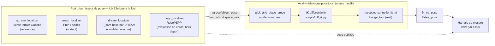

# Spécification — valider une brique interchangeable dans l'architecture R6A

*Cadre d'évaluation comparative. Première instanciation : l'estimation de pose
sans marqueur, DREAM contre RoboPEPP, sur le pick-and-place — d'abord en
simulation, puis sur le banc de Lyon.*

> **Statut :** proposition, à relire par l'équipe. Rien de ce document n'est
> implémenté. Les faits cités sont tirés du dépôt et référencés ; les
> propositions sont marquées comme telles.

---

## 1. Objet

Le projet va devoir trancher, plusieurs fois et sur plusieurs sous-systèmes,
entre des technologies concurrentes. DREAM contre RoboPEPP pour l'estimation de
pose n'est que la première occurrence : la même question se posera pour la
détection d'objet (HSV contre détecteur appris), le simulateur (Gazebo contre
Isaac Sim), la politique (script contre VLA).

**Ce document définit comment on tranche**, de façon que deux briques
concurrentes soient comparées dans les mêmes conditions, contre la même
référence, avec le même protocole — et que le résultat survive à la relecture.

### Hors périmètre

- Le choix de DREAM ou de RoboPEPP. Ce document décrit l'épreuve, pas son issue.
- L'entraînement des modèles, couvert par [`training/dream/README.md`](../training/dream/README.md).
- La téléopération et le VLA, qui n'utilisent pas ce port.

---

## 2. Le point d'appui : l'architecture a déjà un port enfichable

C'est le fait le plus important de ce document, et il est **déjà dans le code**.

`pick_and_place_aruco_node` ne connaît pas sa source de pose. Il consomme deux
topics, et deux fournisseurs interchangeables les alimentent déjà :

| Fournisseur | Fichier | Source de la pose |
|---|---|---|
| `gz_sim_localizer` | `gz_sim_localizer_node.py` | Vérité terrain Gazebo |
| `aruco_localizer` | `aruco_localizer_node.py` | PnP sur 4 ArUco au sol |

Contrat commun, vérifié dans les docstrings des deux nœuds :

```
/aruco/object_pose      geometry_msgs/PoseStamped   pose de l'objet, repère base
/aruco/workspace_valid  std_msgs/Bool               le fournisseur est prêt
```

**Toute brique candidate se branche ici.** Rien en aval ne change : ni l'IK, ni
la machine à états, ni les contrôleurs. C'est ce qui rend la comparaison
honnête — la seule variable est la source de pose.

La déprojection pixel → base est elle aussi déjà factorisée :
`vision/object_localizer.py` expose
`pixel_to_base(u, v, K, T_world_cam, table_z)`. Un estimateur sans marqueur ne
fournit que `T_world_cam` ; tout le reste est commun.

### Ce que DREAM apporte réellement au pick

À ne pas confondre : **DREAM n'estime pas l'objet, il estime la caméra.** Il
donne `T_cam→base` à partir du bras lui-même. Aujourd'hui ce lien vient d'une
calibration ArUco figée dans un fichier, et [`CLAUDE.md`](../CLAUDE.md) mesure
qu'elle **périme** — le 09/09, une caméra ayant bougé de 9,9 mm et 1,63°
laissait 14,1 mm d'erreur au sol.

La promesse d'une brique sans marqueur est donc précise : **supprimer la
calibration figée et les marqueurs au sol**, pas améliorer la détection.

---

## 3. Architecture cible



Les nœuds en gras existent ; `dream_localizer` et `pepp_localizer` sont à
écrire et constituent l'essentiel du travail d'intégration.

### Le harnais de mesure

`precision_benchmark_node` fait déjà l'essentiel : grille de 9 cibles, rapport
CSV, et il existe en deux déclinaisons — `precision_benchmark.launch.py` et
`precision_benchmark_real.launch.py`. **Proposition :** l'étendre plutôt que
d'écrire un outil neuf, en lui ajoutant une colonne « fournisseur de pose » et
l'écart entre pose estimée et pose de référence.

---

## 4. Cas d'usage

Quatre, à exécuter dans cet ordre. Les deux premiers sont des **témoins** :
sans eux, un écart mesuré ne peut être attribué à la brique.

| # | Monde | Fournisseur | Référence | Ce que ça établit |
|---|---|---|---|---|
| **UC1** | Gazebo | `gz_sim_localizer` | vérité terrain | Le plancher de l'aval : ce que coûtent l'IK, les contrôleurs et le cycle, **hors perception**. Tout écart ici est un défaut du pipeline, pas de la brique |
| **UC2** | Gazebo | candidat | vérité terrain | L'erreur propre de la brique, sans bruit mécanique. **L'épreuve d'anti-circularité (§6) se déroule ici** |
| **UC3** | Banc Lyon | `aruco_localizer` | baseline métrologique | L'état de l'art interne, re-mesuré le jour même — la baseline dérive |
| **UC4** | Banc Lyon | candidat | UC3 | La seule comparaison qui décide |

**UC1 et UC2 partagent la scène `real_table.sdf`**, réplique mesurée du banc :
plateau 622 × 449 × 8,5 mm, quatre ArUco de 50 mm aux positions relevées. C'est
ce qui rend UC2 et UC4 comparables.

⚠ **Ne pas utiliser `sim_sorting_grasp` comme juge.** Son issue n'est pas
déterministe : à géométrie commandée identique, le cylindre sort du bac 4 fois
sur 7 (mesuré le 22/09, voir
[`PICK_AND_PLACE_SIMULATION.md`](PICK_AND_PLACE_SIMULATION.md)). Un banc dont
le verdict varie ne peut pas départager deux briques.

---

## 5. Budget d'erreur — ce que le banc peut résoudre

Mesuré sur le banc de Lyon, campagne du 09/09
([protocole](../training/calibration/PROTOCOLE_ESSAIS_PRECISION.md)). **Ces
chiffres bornent ce qui est mesurable**, avant toute discussion sur les briques.

| Source | Ordre de grandeur | Conséquence pour la comparaison |
|---|---|---|
| Répétabilité RP (ISO 9283) | jusqu'à **0,838 mm** ; 3 séries sur 6 hors des ±0,5 mm annoncés | Plancher de bruit. Un écart inférieur entre deux briques n'est pas mesurable sur ce banc |
| Biais de direction d'approche | **5,918 mm**, confirmé 3 fois à 0,07 mm près | **Interdiction de mélanger les directions** entre l'apprentissage d'un point et sa reprise. Sinon ce biais est attribué à la brique |
| Extrinsèque, leave-one-out | **5,46 mm** (12,25 mm au marqueur le plus lointain) contre 0,594 mm de résidu annoncé | Un résidu d'ajustement n'est pas une justesse. La référence UC3 porte cette incertitude |
| Dérive de l'extrinsèque | 14,1 mm au sol après 9,9 mm / 1,63° de déplacement caméra | **Recalibrer au début de toute séance qui compte en millimètres** |
| Échelle de la vision | pas d'erreur (−3,25 % sur un tag de 50 mm = artefact d'obliquité ; +0,005 % sur 100 mm) | Ne jamais « corriger » `marker_size_mm` sur la foi d'une mesure optique |
| Validité hors plan table | nulle — tous les marqueurs sont à Z = 0 | Aucune conclusion à 17 cm de haut |

**Lecture :** une brique qui ferait 3 mm d'erreur de pose serait, sur ce banc,
indiscernable d'une brique parfaite si les directions d'approche sont mélangées.
Le protocole doit donc les contrôler avant de prétendre mesurer quoi que ce soit.

---

## 6. Les épreuves obligatoires

### 6.1 Anti-circularité — la brique suit-elle vraiment l'image ?

**Cette épreuve est éliminatoire, et elle a déjà éliminé une démonstration.**

Le 02/09, une estimation sans marqueur affichait 27,9 mm et 1,62°. Elle a été
**invalidée le jour même** : avec ce checkpoint, `base`, `link1` et `link2` sont
des constantes par montage — décaler l'image de 30 px les déplace de 0 %. Ajuster
une pose de caméra dessus, c'est retrouver la pose implicite des données de
fine-tuning. Le résidu était faible *parce que* c'était circulaire. Sur la SVPRO,
seule caméra ayant réellement bougé, la même méthode donne 54,9 mm et 7,16°.

**Test d'acceptation, à passer avant toute autre mesure :**

> Décaler l'image de N pixels. La détection doit suivre de N pixels.

Une brique qui échoue ici est écartée, quels que soient ses résidus.

### 6.2 Le jeu de validation doit tenir un point de vue à l'écart

Les 800 images ayant validé le checkpoint actuel étaient espacées de 26° en
espace articulaire **mais toutes issues d'une seule vue**. Elles mesuraient la
généralisation aux poses du bras, pas aux points de vue.

La PR #13 montre la bonne pratique dans ce dépôt : ses 927 images de validation
viennent d'une caméra **jamais vue à l'entraînement**
([datasets](../Headless_Task-Grounded_Pick-and-Place_in_Gazebo/datasets/README.md)).
Toute brique candidate est évaluée sur un montage de caméra tenu à l'écart.

### 6.3 Observabilité déclarée

Chaque brique déclare ce qu'elle n'observe pas. Pour DREAM, c'est mesuré et
structurel : **J6 est inobservable** — déplacement FK des 7 points clés nul sur
toute sa course — et **J5 n'est utilisable que de 0° à −60°**. Une brique
concurrente qui prétend observer J6 doit le démontrer par le test §6.1 appliqué
à un mouvement de J6 seul.

---

## 7. Critères d'acceptation

Une brique est **retenue** si, et seulement si :

1. Elle passe l'épreuve d'anti-circularité (§6.1).
2. Elle est évaluée sur un point de vue tenu à l'écart (§6.2).
3. En UC2, son erreur de pose objet reste sous **le seuil décidé par l'équipe**
   — *valeur à fixer, voir §9* — sur les 9 cibles de la grille.
4. En UC4, le **taux de saisie réussie** n'est pas inférieur à celui d'UC3, sur
   un nombre d'essais décidé à l'avance et jamais ajusté après coup.
5. Sa latence tient dans le budget du cycle, mesurée et non estimée —
   `/dream/keypoints` porte déjà `inference_ms` et l'horodatage de l'image
   pour cela.
6. Elle déclare son enveloppe d'observabilité (§6.3).

Un critère non mesuré vaut critère non rempli.

---

## 8. Prérequis — un défaut bloquant à corriger d'abord

**`aruco_localizer_node` construisait un modèle 3D deux fois trop petit.**
`workspace_markers.yaml` écrit `marker_size_mm: 50.0`, le nœud ne lisait que la
clé `marker_size_m` — absente — et se repliait silencieusement sur son défaut de
**0,025 m**. Les coins envoyés à `solvePnP` faisaient donc ±12,5 mm pour des
marqueurs de 50 mm, alors que les centres, eux, étaient justes.

Corrigé le 22/09 (le chargeur accepte les deux clés). **Conséquence pour ce
plan : toute mesure UC3 antérieure est suspecte et la référence doit être
reprise après correction.**

Reste ouvert : `workspace_markers.yaml` est par ailleurs **périmé** — la planche
a bougé le 10/09 (rotation −1,750°, translation 18,8 / −6,5 mm) et toute
calibration s'appuyant dessus sera fausse de 12 à 28 mm selon le marqueur.

---

## 9. Décisions qui reviennent à l'équipe

Aucune ne peut être tranchée depuis le code seul.

1. **Le seuil d'acceptation en UC2** (§7.3). Il doit être supérieur au plancher
   de bruit du banc (§5), sinon il est invérifiable.
2. **Le nombre d'essais en UC4**, fixé avant de commencer.
3. **Qui écrit `dream_localizer` et `pepp_localizer`**, et sur quelle branche —
   la règle de branchement impose un domaine par branche.
4. **Ce que l'évaluation RoboPEPP en cours doit rapporter** — voir §11. Le
   travail a commencé hors de ce dépôt ; ce qui manque n'est pas la décision
   d'évaluer, mais l'accord sur les mesures à produire.
5. **Le banc de référence.** Les données de campagne actuelles viennent de
   **Lyon**, qui mène aussi l'évaluation RoboPEPP : UC3 et UC4 ont donc tout
   intérêt à être menés là, dans une seule campagne. Si Nanterre doit produire
   des mesures comparables, le protocole commun est un prérequis, pas une
   conséquence.

---

## 10. RoboPEPP — évaluation en cours, hors de ce dépôt

**État au 23/09/2026 :** RoboPEPP est en cours de test et de validation,
**mené par ABMI Lyon**, sous **licence open-source**. Ce dépôt n'en porte
encore aucune trace — ni branche, ni pull request, ni fichier.

**Lyon tient aussi le banc qui définit la baseline** (§5). C'est une
circonstance favorable qu'il serait dommage de gâcher : l'équipe qui évalue
RoboPEPP a sous la main l'instrument, le protocole des treize essais et
l'opérateur qui l'a exécuté. UC3 et UC4 peuvent donc être menés **par les
mêmes mains, sur le même banc, dans la même campagne** — ce qui supprime d'un
coup la plus grosse source d'incomparabilité entre deux évaluations.

Le risque restant : **une validation menée hors de ce cadre produira des
chiffres incomparables avec ceux de DREAM**, et il faudra la refaire. Le projet
a déjà payé cette erreur le 02/09, avec une démonstration invalidée le jour même
faute d'avoir posé la bonne épreuve.

### Ce que l'évaluation doit produire pour se brancher ici

Sans ces cinq points, le résultat ne sera pas opposable à DREAM :

1. **L'épreuve d'anti-circularité (§6.1)**, dans sa forme exacte : décaler
   l'image de N pixels, vérifier que la détection suit de N pixels. Un bon
   résidu de reprojection ne la remplace pas — c'est précisément ce qui avait
   trompé le 02/09.
2. **Un jeu de validation tenant un point de vue à l'écart (§6.2)**, pas
   seulement des images. Un montage de caméra jamais vu à l'entraînement.
3. **L'enveloppe d'observabilité déclarée (§6.3)** : quelles articulations la
   méthode n'observe pas, mesuré et non supposé. DREAM déclare J6 inobservable
   et J5 utilisable de 0° à −60° ; une comparaison sans cet équivalent est
   bancale.
4. **La latence mesurée**, pas estimée, sur le matériel visé.
5. **Le coût d'intégration** : licence, dépendances, format d'entrée, et surtout
   s'il faut ré-entraîner sur le MyCobot — auquel cas les données nécessaires et
   leur volume.

### Ce que ce dépôt fournit en retour

- La scène `real_table.sdf`, réplique mesurée du banc, pour évaluer les deux
  briques sur la même géométrie.
- Le port enfichable (§2) : l'intégration se réduit à publier deux topics.
- Le budget d'erreur du banc (§5), qui dit d'avance quelles différences seront
  démontrables et lesquelles seront noyées dans le bruit.
- La grille de 9 cibles de `precision_benchmark_node` et son rapport CSV.

### Deux points à verrouiller

⚠ **Le lien du dépôt.** Tant que ce document ne peut pas y renvoyer, quiconque
lit cette spécification ignorera que l'évaluation existe — et la referait.

⚠ **La licence exacte, pas seulement « open-source ».** Ce dépôt est sous
**Apache-2.0** (voir [`../LICENSE`](../LICENSE)). Une brique sous MIT, BSD ou
Apache s'y intègre sans difficulté. Une brique sous **GPL ou AGPL** impose ses
conditions à ce qui l'embarque : la question doit être tranchée **avant**
d'écrire `pepp_localizer`, pas après. Si le doute existe, un appel réseau vers
un service séparé isole la contrainte — mais c'est un choix d'architecture, à
faire en connaissance de cause.

---

## 11. Livrables

| Livrable | Nature |
|---|---|
| `dream_localizer_node.py` | Fournisseur de pose adossé à `/dream/pose` |
| `pepp_localizer_node.py` | Idem pour RoboPEPP, sous réserve de §9.4 |
| Extension de `precision_benchmark_node` | Colonne fournisseur + écart estimé/référence |
| `tests/test_pose_provider_contract.py` | Tout fournisseur respecte le contrat des deux topics |
| Script d'épreuve d'anti-circularité | Décalage de N px, vérification du suivi |
| Rapport de campagne | Un par brique, adossé au protocole existant |

---

## Documents liés

- [`PICK_AND_PLACE_SIMULATION.md`](PICK_AND_PLACE_SIMULATION.md) — le banc de tri et son non-déterminisme
- [`PICK_AND_PLACE_BOUCLE_FERMEE.md`](PICK_AND_PLACE_BOUCLE_FERMEE.md) — ce qui a été mesuré sur le robot réel
- [`../training/calibration/PROTOCOLE_ESSAIS_PRECISION.md`](../training/calibration/PROTOCOLE_ESSAIS_PRECISION.md) — les treize essais de la campagne
- [`../training/dream/README.md`](../training/dream/README.md) — entraînement et évaluation
- [`ARCHITECTURE.md`](ARCHITECTURE.md) — topologie générale
